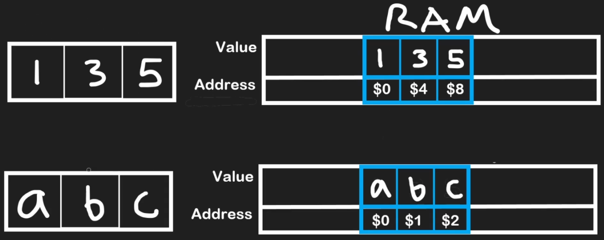
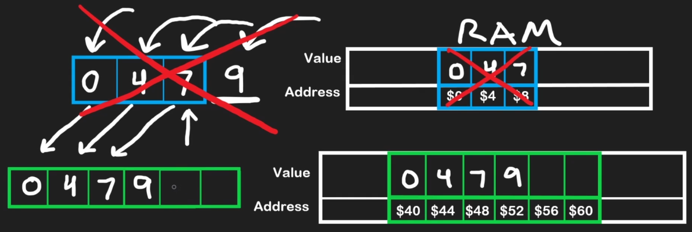
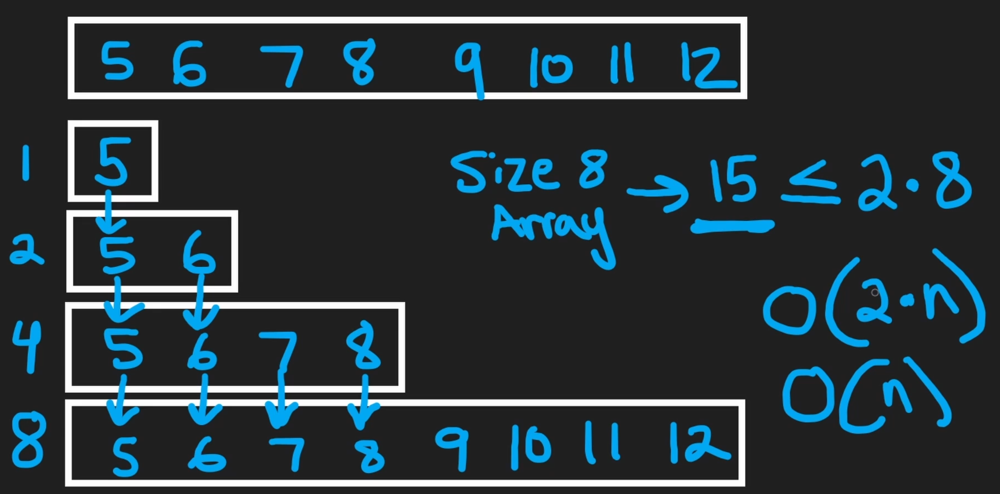
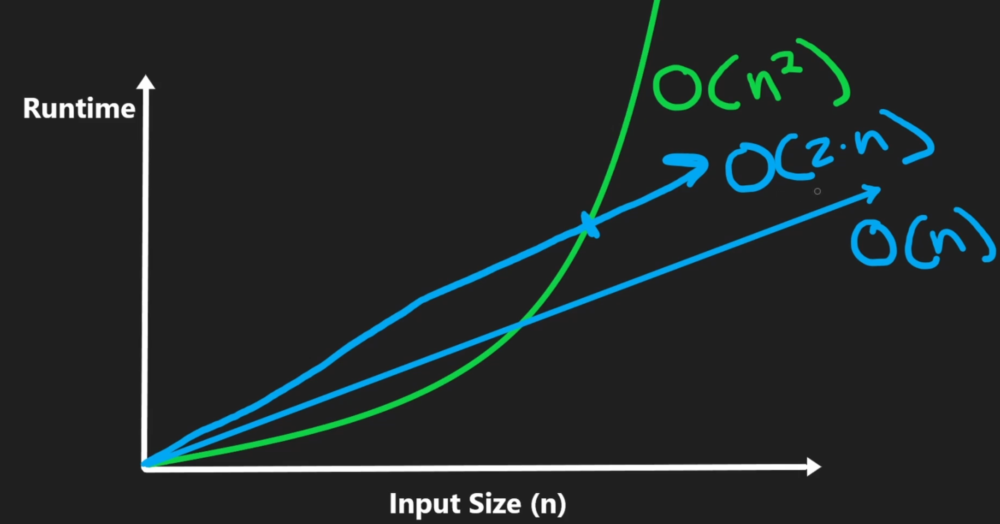
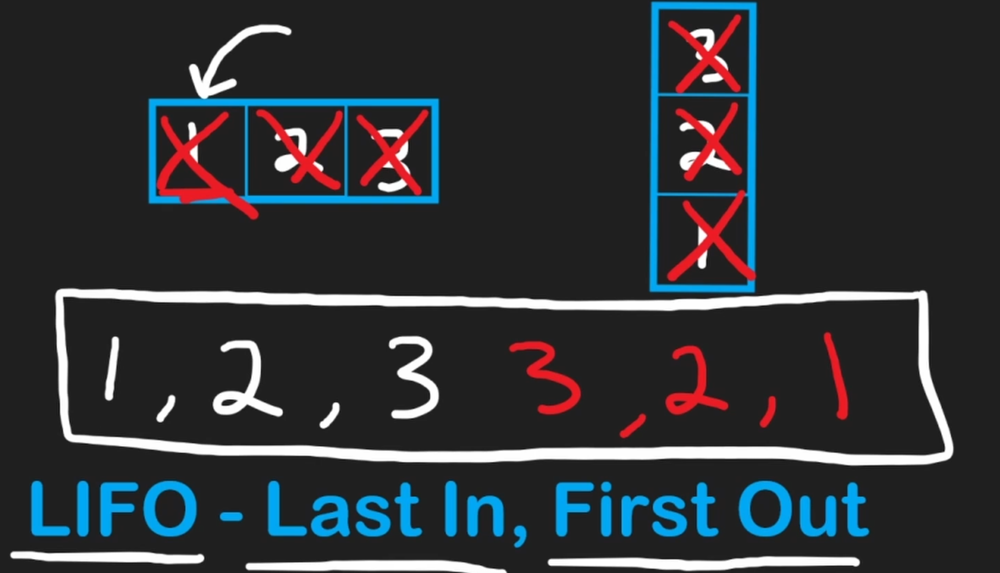

# array

- [x] Done

## Array

What is it?

- An ordered collection of contiguous elements
- Elements are located one after another with no space in between

## Ram

What is it?

- RAM (Random Access Memory)
  - All variables and data structures are stored
  - Composed of billions of bytes
- Byte
  - 1 byte = 8 bits
- Bit
  - 1 bit could be either a 0 or a 1

Each element's location in memory has a unique address. Because they are stored sequentially, the address for each subsequent element increases by a fixed amount determined by the data type's size

- Integer: Uses 4 bytes (e.g., address 0, address 4, address 8)
- Character: Uses 1 byte (e.g., address 0, address 1, address 2)



## Static Arrays

Actions

- Traversing

:::note
The last element in an array is always at index n−1 where n is the size of the array. If the size of our array is 3, the last accessible index is 2
:::

- Deleting
  - From the end of the array
    - In statically typed languages, all array indices are filled with 0s or some default value upon initialization, denoting an empty array
    - When we want to remove an element from the last index of an array, we should set its value to 0 / null or -1 - soft delete
  - At an ith index
    - We are given the deletion index i
    - We iterate starting from i + 1 until the end of the array
    - We shift each element 1 position to the left
    - (Optional) We replace the last element with a 0 or null to mark it empty, and decrement the length by 1
- Inserting
  - At the end of the array
  - At an ith index

```python
# Remove from the last position in the array if the array
# is not empty (i.e. length is non-zero)
def removeEnd(arr, length):
  if length > 0:
    # Overwrite last element with some default value
    # We would also consider the length to be decreased by 1
    arr[length - 1] = 0
```

```python
# Remove value at index i before shifting elements to the left
# Assuming i is a valid index
def removeMiddle(arr, i, length):
  # Shift starting from i + 1 to end
  for index in range(i + 1, length):
    arr[index - 1] = arr[index]
  # No need to 'remove' arr[i], since we already shifted
```

```python
# Insert n into arr at the next open position
# Length is the number of 'real' values in arr, and capacity
# is the size (aka memory allocated for the fixed size array)
def insertEnd(arr, n, length, capacity):
  if length < capacity:
    arr[length] = n
```

```python
# Insert n into index i after shifting elements to the right
# Assuming i is a valid index and arr is not full
def insertMiddle(arr, i, n, length):
  # Shift starting from the end to i
  for index in range(length - 1, i - 1, -1):
    arr[index + 1] = arr[index]
  
  # Insert at i
  arr[i] = n
```

:::note
There is a common confusion that O(1) is always fast. This is not the case. There could be 1000 operations and the time complexity could still be O(1). If the number of operations does not grow as the size of the data or input grows then it is O(1)
:::

## Dynamic Arrays

Actions

- Inserting

```python
# Insert n in the last position of the array
def pushback(self, n):
  if self.length == self.capacity:
    self.resize()
      
  # insert at next empty position
  self.arr[self.length] = n
  self.length += 1
```

```python
def resize(self):
  # Create new array of double capacity
  self.capacity = 2 * self.capacity
  newArr = [0] * self.capacity 

  # Copy elements to newArr
  for i in range(self.length):
      newArr[i] = self.arr[i]
  self.arr = newArr
```

What is it?

- Dynamic arrays manage a block of memory with a certain capacity
- If you don't specify the size, it will initialize it to some default size depending the programming language
- There is a pointer to save the last element of the array
- Size: The number of elements currently in the array
- Capacity: The total number of elements the array can hold before needing to resize

When the size exceeds the capacity, the array automatically

- Allocates a new, larger block of memory (often double the size)
- Copies all existing elements to the new location &rarr; O(n) operation
- Deallocates the old memory block
- Adds the new element

:::note
When all the elements from the first array have been copied over, the first static array will be deallocated
:::



### More

Amortized complexity

- Amortized time complexity is the average time taken per operation over a sequence of operations
- The resize operation itself is O(n), but since it is not performed every time we add an element, the average time taken per operation is O(1)
- But this is only the case if we double the size of the array when we run out of space

Why double the capacity



- The size of the array went from `1 -> 2 -> 4 -> 8`
- To analyze the complexity, we have to take into consideration the sum of all the operations that occured before the last one
- To achieve an array of size 8, we would have to perform `1 + 2 + 4 + 8` 15 operations (8 addition, 7 copy) ~ 2n (it will take at most 2n operations to create an array of size 8)
- In this case, `1 + 2 + 4 = 7 < 8`

:::note
With time complexity, we are concerned with asymptotic analysis. This means we care about how quickly the runtime grows as the input size grows. We don't distinguish between O(2n) and O(n) because the runtime grows linearly with the input size, even if the constant is doubled. With time complexity analysis, we typically drop constant terms and coefficients
:::



## Stack

What is it? LIFO

- A subset of operations from a dynamic array
- Only add and delete elements from one end of the array (referred to as the top of the stack)



Actions

- Push: Adds an element to the end (top) of the stack
- Pop: Removes an element from the end of the stack
- Peek: Looks at the last element without removing it

```python
def push(self, n):
  # using the pushback function from dynamic arrays to add to the stack
  self.stack.append(n)
```

```python
def pop(self):
  return self.stack.pop()
```

```python
def peek(self):
  return self.stack[-1]
```

:::note
Since a stack will remove elements in the reverse order that they were inserted in, it can be used to reverse sequences - such as a string, which is just a sequence of characters
:::

:::note
In most languages, before popping, it is a good measure to check if the stack is empty to avoid errors
:::

## Complexity

Array (General)

| Operation       | Big-O Time Complexity | Notes                                                                           |
| :------------------------------- | :-------------------- | :------------------------------------------------------------------------------ |
| Reading / Access (by index)      | O(1)                | Instantaneous because each index is mapped to a direct memory address in RAM.   |
| Update (by index)                | O(1)                | Same as reading; direct memory access.                                          |
| Traversing                       | O(n)                | Requires visiting each of the n elements, for example with a for or while loop. |
| Inserting / Deleting (at middle) | O(n)                | Requires shifting all subsequent elements to the left or right.                 |

Static Array

| Operation                         | Big-O Time Complexity | Notes                                                            |     |
| :-------------------------------- | :-------------------- | :--------------------------------------------------------------- | :-- |
| Appending / Deleting (at the end) | O(1)                | No resizing or shifting is needed as long as space is available. |     |

Dynamic Array

| Operation                         | Big-O Time Complexity | Notes                                                                                                     |
| :-------------------------------- | :-------------------- | :-------------------------------------------------------------------------------------------------------- |
| Appending / Deleting (at the end) | O(1) amortized      | Usually constant time, but occasionally requires resizing the entire array, which is an O(n) operation. |

Stack

| Operation             | Big-O Time Complexity | Notes                                                    |
| :-------------------- | :-------------------- | :------------------------------------------------------- |
| Push (add to top)     | O(1)                | Adds an element to the collection.                       |
| Pop (remove from top) | O(1)                | It's best practice to check if the stack is empty first. |
| Peek / Top (view top) | O(1)                | Retrieves the top element without removing it.           |
