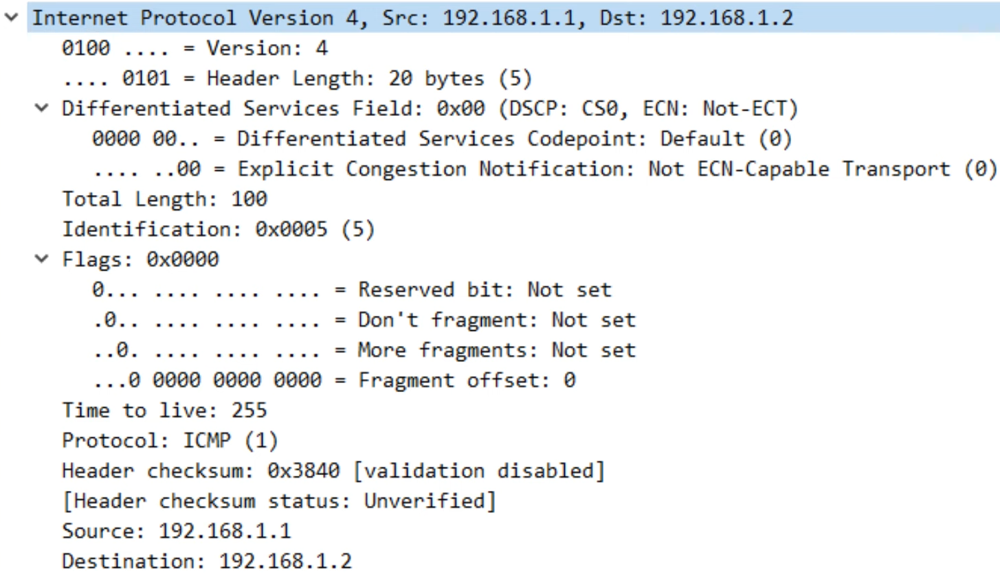

# ipv4 header

- [x] Done

## IPv4 Header


### Version

Definitions

- Length: 4 bits
- Identifies the version of IP used
  - IPv4: 4 (0100)
  - IPv6: 6 (0110)

### Internet Header Length

Definitions

- Length: 4 bits
- The final field of the IPv4 header (Options) is variable in length, so this field is necessary to indicate the total length of the header
- Identifies the length of the header in 4-byte increments
- Value of 5: 5 x 4 = 20 bytes
- Minimum value is 5 (= 20 bytes)
- Maximum value is 15 (= 60 bytes) - all 1s (1111)
- Minimum IPv4 header length is 20 bytes
- Maximum IPv4 header length is 60 bytes

### DSCP

Definitions

- Length: 6 bits
- Differentiated Services Code Point
- Used for QoS (Quality of Service)
- Used to prioritie delay-sensitive data (streaming voice, video, etc.)

### Ecn

Defitions

- Length: 2 bits
- Explicit Congestion Notification
- Provides end-to-end (between endpoints) notification of network congestion without dropping packets
- Optional feature that requires both endpoints, as well as the underlying network infrastructure to support it

### Total Length

Definitions

- Length: 16 bits
- Indicates the total length of the packet (L3 header + L4 segment)
- Measured in bytes (not 4-byte increments like IHL)
- Minimum value of 20 (IPv4 header with no encapsulated data)
- Maximum value is 65,535 (2^16 - 1)


### Identification

Definitions

- Length: 16 bits
- If a packet is fragmented due to being too large, this field is used to identify which packet the fragment belongs to
- All fragments of the same packet will have their own IPv4 header with the same value in this field
- Packets are fragmented if larger than the MTU (Maximum Transmission Unit)
- The MTU is usually 1500 bytes
- Fragments are reassembled by the receiving host

### Flags

Definitions

- Length: 3 bits
- Used to control and identify fragments
- Bit 0: Reserved, always set to 0
- Bit 1: Don't fragment (DF bit), used to indicate that the packet should not be fragmented
- Bit 2: More fragments, set to 1 if there are more fragments in the packet, set to 0 for the last fragment
- Unfragmented packets will always have their MF bit set to 0

### Fragment Offset

Definitions

- Length: 13 bits
- Used to indicate the position of the fragment within the original packet, unfragmented IP packet
- Allows fragmented packets to be reassembled even if the fragments arrive out of order

### Time to Live

Definitions

- Length: 8 bits
- A router will drop a packet with a TTL of 0
- Used to prevent infinite loops
- Originally designed to indicate the packet's maximum lifetime in seconds
- In practice, indicates a hop count: Each time the packet arrives at a router, the router decreases the TTL by 1
- Recommended default TTL: 64

### Protocol

Definitions

- Length: 8 bits
- Indicates the protocol of the encapsulated L4 PDU
- Value of 6: TCP
- Value of 17: UDP
- Value of 1: ICMP
- Vakye of 89: OSPF

### Checksum

Definitions

- Length: 16 bits
- A calculated checksum used to check for errors in the IPv4 header
- When a router receives a packet, it calculates the checksum of the header and compares it to one in this field of the header
- If they do not match, the router drops the packet
- Used to check for errors only in the IPv4 header
- IP relies on the encapsulated protocol to detect errors in the encapsulated data
- Both TCP and UDP have their own checksum fields to detect errors in the encapsulated data

### Source and Destination IP Address

Definitions

- Length: 32 bits (each)
- Source IP Address: IPv4 address of the sender of the packet
- Destination IP Address: IPv4 address of the intended receiver of the packet

### Options

Definitions

- Length: 0 - 320 bits
- Rarely used
- If the IHL field is greater than 5, it means that Options are present

## Wireshark



Commands

```txt
// Send 10000 byte pings -> Cause fragmentation
ping 192.168.1.2 size 10000
```


```txt
ping 192.168.1.2 df-bit

// Fail
ping 192.168.1.2 size 10000 df-bit
```
