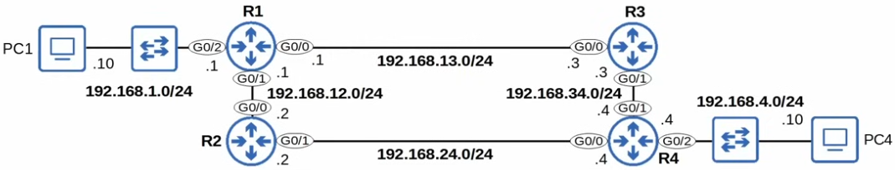

# static routing 2

- [] Done

## Connected and Local Routes



```txt
configure terminal
interface g0/0
ip address 192.168.12.2 255.255.255.0
no shutdown

interface g0/1
ip address 192.168.24.2 255.255.255.0
no shutdown
```

Definitions

- The following routes are automatically added to the routing table for each interface with an IP address configured
- C - Connected
  - A route to the network the interface is connected to (with the actual netmask configured on the interface)

## Static Routes

## Configuration

## Default Routes
