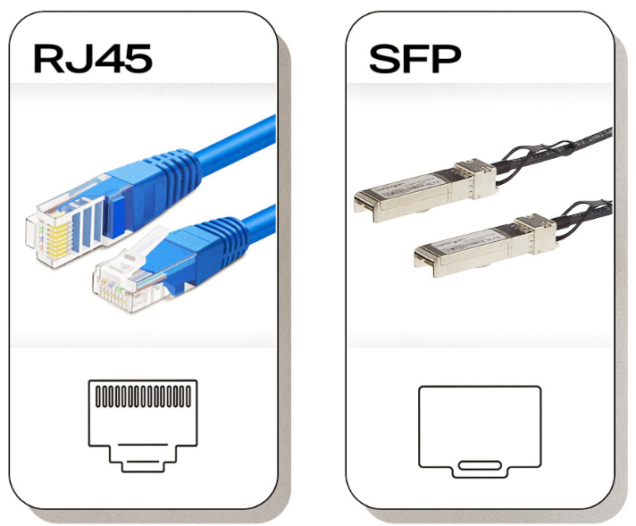
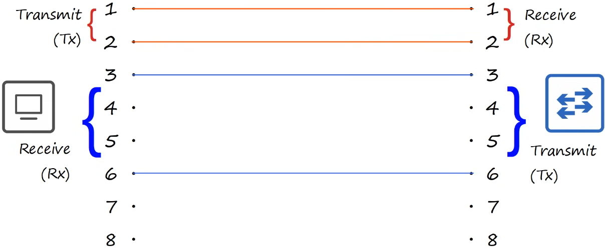
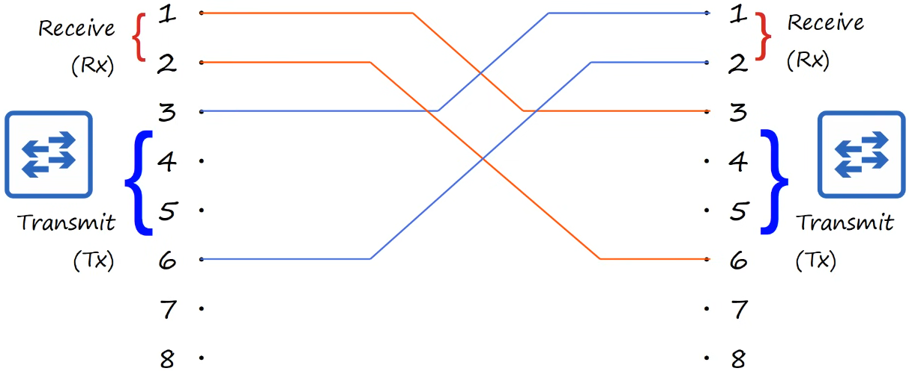
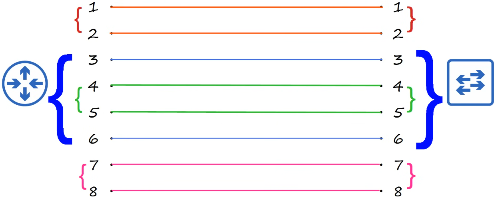
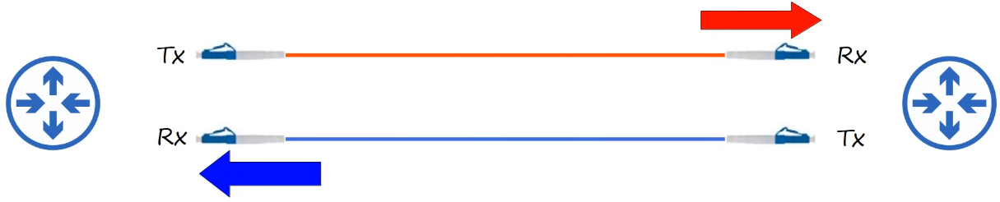
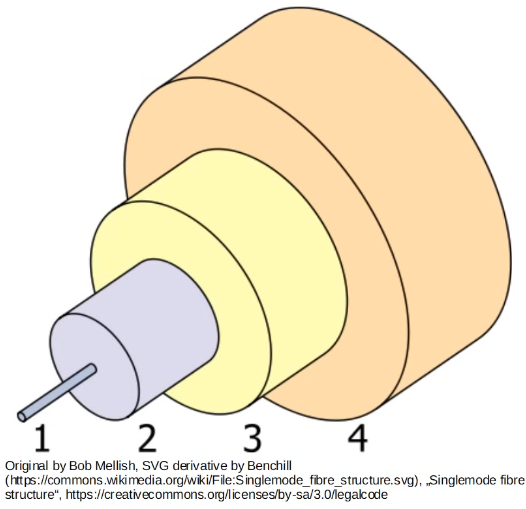
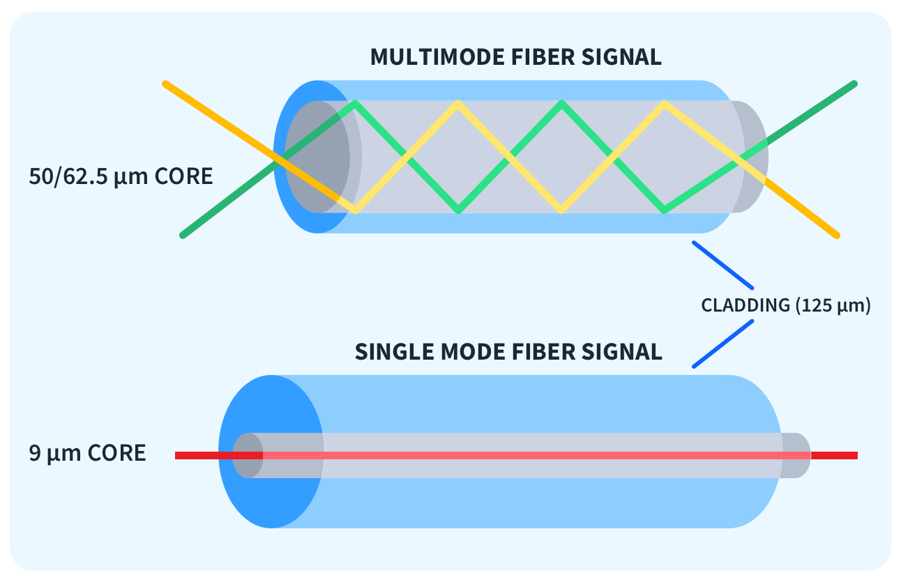

# interfaces and cables

- [x] Done

## Ports

Types

- RJ45 is for standard Ethernet cables
- SFP is for fiber optic or copper cables via SFP modules

## Ethernet

Definition

- A collection of network protocols/standards

Why do we need network protocols/standards?

- Requires a common language data transmission, formatting, etc.

Physical cables: Used to connect devices in an Ethernet network

- UTP cable: Transmits data using electrical signals through copper wires
- Fiber Optic cable: Transmits data using pulses of light through glass or plastic fibers

## Bits and Bytes

Definitions

- Value represented by either a 0 or 1
- Data is sent or received a bit (not byte) at a time
  - 1 byte = 8 bits
- Speed is measured in bits per second (Kbps, Mbps, Gbps, etc.) not bytes per second

Examples

- 1 kilobit (Kb) = 1 000 bits (thousand)
- 1 megabit (Mb) = 1 000 000 bits (million)
- 1 gigabit (Gb) = 1 000 000 000 bits (billion)

## Ethernet Standards

Definitions

- Defined in the IEEE 802.3 standard in 1983
- IEEE: Institute of Electrical and Electronics Engineers
- This standard is for local area networks (LANs)

Copper

| Speed     | Common Name       | IEEE Standard | Informal Name | Maximum Length | Pairs |
|-----------|-------------------|---------------|---------------|----------------|-------|
| 10 Mbps   | Ethernet          | 802.3i        | 10BASE-T      | 100 m          |2 pairs|
| 100 Mbps  | Fast Ethernet     | 802.3u        | 100BASE-T     | 100 m          |2 pairs|
| 1 Gbps    | Gigabit Ethernet  | 802.3ab       | 1000BASE-T    | 100 m          |4 pairs|
| 10 Gbps   | 10 Gig Ethernet   | 802.3an       | 10GBASE-T     | 100 m          |4 pairs|

- BASE: Baseband signaling
- T: Twisted pair

## UTP Cables

Definitions

- Unshielded: The cable does not have additional shielding to protect the data signals from Electromagnetic Interference (EMI) and Radio Frequency Interference (RFI)
- Twisted: Pairs of wires are twisted together
- Pair: Each pair consists of two insulated copper wires

### 10base-T and 100base-T

Definition: Full-Duplex transmission: Two devices can send data at the same time without issues

- Straight-through cable: A type of network cable used to connect to different types of devices

- Crossover cable: A type of network cable used to directly connect two devices of the same type without going through a switch or hub

Tx and Rx table

| Device Type | Transmit (Tx) Pins | Receive (Rx) Pins |
|-------------|---------------------|-------------------|
| Router      | 1 and 2             | 3 and 6           |
| Firewall    | 1 and 2             | 3 and 6           |
| PC          | 1 and 2             | 3 and 6           |
| Switch      | 3 and 6             | 1 and 2           |

- Auto MDI-X
  - A feature in modern networking devices
  - Automatically detect which pins their neighbor is transmitting data on, and then adjust which pins they use to transmit and receive data
  
### 1000base-T and 10gbase-T

Definitions

- Each pair is bidirectional

## Fiber-Optic Cable

Definitions

- Electrical signal is sent over copper wiring
- Light is sent over glass fibers
- Two connectors on each end
  - One for transmitting and one for receiving data

Structure

- (1) The fiberglass core itself
- (2) Cladding that reflects light
- (3) A protective buffer
- (4) The outer jacket of the cable

Multi-mode fiber

- Core diameter is wider than single-mode fiber
- Allows multiple angles(modes) of light waves to enter the fiberglass core
- Allows longer cables than UTP, but shorter cables than single-mode fiber
- Cheaper than single-mode fiber due to cheaper LED-based SFP transmitters

Single-mode fiber

- Core diameter is narrower than multi-mode
- Light enters at a single angle (mode from a laser-based transmitter)
- Allows longer cables than both UTP and multi-mode fiber
- More expensive than multi-mode fiber due to more expensive LED-based SFP transmitters

Fiber-optic cable standards

| Informal Name | IEEE Standard | Speed   | Cable Type                | Maximum Length        |
|---------------|---------------|---------|---------------------------|-----------------------|
| 1000BASE-LX   | 802.3z        | 1 Gbps  | Multi-mode or single-mode | 550 m (MM), 5 km (SM) |
| 10GBASE-SR    | 802.3ae       | 10 Gbps | Multi-mode                | 400 m                 |
| 10GBASE-LR    | 802.3ae       | 10 Gbps | Single-Mode               | 10 km                 |
| 10GBASE-ER    | 802.3ae       | 10 Gbps | Single-Mode               | 30 km                 |

## Comparison

| UTP                                                                                  | Fiber-Optic                                                                                  |
| ------------------------------------------------------------------------------------ | ---------------------------------------------------------------------------------------------|
| Lower cost than fiber-optic                                                          | Higher cost than UTP                                                                         |
| Shorter maximum distance than fiber-optic (~100m)                                    | Longer maximum distance than UTP                                                             |
| Can be vulnerable to EMI (Electromagnetic Interference)                              | No vulnerability to EMI                                                                      |
| RJ45 ports used with UTP are cheaper than SFP ports                                  | SFP ports are more expensive than RJ45 ports (single-mode is more expensive than multi-mode) |
| Emit (leak) a faint signal outside of the cable, which can be copied (security risk) | Does not emit any signal outside of the cable (no security risk)                             |
