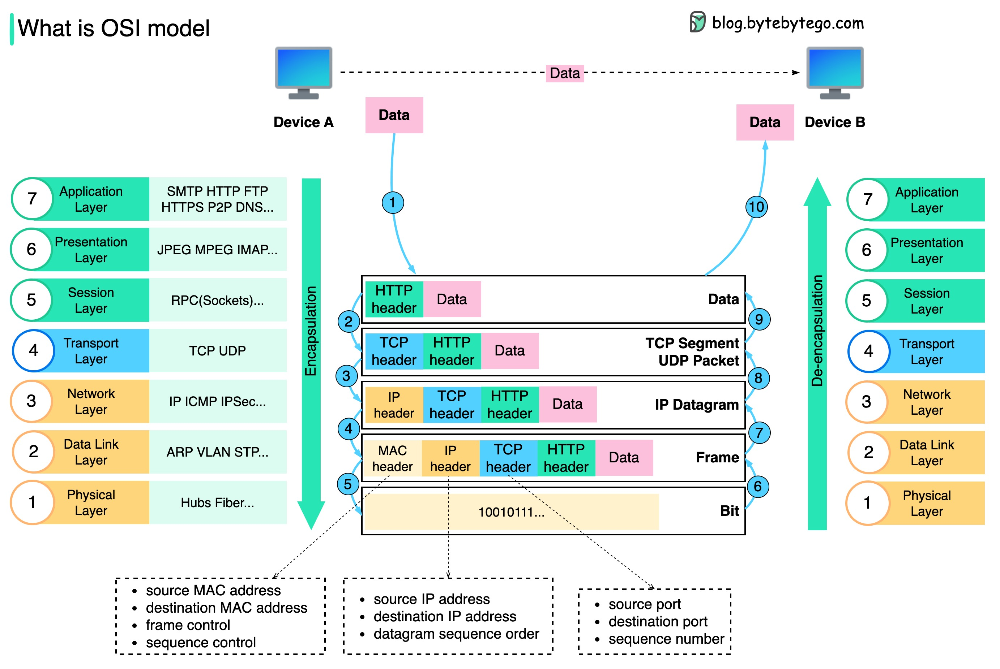

# osi and tcp

- [x] Done

## Networking Model

Definitions

- Networking models categorize and provide a structure for networking protocols and standards
- Protocol is a set of rules defining how network devices and software should work

## Osi

Definitions

- OSI: Open Systems Interconnection
- A conceptual model that categorizes and standardizes the different functions in a network
- Created by International Organization for Standardization (ISO)
- Functions are divided into 7 layers

### Application Layer - Data

Definitions

- This layer is closest to the end user
- Interacts with software applications, for example your web browser (Brave, Firefox, Chrome, etc.)
- HTTP and HTTPS are layer 7 protocols `(https://www.google.com)`

Functions

- Identify communication partners
- Synchronize communication

Processes

- Encapsulation
- De-encapsulation
- Same-layer interaction: Communication between the application layers of the two different systems

### Presentation Layer - Data

Definitions

- Data in the application layer is in application format
- It needs to be translated to a different format to be sent over the network

Functions

- Translates between application and network formats
  - For example, encryption of data as it is sent, and decryption of data as it is received
- Translates between different application layers formats

### Session Layer - Data

Functions

- Controls dialogues (sessions) between communicating hosts
- Establishes, manages, and terminates connections between the local application (for example, web browser) and the remote application (for example, Youtube)

### Transport Layer - Segment

Functions

- Segments and reassembles data for communication between end hosts
- Breaks large pieces of data into smaller segments which can be more easily sent over the network and are less likely to cause transmission problems if errors occur
- Provide host-to-host communication

### Network Layer - Packet

Functions

- Provides connectivity between end hosts on different networks (ie. outside of the LAN)
- Provides logical addressing (IP addresses)
- Provides path selection between source and destination
- Routers operate at this layer

### Data Link Layer - Frame

Functions

- Provides node-to-node connectivity and data transfer (for example, PC to switch, switch to router, router to router)
- Defines how data is formatted for transmission over a physical medium (for example, copper UTP cables)
- Detects and (possibly) corrects Physical Layer errors
- Uses layer 2 addressing, separate from layer 3 addressing
- Switches operate at this layer

### Physical Layer - Bit

Functions

- Define physical characteristics of the medium used to transfer data between devices
  - For example, voltage levels, maximum transmission, distances, physical connectors, cable specifications, etc.
- Digital bits are converted into electrical (for wired connections) or radio (for wireless connections)

## TCP/Ip

Definitions

- Conceptual model and set of communications protocols used in the Internet and other networks
- Developed by the US Department of Defense through DARPA (Defense Advanced Research Projects Agency)
- Similar structure to the OSI Model, but fewer layers
- This is the model actually in use in modern networks

Note: The OSI Model still influences how network engineers think and talk about networks

