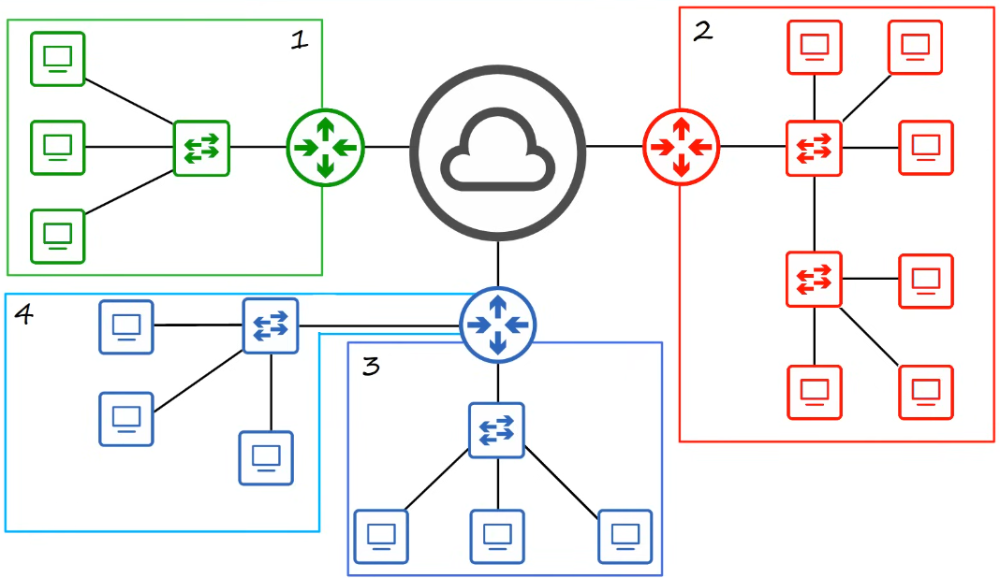

# ethernet lan switching

- [x] Done

## Local Area Networks

## Ethernet Frame

### Preamble

Definitions

- Length: 7 bytes (56 bits)
- Alternating 1's and 0's
- 10101010 * 7
- Allows device to synchronize their receiver clocks to ensure they are ready to receive the rest of the frame

### SFD

Definitions

- Start Frame Delimiter
- Length: 1 byte (8 bits)
- 10101011
- Makes the end of the preamble and the beginning of the rest of the frame

### Definition and Source

Definitions

- Indicate the devices sending and receiving the frame
- Consist of the destination and source "MAC address"
- MAC - Media Access Control includes 6 bytes (48 bits) address of the physical device

### Type or Length

Definitions

- Indicate the Layer 3 protocol used in the encapsulated packet, which is always Internet Protocol (IP) version 4 or version 6
- 2 bytes (16 bits) field
- A value of 1500 or less in this field indicates the LENGTH of the encapsulated packet (in bytes)
- A value of 1536 or greater in this field indicates the TYPE of the encapsulated packet (IPv4 or IPv6), and the length is determined via other methods

Information

- IPv4 = 0x0800 in hexadecimal &rarr; 2048 in decimal
- IPv6 = 0x86DD in hexadecimal &rarr; 34525 in decimal

### FCS

Definitions

- Frame Check Sequence
- 4 bytes (32 bits) in length
- Detects corrupted data by running a CRC algorithm over the received data
- CRC = Cyclic Redundancy Check

### MAC Address

Definitions

- 6 bytes (48 bits) physical address assigned to the device when it is made
  - The first 3 bytes are the OUI (Organizationally Unique Identifier), which is assigned to the company making the device
  - The last 3 bytes are unique to the device itself
- A.K.A "Burned-In Address" (BIA)
- Is globally unique
- Written as 12 hexadecimal characters

Additional information: Since 1 byte = 8 bits and 1 hexadecimal character = 4 bits, it takes two hexadecimal characters to represent one byte

Notation

- F stands for FastEthernet
- 0 is the slot number
- 1 is the port number

How a Switch Learns MAC Addresses

- PC1 sends a frame to PC2. The frame enters the switch (SW1) on port F0/1
- SW1 checks the source MAC address of the frame. It adds PC1's MAC address to its MAC address table and links it to port F0/1. This is how the switch learns where devices are
- Next, SW1 looks for the destination MAC address (PC2's address) in its table
- Because the switch doesn't know which port leads to PC2 yet, the frame is considered an unknown unicast frame
- The switch's only option is to flood the frame, sending a copy out of all its ports except the one it came in on (F0/2 and F0/3)
- PC3 receives the frame, sees the destination MAC doesn't match its own, and drops (ignores) it
- PC2 receives the frame, recognizes its MAC address, and processes it
- When PC2 replies to PC1, SW1 receives the frame. This time, it already knows PC1 is on port F0/1, so it forwards the frame directly to that single port instead of flooding

Note: Dynamically learned MAC addresses are removed from the MAC address table after a period of inactivity (typically 5 minutes)

Example

## Number Systems

### Decimal

Definition: Uses 10 possible digits: 0 &rarr; 9

Example: 123.45

- 1 in the hundreds place (1x10^2)
- 2 in the tens place (2x10^1)
- 3 in the units place (3x10^0)
- 4 in the tenths place (4x10^−1)
- 5 in the hundredths place (5x10^−2)

### Hexadecimal

Definition: Uses 16 possible digits: 0 &rarr; 9, A &rarr; F

Example: Convert 30 (Decimal) to Hexadecimal

- Divide 30 by 16: 30 / 16 = 1 with a remainder of 14. In hexadecimal, 14 is represented by the digit E
- The result is 1E
- To verify
  - The E is in the 1s place (16^0): 14 x 1 = 141
  - The 1 is in the 16s place (16^1): 1 x 16 = 16
  - Sum: 14 + 16 = 30

## Types of Frames

### Unicast Frame

Definition: A frame destined for a single target

Types

- Known Unicast Frame: When a switch knows which port the destination MAC address is on, it forwards the frame directly to that single port
- Unknown Unicast Frame: When a switch doesn't have the destination MAC address in its table, it must flood the frame to all ports except the one it came from

## Additional Information

Relationship between Preamble and SFD

- The Preamble gives the receiving device time to synchronize its internal clock with the sender's clock. It's the "get ready" signal
- The SFD acts as a marker. It signals to the receiving device that the synchronization is complete and the actual frame content (starting with the destination MAC address) begins immediately after
- The purpose of this synchronization is to ensure data is read correctly. For example, if the transmitting device sends 100 million bits in one second, the receiver's clock must be perfectly aligned to be able to read exactly 100 million bits in that same second
