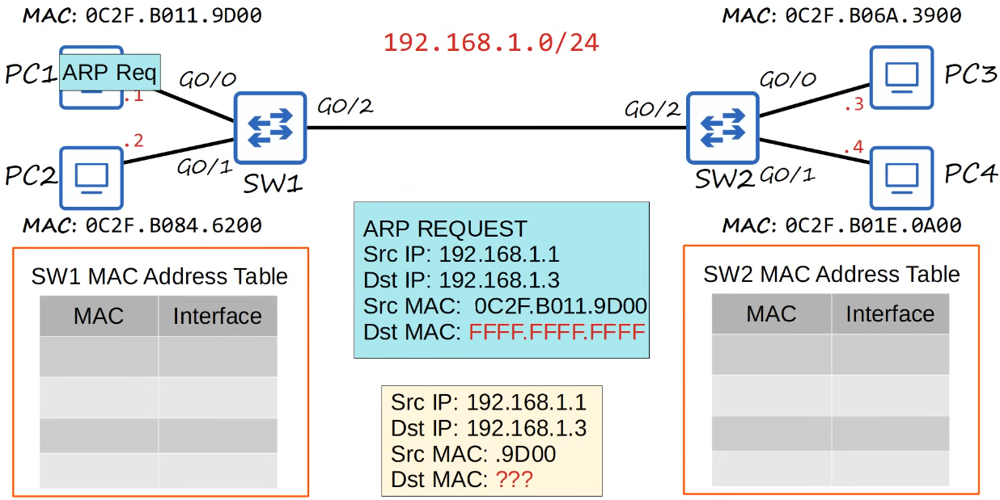
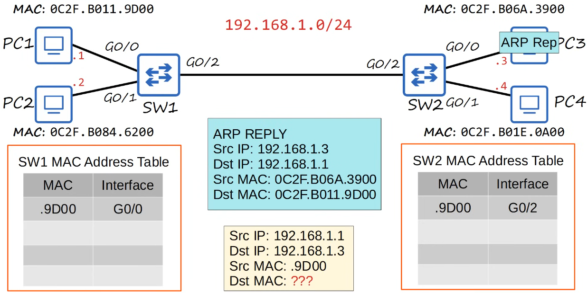
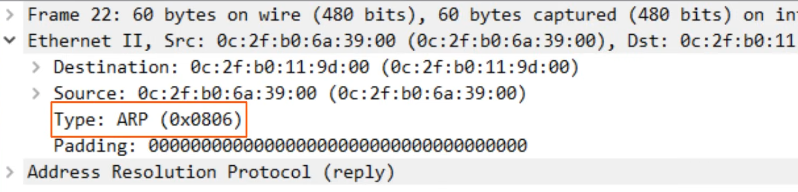

# ethernet lan switching 2

- [x] Done

## Ethernet Frame

Definitions

- The Preamble and SFD is usually not considered part of the Ethernet header
- The size of the Ethernet header and trailer is 18 bytes (6 - 6 - 2 - 4)
- The minimum size for an Ethernet frame (Header - Payload [Packet] - Trailer) is 64 bytes
- 64 bytes - 18 bytes (Header and trailer size) = 46 bytes
- Therefore the minimum payload (packet) size is 46 bytes
- If the payload is less than 46 bytes, padding bytes are added
  - Ie. 36-byte packet + 12-byte padding = 46 bytes
  - Ie. If you send 36 bytes, but the minimum Ethernet payload size is 46 bytes, so a series of padding bytes must be added to meet the minimum payload size


Note: The payload of an Ethernet frame may contain an IP packet, which includes IP addresses

## Ethernet LAN Switching


Note: PC1 wants to send this Ethernet frame to PC3, it has to learn PC3's MAC address &rarr; ARP

## Arp

Definitions

- Address Resolution Protocol
- ARP is used to discover the Layer 2 address (MAC address) of a known Layer 3 address (IP address)
- Consists of two messages
  - ARP Request: Broadcast message sent to all devices on the LAN asking "Who has this IP address?"
  - ARP Reply: Unicast message sent back to the requester with the MAC address associated with the IP address






### ARP Table

Definitions

- Use `arp -a` to view the ARP table (Windows, macOS, Linux)
- Internet address = IP address - Layer 3 address
- Physical address = MAC address - Layer 2 address
- Type static = default entry
- Type dynamic = learned via ARP


## Ping

Definitions

- A network utility used to test the reachability
- Measures round-trip time
- Uses two messages
  - ICMP Echo Request: Sent to the target host to request a reply
  - ICMP Echo Reply: Sent back to the requester to confirm reachability
- Command to use ping: `ping <ip-address>`


## Cisco Command

Commands

```txt
show mac address-table

clear mac address-table dynamic

clear mac address-table dynamic address <mac-address>

clear mac address-table dynamic interface <interface>
```

## Wireshark




## Summary

Flow

- If a device (e.g., PC1) wants to send data to another device (e.g., PC3) on the same LAN but does not know its MAC address, it will perform an ARP discovery first
- And then, once the MAC address is learned, it will send the actual data