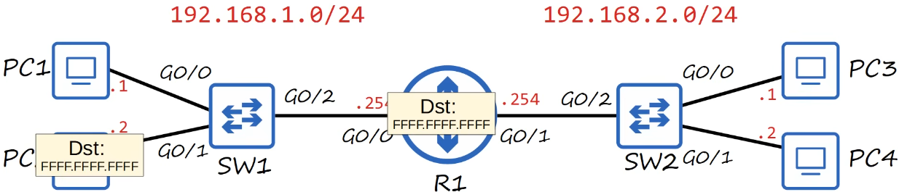
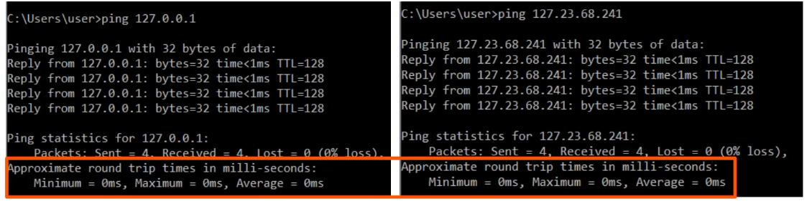
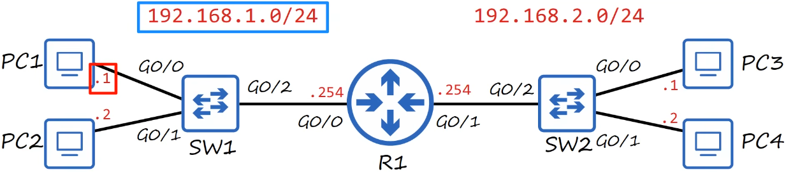
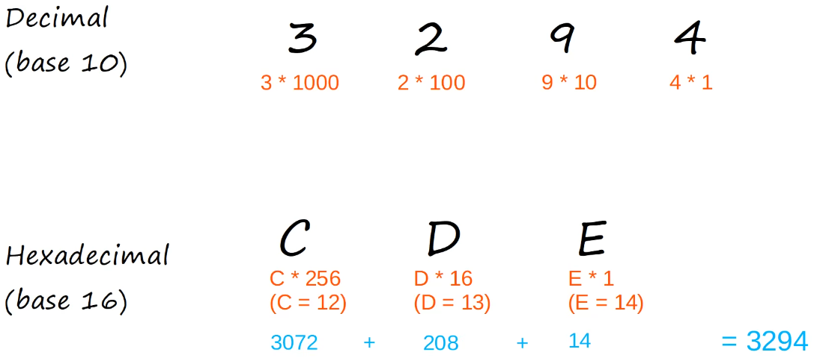
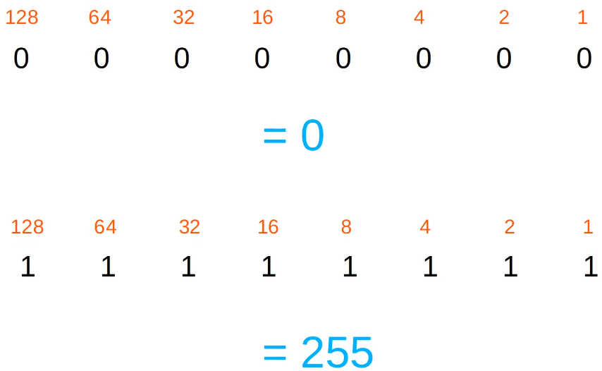
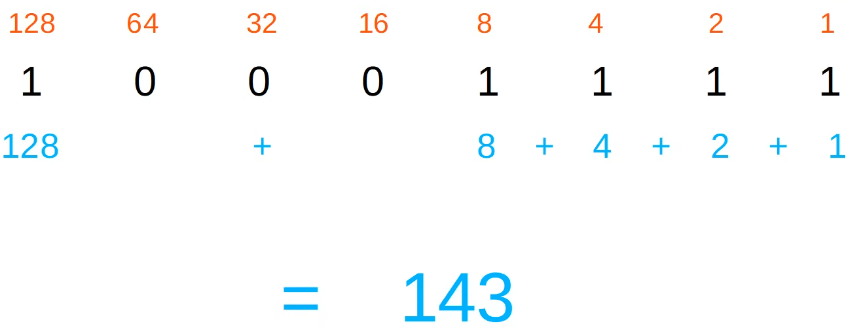

# ipv4 addressing 1

- [x] Done

## Routing

Note: The broadcast is limited to the local network, it does not cross the router and go to SW2, etc.

## IPv4 Address

### Network and Host Portion

Example: 154.78.111.32/16

- 4 octets
- First two octets are the network portion: 154.78
- Last two octets are the host portion: 111.32

### Classes

| Class | First octet  | First octet numeric range | Prefix Length | Network Number Bit Field | Rest Bit Field | Number of Networks | Addresses per Network          |
|-------|--------------|---------------------------|---------------|--------------------------|----------------|--------------------|--------------------------------|
| A     | 0xxxxxxx     | 0-127                     | /8            | 8 bits                   | 24 bits        | 2^7 = 128 (126 due to loopback)    | 2^24 = 16,777,216 (16,777,214) |
| B     | 10xxxxxx     | 128-191                   | /16           | 16 bits                  | 16 bits        | 2^14 = 16,384      | 2^16 = 65,536 (65,534)         |
| C     | 110xxxxx     | 192-223                   | /24           | 24 bits                  | 8 bits         | 2^21 = 2,097,152   | 2^8 = 256 (254)                |
| D     | 1110xxxx     | 224-239                   | Not applicable| Not applicable           | Not applicable | Multicast          | Multicast                      |
| E     | 1111xxxx     | 240-255                   | Not applicable| Not applicable           | Not applicable | Experimental       | Experimental                   |

Note

- Class A
  - Network 0.0.0.0 is a default route
  - Network 127.0.0.0 is a loopback address

Examples

- Class A: 12.128.251.34/8
- Class B: 154.78.111.32/16
- Class C: 192.168.1.254/24

### Loopback Addresses

Definitions

- Address range 127.0.0.0 - 127.255.255.255
- Used to test the network stack on the local device

### Netmask

Definitions

- Class A: /8 &rarr; 255.0..0.0
- Class B: /16 &rarr; 255.255.0.0
- Class C: /24 &rarr; 255.255.255.0

### Network Address

Definitions

- Used to identify the network itself (like a name of a road, not a specific house)
- Host portion of the address is all 0's - network address
- The network address cannot be assigned to a host

### Broadcast Address

Definitions

- Used to send messages to all devices connected to the same network at the same time (like a loudspeaker shouting "Send to all houses on street 192.168.1")
- Host portion of the address is all 1's - broadcast address
- The broadcast address cannot be assigned to a host

## Numeral System

### Decimal and Hexadecimal

### Binary

Note: 2^8 = 256 

### Binary to Decimal

### Decimal to Binary

