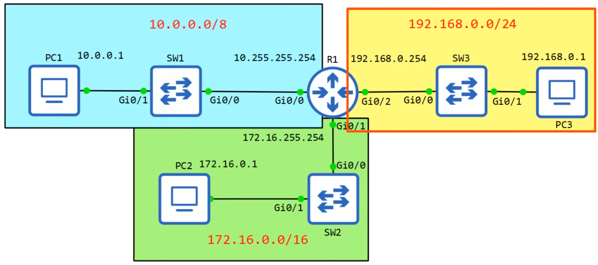

# ipv4 addressing 2

- [x] Done

## Maximum Hosts Per Network

Examples

- 192.168.1.0/24 &rarr; 192.168.1.255/24
  - Host portion: 8 bits = 2^8 = 256
  - Maximum hosts per network: 256 - 2 = 254
  - First usable address: 192.168.1.1
  - Last usable address: 192.168.1.254
- 172.16.0.0/16 &rarr; 172.16.255.255/16
  - Host portion: 8 bits = 2^16 = 65,536
  - Maximum hosts per network: 65,536 - 2 = 65,534
  - First usable address: 172.16.0.1
  - Last usable address: 172.16.255.254
- 10.0.0.0/8 &rarr; 10.255.255.255/8
  - Host portion: 8 bits = 2^24 = 16,777,216
  - Maximum hosts per network: 16,777,216 - 2 = 16,777,214
  - First usable address: 10.0.0.1
  - Last usable address: 10.255.255.254

Formula

- Maximum hosts per network = 2^n - 2
  - n: number of host bits

## Configure IP Addresses on Cisco Devices

Note

- administratively down: Interface has been disabled with shutdown command
  - This is the default status of Cisco router interfaces
- Cisco switch interfaces are not administratively down by default
- Status column refers to layer 1 status
- Protocol column refers to layer 2 status



R1 - 10.0.0.0/8

```txt
en
show ip interface brief
conf t
interface g0/0
description ## to SW1 ##
ip address 10.255.255.254 255.0.0.0
no shutdown
do show ip interface brief
```

R1 - 172.16.0.0/16

```txt
interface g0/1
description ## to SW2 ##
ip address 172.16.255.254 255.255.0.0
no shutdown
do show ip interface brief
```

R1 - 192.168.1.0/24

```txt
interface g0/2
description ## to SW3 ##
ip address 192.168.0.254 255.255.255.0
no shutdown
do show ip interface brief
```

Other commands

```txt
show interfaces g0/0
show interfaces description
```

## Exercise

Example 1: PC1 has an IP address of 43.109.23.12/8

- Network address: 43.0.0.0
- Maximum number of hosts per network: 16,777,214
- Broadcast address: 43.255.255.255
- First usable address: 43.1.0.0
- Last usable address: 43.254.255.254

Example 2: PC4 has an IP address of 129.221.23.13/16

- Network address: 129.221.0.0
- Maximum number of hosts per network: 65,534
- Broadcast address: 129.22.255.255
- First usable address: 129.221.0.1
- Last usable address: 129.221.255.254
