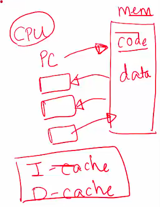
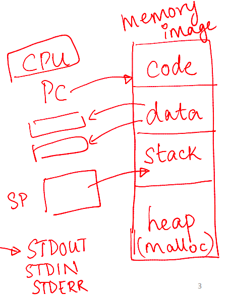
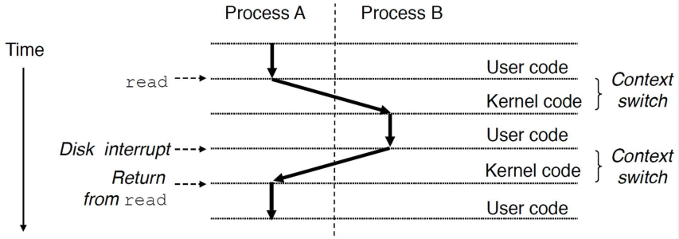
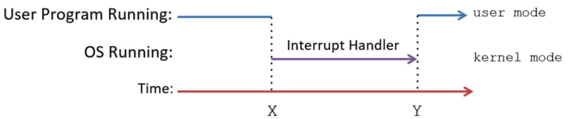
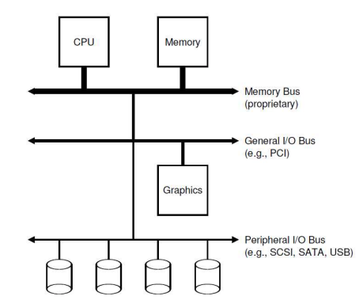
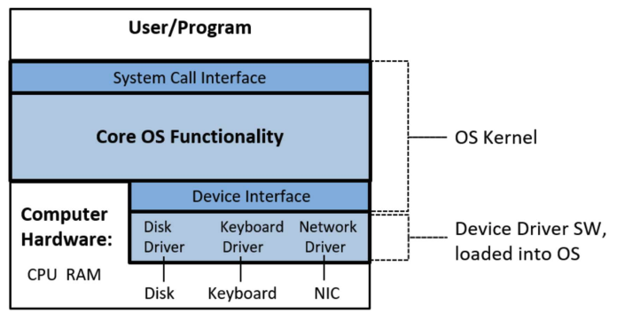

# intro

- [x] Done

## Computer System

Concepts: A computer system contains

- User software: User applications (browser, email client, games, application servers, databases, AI/ML algorithms, etc.)
- System software: Operating System (OS), etc.
- Hardware: CPU, memory, I/O devices, etc.

## Operating System?

Concepts

- Middleware between user software and hardware
  - Examples: Linux, Windows, MacOS
- Contains kernel and other programs
  - Kernel is the core functionality of the OS
  - Other programs: Shell, commands on shell, other utilities that help users interact with the OS

Functions

- Manages computer hardware: CPU, main memory, I/O devices (hard disk, network card, mouse, keyboard etc.)
  - User applications do not have to worry about the details of low-level hardware
  - Instead of having the application talk directly to the hardware (which is extremely complicated and dangreous), the OS provides a set of standardized API called system calls

Goals

- Abstracts the hardware by hiding the complex, low-level details of how physical components work underthehood
- Optimizes the use of the CPU, memory, and other resources by deciding which process gets to use which resources, and for how long
- Ensures separation between multiple processes. It means that one program should not crash/impact another program or the entire system

## Program

Concepts

- The executable file stored on disk
  - Contains code (CPU instructions) and data for a specific task
  - Icon (.app - already-complied package) contains Contents folder (executable file) and Resources (data)
- Processes is a running instance of a program that the OS has loaded into memory
  - A single program (like Google Chrome) can run as one or more processes to handle separate tasks (e.g., one process for the main UI, one for each tab)

### What Happens When You Run a Program?

Stage 1: Compilation

- A compiler translates high-level code into an executable file containing machine code (the 1s and 0s) and data
- The executable file (e.g., “a.out”) is created and stored on the hard disk

Stage 2: Loading - OS

- The OS creates a process and a record (Process Control Block) to keep track of its status
- The OS allocates a private virtual address space for the process
- The OS loader reads the executable file from disk and loads it into memory
- The OS allocates a stack for the process
- The OS initializes the CPU context
  - It sets the Program Counter (PC) to the virtual address of the program's entry point (the first instruction)
  - It sets the Stack Pointer (SP) to the top of the newly allocated stack
  - It initializes other registers
- The OS places the process in the ready queue

Stage 3: Execution - CPU

- The CPU fetches the instruction pointed by the PC from memory
- The CPU increments the PC to point to the next instruction
- The CPU decodes the instruction to figure out what operation needs to be done
- The CPU loads the data from memory into registers, if needed
- The CPU executes the instruction
- The CPU stores results back into a register or a memory location

## Terms

### CPU Virtualization

Context

- In the past, a computer could only run one program (process) at a time
- This created a slow and poor user experience. For example, you couldn't listen to music while browsing the web

Solution

- To fix this, we needed a way for one computer to run multiple programs at the same time
- The OS (Operating System) does this using a concept called CPU Virtualization. This relies on two key parts
  - The OS scheduler decides which program to run next and for how long
  - The OS performs a context switch, which means it quickly swaps different processes on and off the CPU
- This switching happens so fast that the OS creates an illusion that every program has its own dedicated CPU

Processes: How a context switch works

- The OS runs Program A for a short time
- It then pauses Program A and saves its current state (its execution context, like what it was doing)
- The OS loads the saved state of another program, Program B
- It runs Program B for a short time before switching again

### Memory Virtualization

Context: WWithout memory virtualization, every program would use the computer's physical RAM directly. This leads to two major issues

- A bug in one program could overwrite and corrupt the memory of another program, or even the OS itself. This could crash the whole computer
- One program could read or modify another program's private data, which is a huge security risk

Concepts: How a program sees memory

- Code: The program's instructions
- Data: Global and static variables
- Heap: For memory that is added as needed (it can grow)
- Stack: For function calls and local variables (it grows and shrinks)

Processes: Mapping

- The OS keeps a page table for each program. This table acts as a map
- This map translates the program's fake (virtual) addresses into the real (physical) addresses in RAM
- This guarantees that each program is kept completely separate and isolated

### Address Space of a Process

Concepts

- Virtual Address Space: This is the illusion of memory that the OS gives to every program. From the program's point of view, it has one large, clean block of memory all to itself, starting at address 0
- Physical Address: This is the real address of the data inside the computer's RAM chips. In reality, a program's data is stored in small chunks scattered all over the physical RAM

Functions

- The programmer only ever sees and uses virtual addresses. (For example, a pointer in your code shows a virtual address)
- When a program tries to access a virtual address, the OS steps in
- The OS's job is to translate that fake virtual address into the real physical address to retrieve the correct data
- This process, called memory virtualization, keeps every program completely separate and safe

### Isolation and Privilege Levels

Context

- When many programs run at the same time, we have to ask some important safety questions
  - How do we protect programs from one another?
  - Can one program mess up the code or data of another program?
  - How can the OS share the computer's hardware safely?
- The answer is found in mechanisms built directly into the CPU

Concepts: CPUs create isolation using different privilege levels

- Unprivileged instructions: These are regular, safe commands, like adding numbers or reading a program's own data
- Privileged instructions: These are sensitive, powerful commands that can affect the whole computer, like managing memory or accessing hardware
- Low privilege Level (e.g., Ring 3 / User Mode): A safe mode where the CPU is only allowed to run unprivileged instructions
- High privilege Level (e.g., Ring 0 / Kernel Mode): A powerful mode where the CPU can run both unprivileged and privileged instructions

### User Mode and Kernel Mode

Concepts

- User mode (Unprivileged)
  - This is the mode where your user programs (like a browser or game) run
  - The CPU is in a low-privilege state and will only execute unprivileged instructions
- Kernel mode (Privileged)
  - This is the mode where the Operating System (OS) runs
  - The CPU is in a high-privilege state and can execute all instructions, including the sensitive privileged ones

Processes: Switching modes

- The CPU must switch from user mode to kernel mode whenever the OS needs to take control. This happens for three main reasons
  - System calls: A user program asks the OS for a service (like opening a file)
  - Interrupts: An external hardware event needs the OS's attention (like a mouse click)
  - Program faults: A program has an error (like dividing by zero) and the OS needs to handle it
- After the OS finishes its work in kernel mode, it shifts the CPU back to user mode, and the original program continues running

### System Calls

Concept: When a user program needs a service from the Operating System (OS), it makes a system call

Examples

- A program makes a system call to read data from the hard disk
- The printf function in the C library is a common example. When you use printf, it invokes (calls) the real system call that writes text to the screen

Reasons

- Why do we need them? A normal user program is not allowed to run privileged instructions that access hardware directly
- This is a safety feature. It prevents one user's program from accidentally (or maliciously) harming another user's data or the whole system

Processes

- A user program asks the OS for a service by making a system call
- The CPU jumps from the user's code to the OS's code that handles that specific call
- After the OS finishes the task, the CPU returns back to the user's code right where it left off

Tip: Programmers usually don't make system calls directly. They use standard library functions (like printf) that handle the system call for them

### Interrupts

Context: Besides just running user programs, the CPU must also handle external events, like a mouse click or a key being pressed

Concept: An interrupt is an external signal from an I/O device (like a keyboard or hard drive) that is asking for the CPU's attention

Examples

- Interrupts stop the CPU from wasting time. Instead of a program waiting for the hard drive to find data, it can do other work
- When the hard drive finally has the data ready, it sends an interrupt signal to the CPU

### Interrupt Handling

Processes: How are interrupts handled?

- The CPU is busy running a program (Program P) when an interrupt signal arrives
- The CPU immediately saves the current state (the context) of Program P. It then switches to kernel mode to run the OS's interrupt handler code (for example, code to read the character from the keyboard)
- Once the OS is done, the CPU restores the saved state of Program P
- The CPU resumes running Program P in user mode as if nothing happened

Note: This interrupt handling code is a part of the OS. The CPU simply runs the OS's handler and then returns to the user's code

### I/O Devices

Concepts

- The CPU and memory are connected by a very fast system (or memory) bus
- I/O (Input/Output) devices (like keyboards, monitors, and hard drives) connect to the CPU and memory using other, separate buses
- The OS is responsible for managing all I/O devices on behalf of all the user programs

Functions: I/O devices have two main jobs

- Interface with the external world (e.g., keyboard, mouse, screen)
- Store user data persistently (e.g., hard drive, SSD)

### Device Controller and Device Driver

Concepts

- Every I/O device (like a keyboard or hard drive) is managed by a device controller
  - This controller is a small, specialized chip (a microcontroller) that knows how to operate the physical device
  - It communicates with the computer's CPU and memory over a bus
- To correctly talk to that specific controller, the computer needs special software called a device driver
  - This driver is part of the Operating System (OS)
  - It has all the device-specific knowledge needed to handle I/O operations for that one piece of hardware

Functions: The OS kernel uses the device driver to

- Initialize the I/O device when the computer starts up
- Start I/O operations by giving commands to the device (for example, telling a hard disk to read this block of data)
- Handle interrupts that come from the device (for example, when the hard disk sends a signal to say, I've finished reading that data and it's ready for you)

## Advices

### Why Study Operating Systems?

Reasons

- Knowledge of hardware (architecture) and system software (OS), and how user programs interact with these lower layers, is essential for writing high-performance, reliable user programs
- Key questions addressed by studying OS
  - What happens when you run a user program?
  - How can you make your program run faster and more efficiently?
  - How can you make your programs more secure, reliable, and tolerant to failures?
  - Why is your program running slowly, and how can you fix it?
  - How much CPU/memory is your program consuming, and why?
- OS expertise is one of the most critical skills for building high-performance, robust, and complex real-world systems

### Beyond OS to Real Systems and Future Courses

Summary

- Architecture + OS: Provides the foundation for understanding how a user program runs on a single machine
- Networking: Explores how programs communicate across machines
- Databases and data storage: Covers how applications store data efficiently and reliably across one or more machines
- Performance engineering: Focuses on making programs run faster
- Distributed systems: Examines how multiple applications across multiple machines work together to perform tasks reliably
- Other topics: Virtualization, cloud computing, security, etc.
