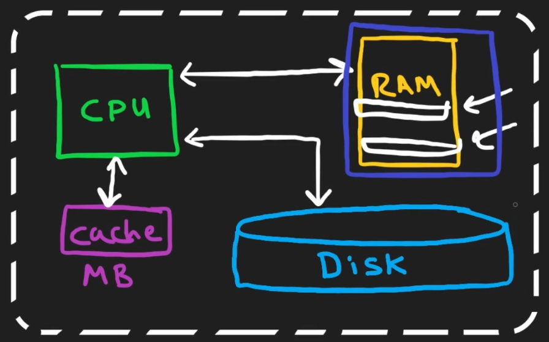
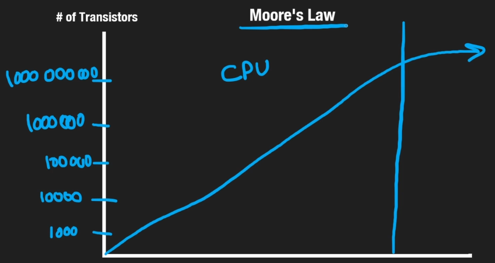

# computer architecture

- [x] Done

## Computer Basics

Definition: From a software point of view, a computer has a few main parts: the disk, memory (RAM), the processor (CPU), and the CPU's cache

## The Disk (Storage)

Definitions

- Known as storage, a hard disk drive (HDD), or a solid-state drive (SSD)
  - SSDs are generally faster than HDD
- Store data permanently
  - If you save a file to the disk and your computer crashes or restarts, the file will still be there when you turn it back on

Pros

- Non-volatility: That data is not lost when the computer loses power
- Capacity and cost: Disks can hold a lot of information usually measured in hundreds of gigabytes (GB) or even terabytes with a relatively low price

Cons

- Speed: Compared to RAM or CPU's cache, it is extremely slow for reading/accessing data

Applications

- When to use: Storing data that must not be lost and does not need to be accessed instantly. For example, operating system, applications, documents, photo, etc.
- Avoid: Storing data that requires frequent, extremely fast (low-latency) access. For example, temporary session information or data needed for real-time computations are better kept in RAM

## Memory (RAM)

Definitions

- Known as random access memory (RAM)
- Not to store data permanently
  - If your computer crashes, any data only stored in RAM will be lost

Pros

- Speed: RAM is incredibly fast - about 10 to 1,000 times faster than a disk. Accessing data from RAM takes microseconds (millionths of a second), while a disk takes milliseconds (thousandths of a second)

Cons

- Volatility: It cannot store data permanently and requires constant power to hold information
- Capacity and cost: RAM usually has less storage than a disk and it is much more expensive than disk storage, which is why computers have a limited amount of it

Applications

- When to use: RAM is perfect for tasks that need fast data access, such as caching layers (to speed up applications) or in-memory databases
- Trade-off: The main decision when using RAM is balancing cost versus performance. You pay more for its speed

## Cpu

Definitions

- The Central Processing Unit (CPU) is the brain of the computer
- It manages everything the other parts do
- The disk and RAM cannot talk each other directly, they need the CPU to move data between them

Functions

- Executing program
  - The code we write is converted into simple instructions (zeros and ones) that the CPU can understand
  - The CPU reads these instructions from RAM to run our programs
- Managing data
  - It reads and writes data to both RAM and the disk
  - It also uses RAM to store the data our code needs to work with, like variables.
- Performing calculations: It handles all the mathematical operations, such as addition and subtraction

## CPU Cache

Definitions

- The CPU cache is a small, extra-fast memory called a cache (belongs to the CPU)
- Hold copies of data from RAM that the CPU uses very often

Pros

- Speed: The cache is the fastest type of memory in a computer. Accessing data from it takes just nanoseconds (billionths of a second)
- Performance: When the CPU needs data, it checks the cache first. If the data is there, it can grab it quickly instead of waiting for the slower RAM. This makes the whole system run much faster

Cons

- Capacity: The cache is much smaller than RAM, typically measured in megabytes (MB)
- Volatility: Like RAM, the cache is not permanent. All data stored in it is lost if the computer loses power

## Limits

Context

- A single computer is a building block, but it has limits. To solve very big problems, we often need to combine many computers together
- One of the biggest limits is CPU speed
- For a long time, Moore's Law described how CPUs got exponentially faster, doubling in speed roughly every two years
- However, in the last 10 years or so, this trend has slowed down and CPU speeds are starting to level off. We can no longer count on a single CPU getting infinitely faster
