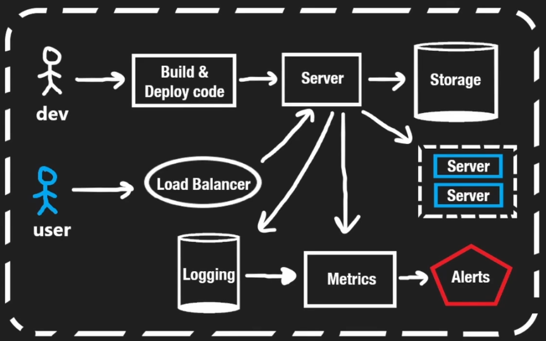
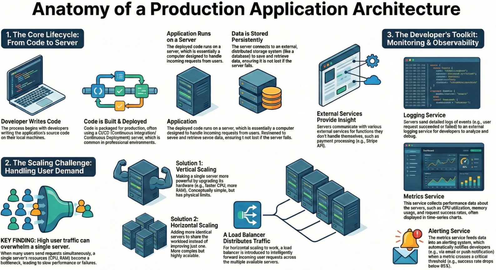

# application architecture

- [x] Done

## The Core Application Basics

Concepts

- Developer perspective: The architecture is viewed from the lens of a developer writing code that must eventually run on a server
- The server: At its simplest level, a server is just a computer that handles requests and serves users
- Deployment: Code does not go directly to a server, it goes through an intermediate build and deploy step
  - This can happen on a local machine or, more commonly in professional settings, on a CI/CD server
- User interaction
  - Users (usually via a browser) send requests to the server
  - Frontend: The server may respond with HTML and JavaScript to load a page
  - Backend: The browser may request data from an API, and the server responds with data (often in JSON format)

## Data Storage

Concepts

- Persistence: Servers need a way to store data permanently
- External storage: While a server has its own disk, it has limitations, so production apps use distributed storage connected over a network
  - This storage is often a database, but it can be any mechanism for storing information
  - These storage systems run on their own computers and may even be located in different parts of the world

## Scaling: Handling Growth

### Vertical Scaling

Concepts

- This involves making the single server better by upgrading its resources (e.g., a faster CPU, more RAM, or better hardware)
- Think of it as adding a "block" to the server to make it stronger

Limitation: Even the fastest hardware has limits and cannot handle infinite requests

### Horizontal Scaling

Concepts

- This involves creating multiple copies of the server to run the code
- Requests are spread across multiple servers, allowing the system to handle more traffic without making individual servers faster

### Load Balancing

Concepts

- When using horizontal scaling, a Load Balancer is required to decide which server receives a specific request
- It ensures traffic is balanced so one server isn't overwhelmed while others are idle

## External Communications

Concept: Servers rarely work in isolation, they communicate with other external servers and APIs

Example: An application might talk to the Stripe API to handle payments

## Observability (Logging & Monitoring)

Context: Developers need to know how the application is performing without manually checking the server

### Logging Service

Concepts

- Just as developers use print statements locally, servers generate logs to record what happens
- Because servers are transient or busy, these logs are sent to an external service for storage
- Developers review these logs to understand successful requests or diagnose problems

### Metrics Service

Concepts

- Logs don't show the full picture, so developers track resource usage (CPU, RAM, storage)
- Metrics can also be derived from logs (e.g., tracking the rate of failed vs. successful responses)
- These are usually visualized in time-series charts to show trends over time

### Alerting Service

Concepts

- Developers cannot watch charts 24/7 or wait for users to email them about bugs
- An alerting system pushes notifications immediately when specific metrics cross a threshold

Example: If successful requests drop from 100% to below 95%, the system automatically notifies the developer

## Infographics

