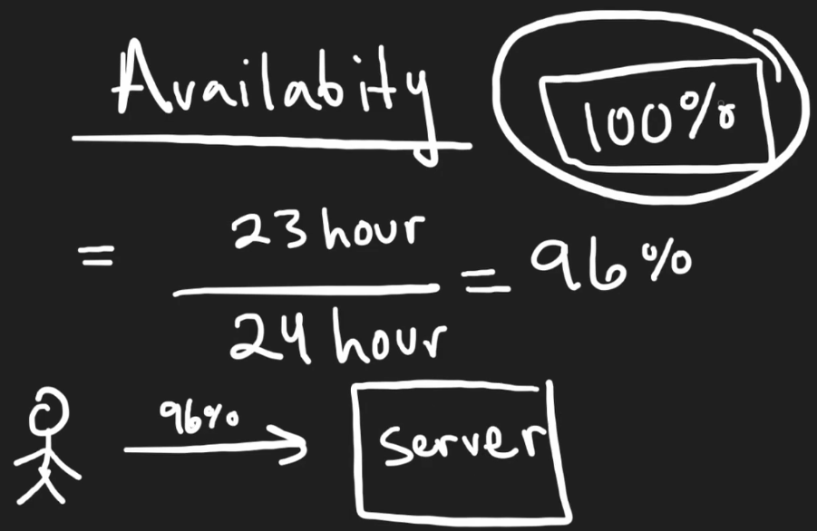
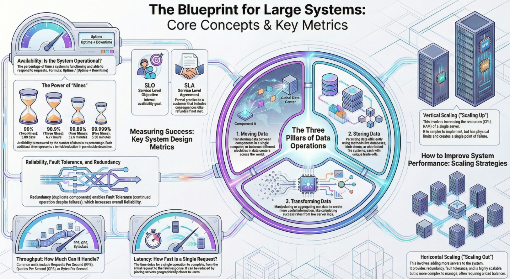

# design requirements

- [x] Done

## The Philosophy of System Design

Concepts

- Trade-offs: There is rarely a single correct answer or perfect solution in system design
- Analysis: It is not about memorizing facts, but about analyzing trade-offs to decide which option is better for a specific problem
- Goal: The objective is to design effective systems to solve very large problems

## The Three Core Data Operations

Context: At a high level, no matter how complex a system is, it boils down to three actions

### Moving Data

Concepts

- Data moves between components (RAM to CPU, CPU to Disk) or between machines across the world
- Moving data across networks and different data centers adds complexity compared to local movement

### Storing Data

Concepts

- Data can be stored in volatile memory (RAM) or persistent storage (Disk)
- Different storage methods (Databases, Blob stores, File systems) have different trade-offs
- Critical warning: Bad design choices in storage are very hard to correct later. Migrating data is much harder than refactoring code

### Transforming Data

Concept: This involves taking input data and manipulating it to get useful output

Example: Aggregating raw server logs to calculate the percentage of successful vs. failed requests

## Availability

Concept: The percentage of time a service is functioning and able to respond to requests

Formula: `Availability = uptime / (uptime + downtime)`

### The Nines

Concepts

- Availability is measured in nines
- 99% (Two Nines): Down for about 3.65 days per year. (Not very good for major businesses)
- 99.999% (Five Nines): Down for only about 5 minutes per year. (Very solid)

### SLO vs. SLA:

Concepts

- SLO (Service Level Objective): The internal goal developers set for the system (e.g., We want 99.999% uptime)
- SLA (Service Level Agreement): An agreement with the customer. If the SLO is not met, there are consequences, such as a partial refund

## Reliability, Redundancy, and Fault Tolerance

Concepts: These terms are often used interchangeably but have specific meanings regarding system failure

- Reliability: The probability that the system will not fail
  - Adding a second server increases reliability because if one fails, the other works
- Fault tolerance: The ability of a system to continue functioning even if a part of it fails
  - Redundancy: Having unnecessary copies of components (like a second server running the exact same code)
  - You don't need both to handle traffic, but the copy exists to take over in case of failure
- Single point of failure: A system with only one server is a single point of failure. If it crashes, the whole system dies

## Throughput

Concepts: Throughput measures how much work a system can handle over a period of time. It is measured in three main ways

- Requests Per Second (RPS): Used for servers. How many user requests can be handled concurrently?
- Queries Per Second (QPS): Used for databases. Conceptually similar to RPS but specific to reading/writing data
- Bytes per second: Used for data pipelines
  - Useful when processing massive data not tied to specific user requests (e.g., processing 1 Terabyte of logs)
  - Helps calculate how long a job will take (e.g., processing 1TB at 1GB/sec takes 1,000 seconds)

## Scaling Strategies

Context: To improve availability and throughput, you can scale the system

- Vertical scaling
  - Making the single server better (more RAM, better CPU)
  - Pros: Simple to design
  - Cons: Limited by hardware physics and remains a single point of failure
- Horizontal scaling
  - Adding more servers (copies) rather than making one server stronger
  - Pros: Increases reliability and redundancy; virtually unlimited scaling potential
  - Cons: More complex. Requires a Load Balancer to distribute traffic and makes database management harder (distributed data)

## Latency

Concepts

- The amount of time it takes for a single operation to complete (e.g., 1 second for a page to load)
- Throughput vs. latency
  - Throughput = How many requests per second
  - Latency = How fast is one request
- Reducing latency
  - Caching: Storing data in faster storage. Reading from Cache (nanoseconds) is orders of magnitude faster than RAM (microseconds)
  - Geography: Distance matters. A user on the other side of the world experiences high latency
  - Solution: Place servers in different parts of the world so users connect to a server physically closer to them

## Infographics

