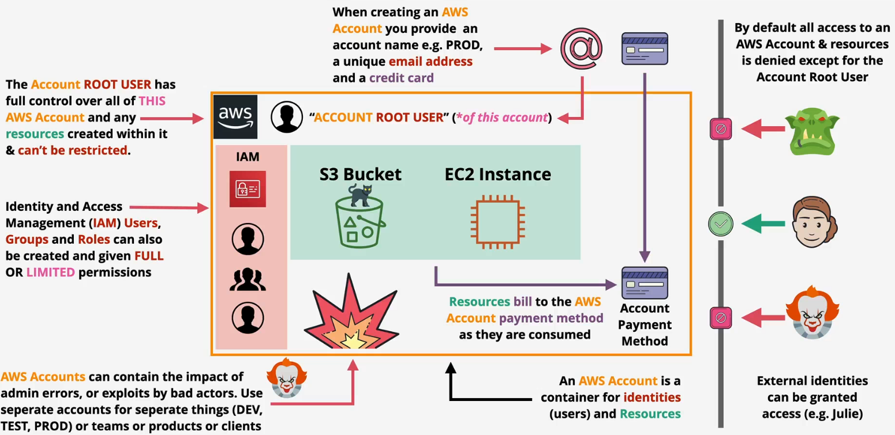
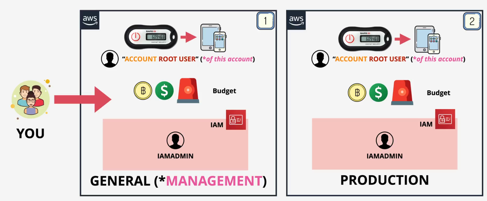
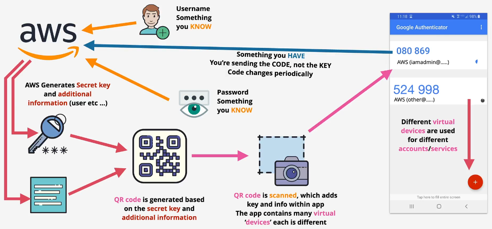
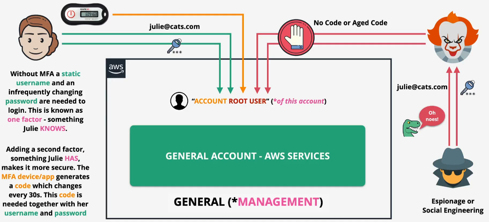

# aws accounts

## Basics

## How to Create an Account

Two root accounts

Create multiple accounts

- All unique emails, no pre-setup required

## How to Setup MFA

We only usernames and passwords - if leaked, anyone can be you!

Factors - different pieces of evidence which prove identity

- Knowledge - Something you know, usernames, passwords
- Possession - Something you have, bank card, MFA device/app
- Inherent - Something you are, fingerprint, face, voice, or iris
- Location - A location (physical), which network (corp or wifi)

More factors means more security and harder to fake

- But we should balance between convenience and security

## How to Create a Budget

Billing Dashboards &rarr; Billing Preferences

Billing Dashboards &rarr; Budgets &rarr; Create a budget
