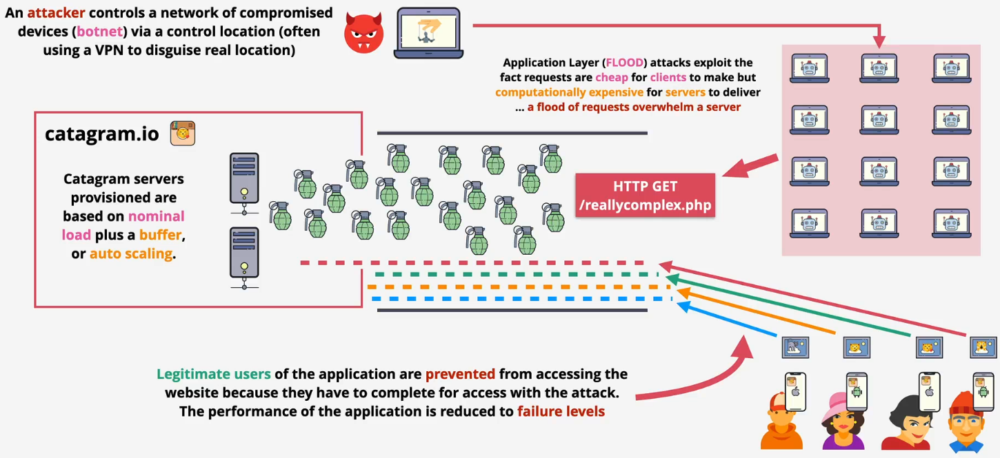
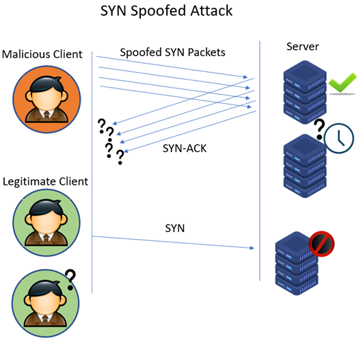
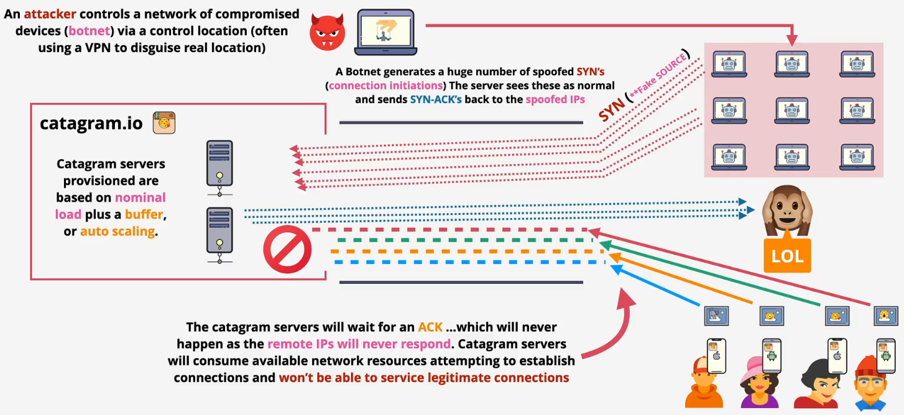
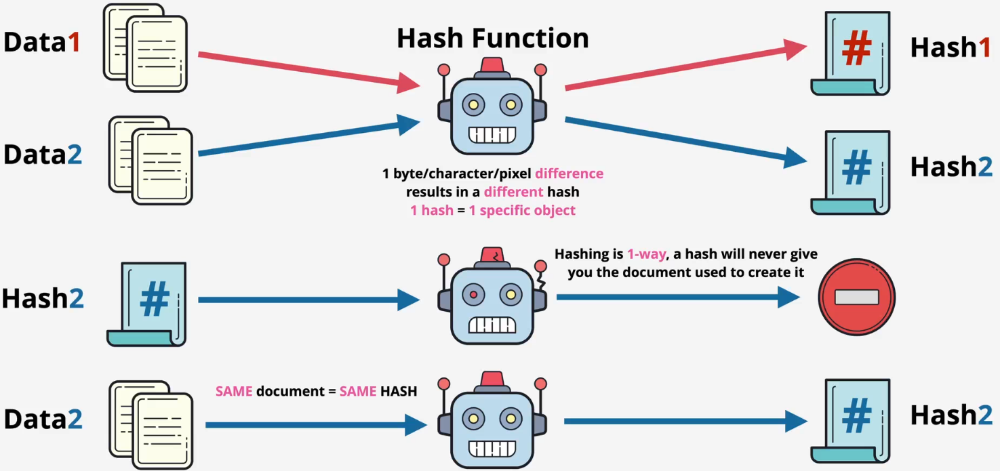
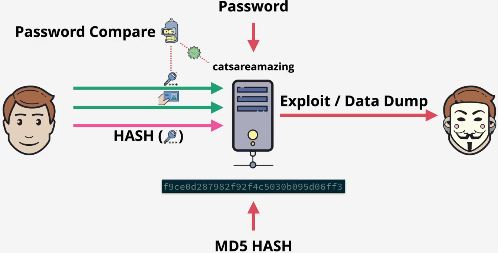
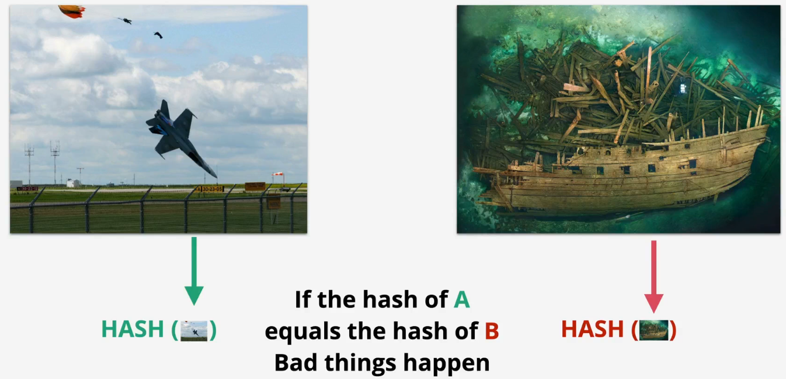

# security

## DDoS

What it is?

- Attacks designed to overload websites
- Compete against legitimate connections
- Distributed - hard to block individual IPs/Ranges
- Often involve large armies of compromised machines - botnets

Category

- Application layer - HTTP flood
  - Sending a massive number of seemingly legitimate requests, such as repeated asking for a webpage or trying to log in
  - The goal is to exhaust the server's resources (like CPI and memory), causing it to crash or become too slow to server actual users
- Protocol attack - SNYK flood
  - Sending a flood of "SNY" requests to a server to initiate a connection but never completes the process. The server is left waiting for a response that never arrives
  - Eventually, the server runs out of available spots to hold for new connections and legitimate users are blocked from connecting
- Volumetric - DNS amplification
  - Sending small requests to public DNS servers but spoofs the return address to be the victim's IP address

Cases

- Normal


- Application layer



- Protocol attack






- Volumetric


## SSL and TLS

What is it?

- SSL - Secure Sockets Layer and TLS - Transport Layer Security
- TLS is a newer and more secure version of SSL
- Provide privacy and data integrity between client and server
  - Privacy: Communications are encrypted. It could be asymmetric and then symmetric
- Identity (server of client/server) verified
- Reliable connection: Protect against alteration

Architecture

- Server certificate issuance flow
  - Generate a key pair: The server owner creates a public key (which will be shared) and a private key (which is kept secret)
  - Create a CSR: They create a Certificate Signing Request (CSR). This is essentially an application form that includes the public key and identifying information (like the domain name)
  - Submit to the CA: The CSR is sent to a trusted Certificate Authority (CA)
  - CA verifies ownership: The CA performs validation to ensure the applicant actually owns the domain they're requesting the certificate for
  - CA signs and issues the certificate: Once verified, the CA uses its own private key to digitally sign the CSR. This act of signing officially creates the SSL certificate
  - Certificate is returned: The final, signed certificate—which now contains the server's public key and the CA's trusted signature—is sent back to the owner
  - Install on server: The owner installs this new certificate and their original private key on the web server, making it ready to accept secure connections
- Phase 3: Exchange
  - The client generates a pre-master secret and encrypts it using the server's public key
  - The server decrypts the encrypted pre-master secret using its private key
  - Both sides use the shared pre-master secret to generate a master secret. This is then used to create the session keys, which encrypt and decrypt all application data (like your browsing activity) for the rest of the session


## Hashing

What is it?

- Data + Hashing function &rarr; Hash
- You cannot get the original data from a hash
- Same data = same hash
- Different data = different hash
- Downloaded data can be verified by using hash
  - You can take data, hash it, and compare the hashesfa
  - If so, the downloaded data is unaltered



How it works?

- When you create an account
  - The server takes your password
  - It scrambles it into a unique code called a hash using a special function
  - Crucially, it only saves this hash, not your actual password
- When you log in
  - You enter the password
  - The server takes what you just typed and scrambles it into a new hash using the exact same function
  - It then compares the new hash to the hash it has stored
- The result
  - If the two hashes match, you are logged in
  - If they do not match, access is denied



Weakness - collision



```bash
ls
plane.jpg ship.jpg

md5 plane.jpg
MD5 (plane.jpg) = 253dd04e87492e4fc3471de5e776bc3d

md5 plane.jpg
MD5 (plane.jpg) = 253dd04e87492e4fc3471de5e776bc3d

md5 ship.jpg
MD5 (ship.jpg) = 253dd04e87492e4fc3471de5e776bc3d

shasum -a 256 plane.jpg
91e34644af1e6c36166e1a69d915d8ed5dbb43ffd62435e70059bc76a742daa6  plane.jpg

shasum -a 256 ship.jpg
caf110e4aebe1fe7acef6da946a2bac9d51edcd47a987e311599c7c1c92e3abd  ship.jpg
```

## Digital Signatures
