# security

- [x] Done

## Distributed Denial of Service (DDoS)

Concepts

- Attacks designed to overload websites
- Compete against legitimate connections
- Distributed - hard to block individual IPs/ranges
- Often involve large armies of compromised machines - botnets

Categories

- Application layer - HTTP flood
  - Sending a massive number of seemingly legitimate requests, such as repeated asking for a webpage or trying to log in
  - The goal is to exhaust the server's resources (like CPU and memory), causing it to crash or become too slow to server actual users
- Protocol attack - SNYK flood
  - Sending a flood of "SNY" requests to a server to initiate a connection but never completes the process. The server is left waiting for a response that never arrives
  - Eventually, the server runs out of available spots to hold for new connections and legitimate users are blocked from connecting
- Volumetric - DNS amplification
  - Sending small requests to public DNS servers but spoofs the return address to be the victim's IP address

Scenarios

- Normal

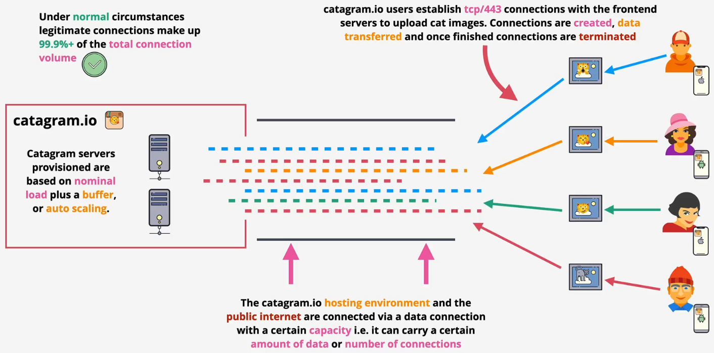

- Application layer


- Protocol attack


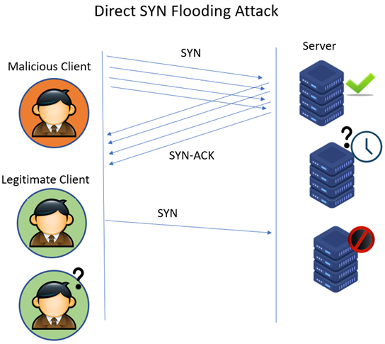


- Volumetric

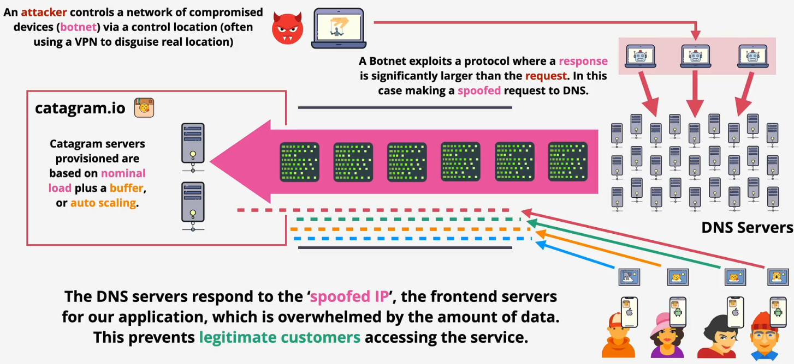

## SSL and TLS - Later 40

Concepts

- SSL - Secure Sockets Layer and TLS - Transport Layer Security
- TLS is a newer and more secure version of SSL
- Provide privacy and data integrity between client and server
  - Privacy: Communications are encrypted. It could be asymmetric and then symmetric
- Identity (server of client/server) verified
- Reliable connection: Protect against alteration

Architecture

- Server certificate issuance flow
  - Generate a key pair: The server owner creates a public key (which will be shared) and a private key (which is kept secret)
  - Create a CSR: They create a Certificate Signing Request (CSR). This is essentially an application form that includes the public key and identifying information (like the domain name)
  - Submit to the CA: The CSR is sent to a trusted Certificate Authority (CA)
  - CA verifies ownership: The CA performs validation to ensure the applicant actually owns the domain they're requesting the certificate for
  - CA signs and issues the certificate: Once verified, the CA uses its own private key to digitally sign the CSR. This act of signing officially creates the SSL certificate
  - Certificate is returned: The final, signed certificate—which now contains the server's public key and the CA's trusted signature—is sent back to the owner
  - Install on server: The owner installs this new certificate and their original private key on the web server, making it ready to accept secure connections
- Phase 3: Exchange
  - The client generates a pre-master secret and encrypts it using the server's public key
  - The server decrypts the encrypted pre-master secret using its private key
  - Both sides use the shared pre-master secret to generate a master secret. This is then used to create the session keys, which encrypt and decrypt all application data (like your browsing activity) for the rest of the session

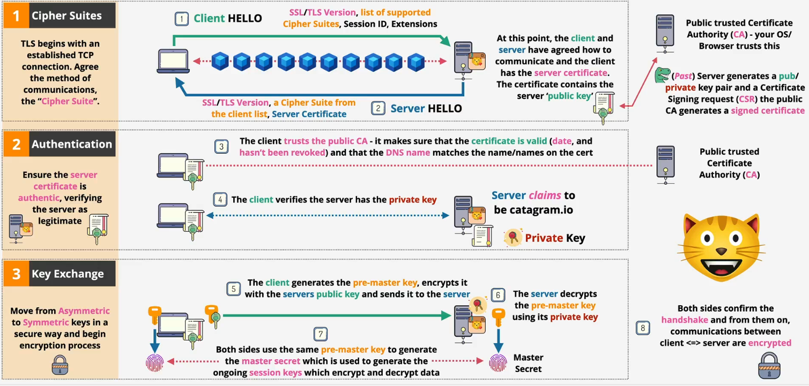

## Hashing - Later 41

Concepts

- Data + Hashing function &rarr; Hash
- You cannot get the original data from a hash
- Same data = same hash
- Different data = different hash
- Downloaded data can be verified by using hash
  - You can take data, hash it, and compare the hashesfa
  - If so, the downloaded data is unaltered


How it works?

- When you create an account
  - The server takes your password
  - It scrambles it into a unique code called a hash using a special function
  - Crucially, it only saves this hash, not your actual password
- When you log in
  - You enter the password
  - The server takes what you just typed and scrambles it into a new hash using the exact same function
  - It then compares the new hash to the hash it has stored
- The result
  - If the two hashes match, you are logged in
  - If they do not match, access is denied


Weakness - collision


```bash
ls
plane.jpg ship.jpg

md5 plane.jpg
MD5 (plane.jpg) = 253dd04e87492e4fc3471de5e776bc3d

md5 plane.jpg
MD5 (plane.jpg) = 253dd04e87492e4fc3471de5e776bc3d

md5 ship.jpg
MD5 (ship.jpg) = 253dd04e87492e4fc3471de5e776bc3d

shasum -a 256 plane.jpg
91e34644af1e6c36166e1a69d915d8ed5dbb43ffd62435e70059bc76a742daa6  plane.jpg

shasum -a 256 ship.jpg
caf110e4aebe1fe7acef6da946a2bac9d51edcd47a987e311599c7c1c92e3abd  ship.jpg
```

## Digital Signatures - Not yet for econcepts only 

Concepts

- Verifies integrity (what) and authenticity (who)
- Hash of the data is taken, original data remains unaltered (integrity)
- Th

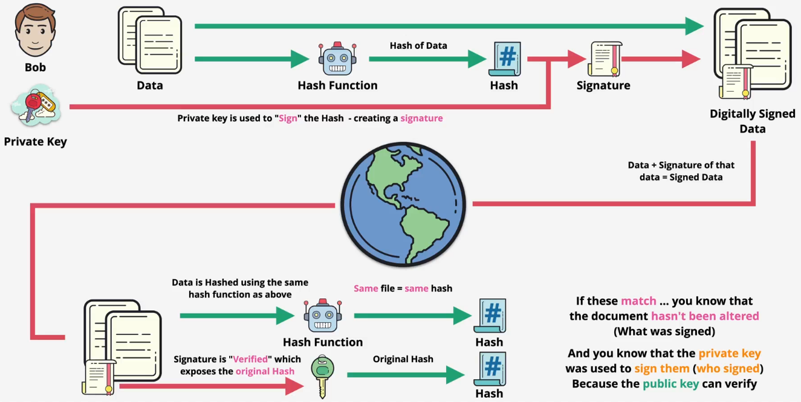

Examples

- Bob generates his keys

```bash
# Private key
openssl genpkey -algorithm RSA -out bob_private.key

# Public key
openssl pkey -in bob_private.key -pubout -out bob_public.key
```

- Bob creates the document

```bash
# Create the document
echo -n "This is the original contract for Alice." > contract.txt
```

- Bob signs the document
  - Step 1: It computes its SHA-256 hash you just saw
  - Step 2: It signs that hash using private key

```bash
# View the document's hash
openssl dgst -sha256 contract.txt
--
SHA2-256(contract.txt)= 619792db98756329d996ae8d6b246b4268281277fe6da170ed24f7bbdb88fc86

# Sign the document's hash using private key
openssl dgst -sha256 -sign bob_private.key -out contract.signature contract.txt
```

- Bob sends the original document, the digital signature, and the the public key to Alice
- Alice verifies the document using the digital signature and Bob's public key
  - Step 1: The public key's algorithm unlicks the signature to get the hash
  - Step 2: The function will hash the original file
  - Step 3: Compare two hashes

```bash
openssl dgst -sha256 -verify bob_public.key -signature contract.signature contract.txt
--
Verified OK
```

- What if the data is altered?

```bash
# Create a modified file
echo "This is the original contract for EVE." > contract_modified.txt

# Verify the modified file
openssl dgst -sha256 -verify bob_public.key -signature contract.signature contract_modified.txt
--
Verification failure
402773E06C710000:error:02000068:rsa routines:ossl_rsa_verify:bad signature:../crypto/rsa/rsa_sign.c:442:
402773E06C710000:error:1C880004:Provider routines:rsa_verify_directly:RSA lib:../providers/implementations/signature/rsa_sig.c:1041:
```

## Domain Name System (DNS)

### Basics - Done

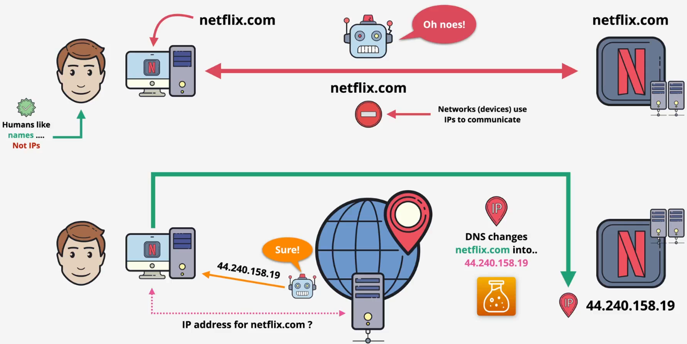

### Architectures - Done

Context: One server creates many issues

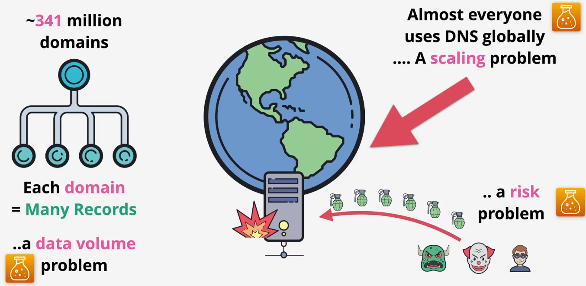

Terms

- DNS zone: A database (e.g., *.netflix.com) containing records
- Zonefile: The file storing the zone on disk
- Name Server (NS): A DNS server which hosts one or more zones and stores one or more zonefiles
- Authoritative contains real/genuine records
- Non-authoritative/cached: Copies of records/zones stored elsewhere to speed things up

Hierarchical design

- The DNS root
  - This is the root of the entire DNS system, which every DNS client knows about and trusts
  - It is hosted on root servers
    - There are 13 root server IP addresses
    - These are operated by various independent organizations(like ICANN, NASA, etc.) to ensure the system is resilient
  - The data inside the root zone is managed by IANA (Internet Assigned Numbers Authority)
  - The root zone does not store much data. Its main job is to store the locations of the Top-Level Domain (TLD) servers
  - Example: The root knows where to find the name servers for .com
- The TLD servers
  - TLD stands for Top-Level Domain
  - There are two main types
    - Generic TLDs (gTLDs): like .com, .org, .net
    - Country Code TLDs (ccTLDs): like .uk, .au
  - IANA delegates the management of each TLD to a specific organization called a Registry. For instance, an organization called Verisign is the registry for .com
  - The TLD zone does not contain specific records like <www.netflix.com>
  - Its main job is to point to the name servers for a specific domain within its category
  - Example: The .com TLD server knows where to find the name servers for netflix.com
- The Domain's Name servers
  - The authoritative source of truth for a specific domain (like netflix.com)
  - This is controlled by the domain owner (e.g., the IT team at Netflix)
  - These name servers host the zone file for that domain
  - This zone file is where the actual records are stored
  - Example: The netflix.com name servers store the record for <www.netflix.com> that points to a specific IP address
- Flow summary: Root server knows where &rarr; .com server is, which knows where &rarr; netflix.com server is, which knows &rarr; the IP address for <www.netflix.com>

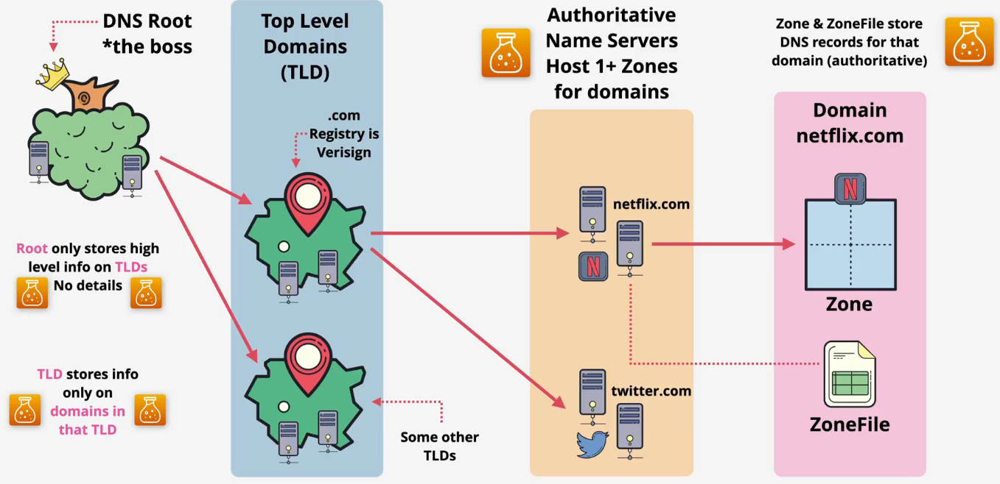

### Functions

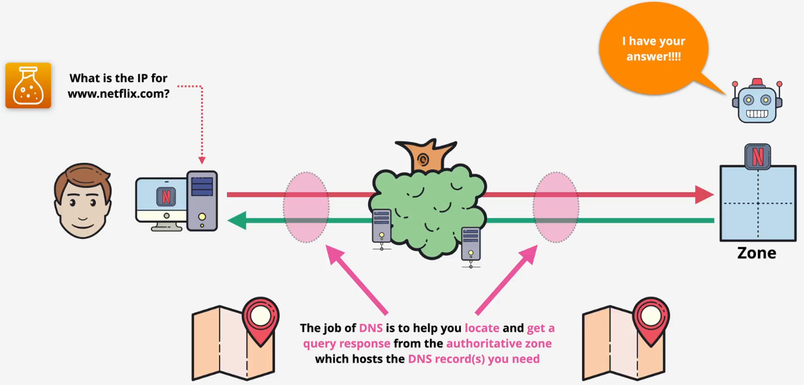

DNS query flow

- Checking flow
  - The local machine
    - Your computer first checks its own local files to see if it already knows the IP address
    - It checks the hosts file, which is a static map
    - It then checks its local DNS cache
  - The DNS resolver
    - If the answer is not found locally, your computer sends the query to a DNS resolver. This is usually your home router or your Internet Service Provider (ISP)
    - The resolver also checks its own cache first. If another user recently asked for the same address, the resolver returns the cached (non-authoritative) answer immediately, and the process stops here
- Full query if there is no answer
  - Root servers
    - The resolver queries a root server
    - The root server doesn't know the IP for <www.netflix.com>, but it knows where the .com servers are
    - Response: It replies with the addresses of the .com TLD name servers
  - TLD servers (.com)
    - The resolver then queries a .com TLD name Server
    - The .com server doesn't know the final IP, but it knows which name servers are in charge of netflix.com
    - Response: It replies with the addresses of the netflix.com name servers
  - Authoritative server (netflix.com)
    - The resolver queries one of the netflix.com name servers
    - This server is authoritative for the netflix.com zone and hosts its zone file
    - Response: It looks up the record for www and returns the final, authoritative answer (the IP address) back to the resolver
  - Final
    - The resolver caches the answer to speed up future requests
    - It sends the final answer (the IP address) back to your computer

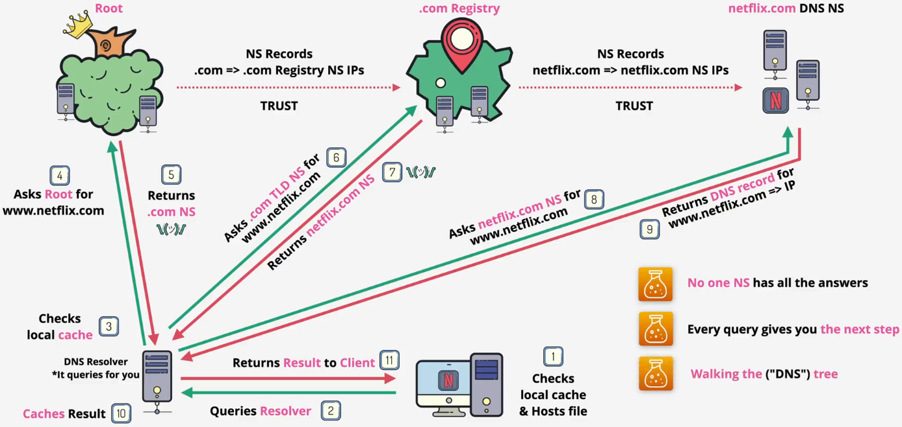

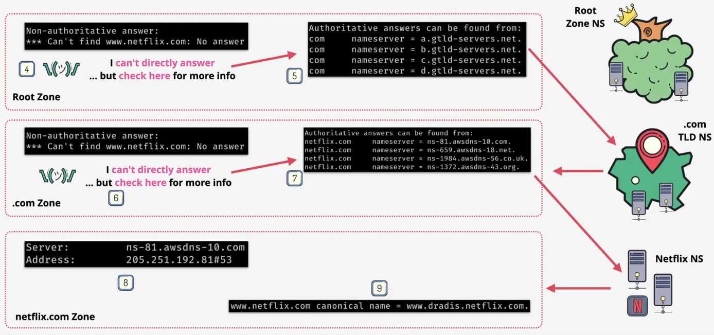

## Domain Name System (DNS) - 50
