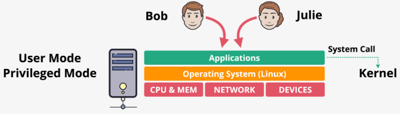
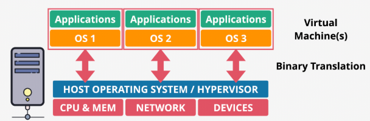
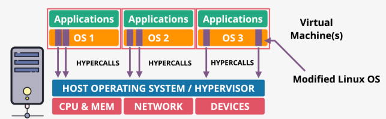
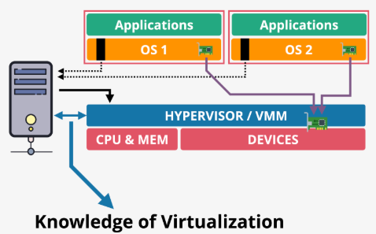
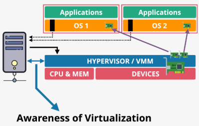
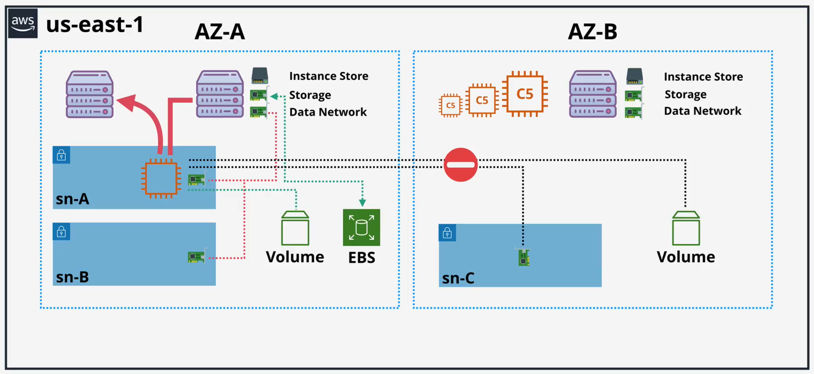
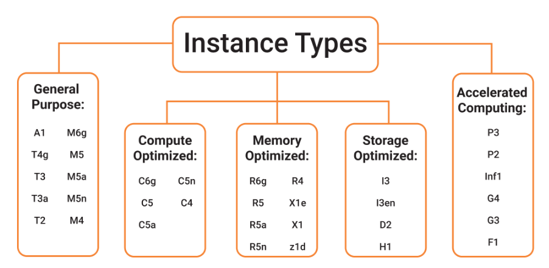
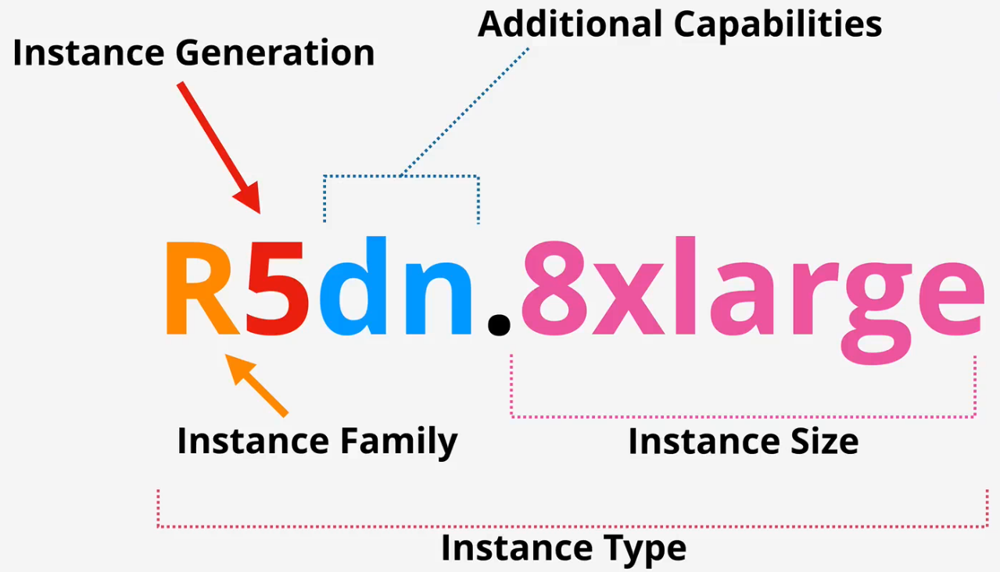

# fundamentals

## Virtualization

Overview

- Allows a single physical server to run multiple, isolated OSs simultaneously
- Hypervisor: The core software layer that creates and manages multiple VMs
- Sits between the hardware and the guest OSs

Types of virtualization

- Emulated virtualization - Deception
  - Guest OSs are unmodified, believing they run on real hardware, but the hypervisor emulates (provide fake/virtual) resources (CPU, memory, disk, network)
  - When the guest OS tries to execute a privileged instruction, the hypervisor intercepts the call via binary translation (intercept - analyze - translate - execute) on behalf of the guest OS
  - Both privileged and non-privileged instructions are processed by the hypervisor before running on CPU
  - The constant interception and software translation process is extremely slow and creates significant overhead

- Para virtualization - Cooperation
  - Guest OS is aware that it is being virtualized and actively cooperates with the hypervisor
  - Guest OSs are modified (the source code of the OS is modified) to communicate with the hypervisor via hypercalls, instead of making privileged hardware calls
  - Non-privileged instructions run directly on the CPU. For privileged instructions, the guest OS makes direct hypercalls to the hypervisor to run on CPU
  - Communication is direct and optimized, resulting in very little overhead and better performance

- Hardware assisted virtualization - Delegation
  - Both privileged and non-privileged instructions are sent directly to the CPU
  - When the Guest OS needs to execute a privileged instruction, the CPU hardware will automatically trap the instruction and transfer control to the Hypervisor to handle the request

SR-IOV

- Allows a single physical device (e.g. a 10GbE network card) to split itself into multiple smaller, independent virtual devices
- Each of these virtual devices can be directly assigned to a VM
- Delivers a better network speed and latency in a virtualized environment

## Architecture

Hierarchy

- An AWS Region contains multiple Availability Zones (AZs)
- Each AZ contains physical servers (EC2 Hosts) within isolated data centers
- Virtual machines (EC2 Instances) run on these hosts inside specific network ranges called Subnets

Instance store: This is high-performance, temporary storage physically attached to the host machine

- Ephemeral: Data is permanently lost if the instance is stopped, terminated, or if the underlying host fails
- Use case: Ideal for temporary data, caches, or buffers

EBS (Elastic Block Store): This is persistent, network-attached storage

- Persistent: Data survives instance stop/termination. The volume can be detached and reattached to another instance
- AZ-Locked: An EBS volume can only be attached to an instance in the same Availability Zone
- Use case: Data for OS, database, application source code, user data, etc.

Key rules

- Instance store data loss: Any action that might move an instance to a new physical host (like an instance stop/start or a host failure) will cause all data on the Instance Store to be lost. A simple reboot, however, does not lose data
- EBS is AZ-Bound: You cannot attach an EBS volume from one AZ (e.g., AZ-A) to an instance in another AZ (e.g., AZ-B)

What's EC2 good for?

- Traditional OS and application compute
- Long-running compute
- Server style applications are either burst or steady-state load
- Monolithic application stacks
- Migrated application workloads or disaster recovery

## Instance Types

Considerations

- Raw CPU, memory, local storage capacity and type
- Resource ratios
- Storage and data network bandwidth
- System architecture or vendor
- Additional features and capabilities

Categories

- General purpose: Diverse workloads, equal resource ratio
- Compute optimized: Media processing, HPC, scientific modelling, gaming, machine learning
- Memory optimized: Processing large in-memory datasets, some database workloads
- Accelerated computing: Hardware GPU, field programmable gate arrays (FPGAs)
- Storage optimized: Sequential and random IO - scale-out transactional databases, data warehousing, Elasticsearch, analytics workloads

Decoding EC2 types

## EC2 Instance Connect

Concepts

- A managed AWS service that provides secure, browser-based SSH access to your instances
- Not an EC2 instance or a traditional bastion host, it's a serverless endpoint
- Acts as a secure proxy for your SSH session

How it works

- Authorization: It first uses IAM to verify that you have permission to connect
- Temporary key: It generates a one-time-use SSH key pair and pushes the public key to your instance. This key is only valid for 60 seconds
- Connection: The AWS service (not your computer) then initiates the SSH connection to your instance using the temporary key

Flow

- Your browser sends your typed commands to the AWS service over a standard secure web connection (HTTPS)
- The AWS service then forwards those commands to your instance using a normal SSH connection
