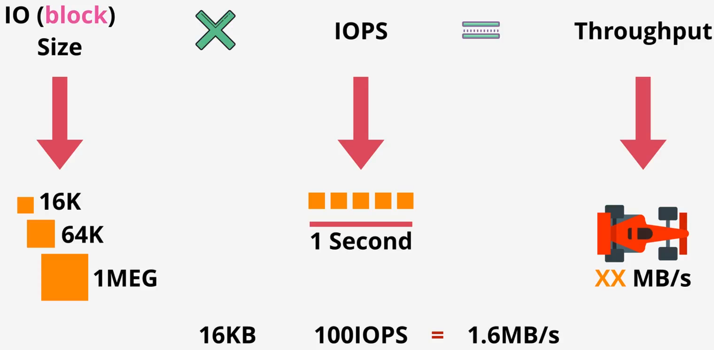
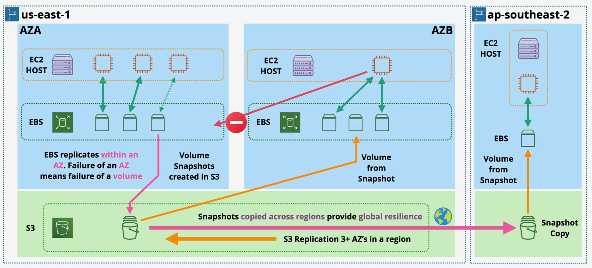
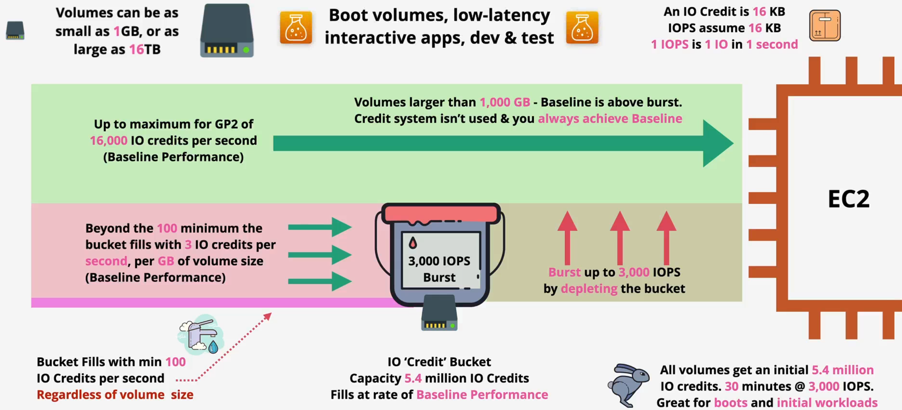
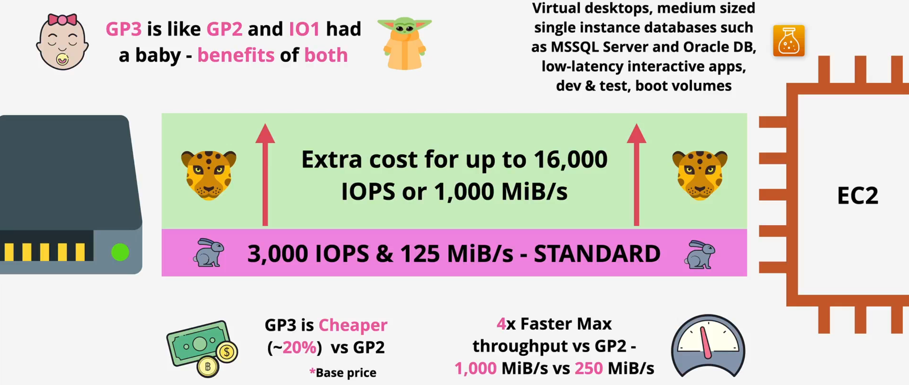
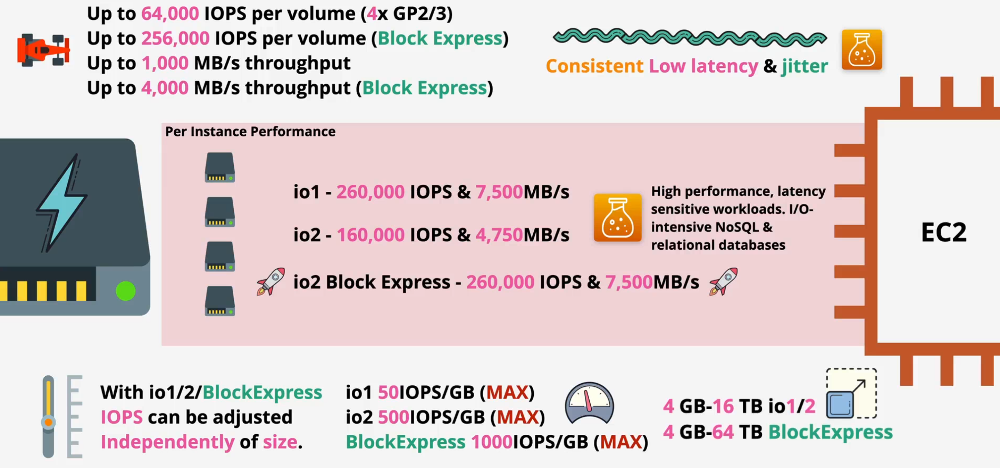
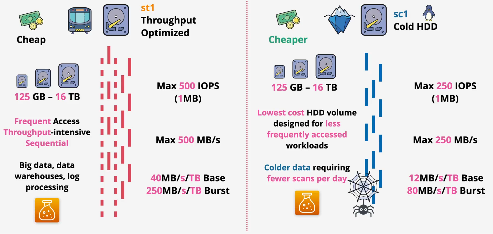

# storage

## Refresher

Key terms

- Direct Attached Storage (DAS)
  - A storage device that is directly connected to the server or computer
  - If the disk, hardware fails, or the instance moves between hosts, the storage can be lost
- Network Attached Storage (NAS)
  - A storage device connected to a network, allowing multiple users and devices on that network to access the data from a central location
  - In on-premises environments, this uses protocols: iSCSI or FIBR channel
- Ephemeral means temporary or short-lived
  - The storage is non-persistent, meaning the data stored on it is lost when the associated server instance is stopped or terminated
  - Designed for temporary files, caches, or data that can be easily recreated
- Persistent storage is durable and lives independently from the compute instance
  - Data written to persistent storage remains intact even if the server is stopped, restarted, or terminated
- Designed for databases, user files, application data, and any information that must not be lost

Types

- Block storage - EBS
  - What is it?
    - A virtual hard drive (HDD, SSD)
    - Divides data into a collection of raw, fixed-size blocks, each with unique identifier
  - How it works?
    - Attach the virtual hard drive to the EC2 instance
    - The storage is presented to an operating system (OS) as a raw block device. The OS can then partition and format this device with a file system (e.g., ext4, XFS, NTFS) and manage data I/O
  - Key features
    - Performance: Characterized by low latency and high I/O Operations Per Second (IOPS). Performance is provisionable based on the selected EBS volume type (e.g., gp3, io2 Block Express)
    - Data structure: Unstructured blocks of data
    - Access Model: Typically single-host attachment, providing dedicated bandwidth and performance
    - Mountable: Yes. An EBS volume is mountable by the operating system of a single EC2 instance
    - Bootable: Yes. EBS volumes can be configured as the boot volume for an EC2 instance, containing the OS and boot loader
  - Use cases: Databases, enterprise applications, OS volumes, etc.
- File storage - EFS, FSx
  - What is it?
    - Organizes data as a hierarchical structure of files within directories
    - Ideal for scenarios where multiple users or applications need to access the same set of files simultaneously
  - How it works?
    - Data is accessed over a network using established file-sharing protocols such as Network File System (NFS) for Linux/UNIX clients or Server Message Block (SMB) for Windows clients
    - Multiple clients (servers, computers) can mount the file storage, and it will appear as a local drive
  - Key features
    - Performance: Optimized for high throughput and consistent, low latency
    - Data structure: Hierarchical files and directories
    - Access model: Shared, multi-client access over a network
    - Mountable: Yes. A file share can be concurrently mounted by thousands of clients (EC2 instances, on-premises servers)
    - Bootable: No. The OS does not have low level access to the storage  
  - Use cases: CMS, web serving, big data analytics, home directories, etc.
- Object storage - S3
  - What is it?
    - Instead of a hierarchy of files and folders or raw blocks, data is stored as self-contained units called objects
    - Each object bundles the data itself with rich, customizable metadata and a globally unique identifier, all within a flat address space
  - How it works?
    - Objects are accessed via a RESTful API over HTTP/S
  - Key features
    - Performance: Optimized for massive throughput and parallel requests. Latency is higher than block or file storage
    - Data structure: Flat address space of objects with rich, user-defined metadata
    - Access Model: Highly distributed access via API endpoints
    - Mountable: No. S3 is not mountable in a traditional sense. It is accessed via API calls
    - Bootable: No. Object storage cannot serve as a boot volume
  - Use cases: Backup, archiving, data lakes, static website hosting, big data and AI/ML, etc.

Performance

- IO (block size) refers to the size of a single read or write operation that is sent to the storage device
- IOPS measures the number of read and write operations a storage device can perform every second
- Throughput measures the total amount of data that can be read or written every second
  - Usually in MB/s or GB/s
- Trade-offs: If you maximize
  - IOPS → The I/O size will be small and you sacrifice throughput (little data → total data volume will be low)
  - Throughput → The I/O size will be large and you sacrifice IOPS (large data → total number of operations will be low)

## EBS

Overview

- Raw disk allocations → Create file system
  - When you create an EBS volume, you get a raw, unformatted block device. Your EC2 instance's OS sees this as a blank disk. To make it usable, you must
    - Format it with a file system. This process organizes the raw blocks into a structure for files and directories
      - Linux: Use commands like mkfs.ext4 or mkfs.xfs
      - Windows: Use the Disk Management tool to format it with NTFS
    - Mount the volume to a directory (e.g., /data on Linux) or assign it a drive letter (e.g., D: on Windows)
  - After these steps, your applications can read and write files to the volume
- Storage is provisioned in ONE AZ (Resilient in that AZ - Data centre)
  - Single Availability Zone (AZ): An EBS volume exists only in the AZ where it was created. You cannot directly attach it to an instance in a different AZ
  - Resilience within the AZ: To protect against hardware failure, AWS automatically replicates your data across multiple servers within that single AZ. This makes volumes durable, but it does not protect against an entire AZ-level disaster (flood, massive power outage, etc.)
- Attach and detach
  - Attachment: By default, a volume can be attached to only one EC2 instance at a time. It connects to the instance over a high-speed AWS network
  - Persistence: An EBS volume is persistent, meaning its lifecycle is independent of any EC2 instance. You can detach it from one instance and reattach it to another (in the same AZ). If you terminate the instance, the volume and its data remain until you explicitly delete them
- Snapshot (backup) into S3, create volume from snapshot (migrate between AZs)
  - When you create a snapshot, AWS copies the volume's data into S3
  - From any snapshot, you can create a new, identical EBS volume in any AZ within that same Region
- Different physical storage types, different sizes, different performance profiles
  - SSD-backed (Solid State Drive) and HDD-backed (Hard Disk Drive)
- Billed based on GB-month (and in some cases performance)
  - Billed for the amount of provisioned storage (not the used storage) and provisioned performance (IOPS)
- Scope
  - EC2 Host, EC2 Instance, and EBS Volume are AZ-based
  - S3 is Region-based

Architecture

## EBS Volume Types - General Purpose SSD

### GP2

Key words

- Volume: A block storage device in EBS
- Boot volume: The root device volume from which EC2 instance's OS boots
- IOPS (Input/Output Operations Per Second): A metric representing the number of read and write operations a volume can perform per second
- Baseline performance: The guaranteed IOPS level for a gp2 volume, which is determined by its provisioned size (x3). This is also the rate at which a volume accrues I/O credits
- I/O credit: The unit consumed for burst I/O operations. One credit represents one I/O operation
- I/O credit bucket: A repository where a volume accumulates I/O credits when its usage is below the baseline
- Initial I/O credit balance: A starting balance of credits provided to all new gp2 volumes to facilitate high-performance initial operations, such as OS boot sequences

Mechanics

- Baseline performance calculation
  - Formula: Baseline IOPS = Volume Size (in GB) × 3 IOPS/GB
  - Minimum: All volumes, regardless of size, have a minimum baseline of 100 IOPS
  - Maximum: The baseline is capped at 16,000 IOPS (achieved with volumes of approximately 5,334 GB or larger)
- Credit accrual and expenditure
  - Accrual (Credit Gain): When I/O usage is below the baseline, the unused IOPS are converted to credits and added to the I/O Credit Bucket
    - Credit Accrual Rate = Baseline IOPS - Actual IOPS Usage
  - Expenditure (Bursting): When I/O usage is above the baseline, the volume consumes credits from the bucket to service the additional I/O requests, up to the 3,000 IOPS maximum
    - Credit Expenditure Rate = Actual IOPS Usage - Baseline IOPS
- I/O credit bucket specifications
  - Maximum capacity: The bucket can hold a maximum of 5.4 million I/O credits
  - Initial balance: Every new gp2 volume is provisioned with an initial balance of 5.4 million I/O credits. This balance is sufficient to sustain the maximum burst of 3,000 IOPS for 1,800 seconds (30 minutes)

Example: 200 GB gp2 volume

- Baseline calculation
  - 200 GB × 3 IOPS/GB = 600 IOPS
  - The volume earns 600 credits per second
- High-demand scenario (Bursting): The application requires 2,000 IOPS
  - The baseline provides the first 600 IOPS
  - The remaining 1,400 IOPS are serviced by bursting
  - Net credit change: 600 (earned) - 2,000 (spent) = -1,400 credits/second. The bucket balance will decrease
- Low-demand scenario (Accruing): The application is idle, using 100 IOPS
  - The volume is earning 600 credits/second but only spending 100
  - Net credit change: 600 (earned) - 100 (spent) = +500 credits/second. The bucket balance will increase until it reaches the 5.4 million credit cap
- Bucket depletion: If the high-demand scenario continues until the credit bucket is empty, the volume's performance will be throttled to its 600 IOPS baseline
- Optional: Throughput - Assuming 256 KB block size
  - Baseline performance
    - 600 IOPS × 256 KB/IO = 153,600 KB/s
    - 153,600 KB/s ÷ 1024 = 150 MiB/s
  - Burst performance
    - 3,000 IOPS × 256 KB/IO = 768,000 KB/s
    - 768,000 KB/s ÷ 1024 = 750 MiB/s
    - Service limit →  250 MiB/s

System limits and edge cases

- Large volume behavior: Any gp2 volume of 1,000 GB or larger has a baseline performance of 1,000 GB × 3 IOPS/GB = 3,000 IOPS. Since its baseline is equal to the maximum burst performance, the I/O credit system is not utilized. These volumes deliver a consistent 3,000 IOPS (or higher, as the baseline continues to scale up to 16,000 IOPS)
- Volume size: gp2 volumes can be provisioned from 1 GB to 16 TB

### GP3

Performance tiers

- Standard:  Every gp3 volume includes a baseline performance of 3,000 IOPS and 125 MiB/s
- Provisioned: For applications requiring higher performance, users can independently provision
  - IOPS above the 3,000 baseline, up to 16,000
  - Throughput above the 125 MiB/s baseline, up to 1,000 MiB/s

Comparison with gp2

- Performance model: gp3 provides consistent, provisioned performance, whereas gp2 uses a burstable, credit-based model tied to volume size
- Max throughput: gp3 supports a maximum throughput of 1,000 MiB/s, which is 4x higher than the 250 MiB/s maximum for gp2
- Cost effectiveness: gp3 eliminates the need to over-provision storage to achieve desired performance, resulting in lower overall costs for most workloads

## EBS Volume Types - Provisioned IOPS

## EBS Volume Types - HDD Based

## Comparison

| Attribute | gp2 | gp3 | io1 / io2 | io2 Block Express | st1 | sc1 |
|-----------|-----|-----|-----------|-------------------|-----|-----|
| Volume Type   | General Purpose SSD        | General Purpose SSD        | Provisioned IOPS SSD           | Provisioned IOPS SSD         | Throughput Optimized HDD  | Cold HDD                 |
| Drive Type    | SSD                       | SSD                        | SSD                            | SSD                          | HDD                      | HDD                      |
| Use Case      | Bursty Apps, Dev/Test, Boot Volumes | Most Workloads, Databases, Virtual Desktops | Critical Databases (Oracle, SQL Server) | Largest Enterprise Databases (SAP HANA) | Big Data, Data Warehouses | Archives, Infrequent Access |
| Performance Model | Burstable (Credits)    | Provisioned                | Provisioned                    | Provisioned                  | Burstable (Credits)       | Burstable (Credits)       |
| Max IOPS      | 16,000                     | 16,000                     | 64,000                         | 256,000                      | 500                      | 250                      |
| Max Throughput| 250 MiB/s                  | 1,000 MiB/s                | 1,000 MB/s                     | 4,000 MB/s                   | 500 MB/s                 | 250 MB/s                 |
| Baseline      | 3 IOPS per GB              | 3,000 IOPS & 125 MiB/s (Included) | Fully Provisioned           | Fully Provisioned            | 40 MB/s per TB           | 12 MB/s per TB           |
| Volume Size   | 1 GB - 16 TB               | 1 GB - 16 TB               | 4 GB - 16 TB                    | 4 GB - 64 TB                 | 125 GB - 16 TB           | 125 GB - 16 TB           |
| IOPS:GB Ratio | N/A                        | N/A                        | io1: 50:1 and io2: 500:1         | 1000:1                       | N/A                      | N/A                      |
| Durability    | 99.8% - 99.9%              | 99.8% - 99.9%              | io1: 99.8% - 99.9% and io2: 99.999% | 99.999%                  | 99.8% - 99.9%            | 99.8% - 99.9%            |
