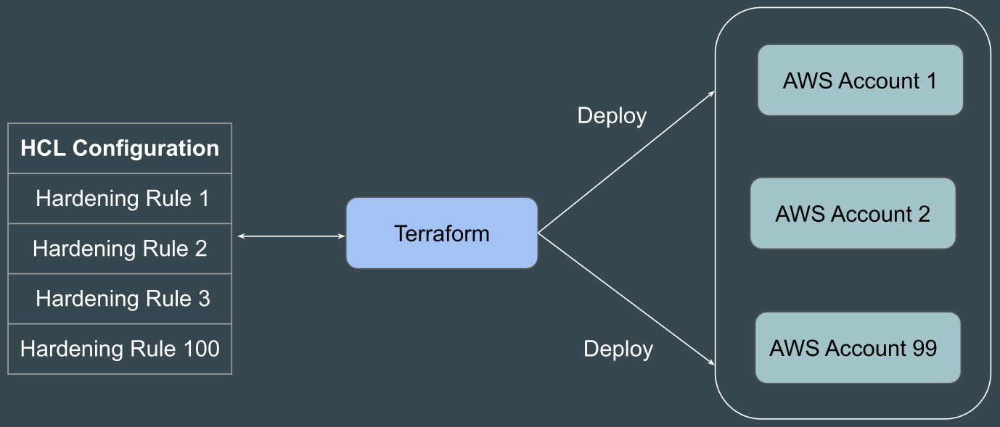

# overview

- [x] Done

## Challenge

Challenge: Terraform allows us to create reusable code that can deploy an identical set of infrastructure in a repeatable fashion

## Benefits

Benefits

- It supports thousands of providers, including AWS, Azure, GCP, and Kubernetes.
- Once you learn Terraform's core concepts, you can write code to create and manage infrastructure across all supported providers
