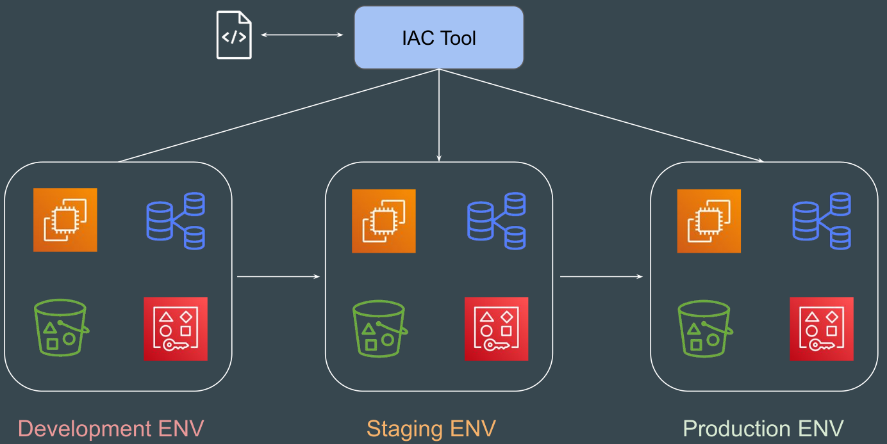

# basics

- [x] Done

## Basics

Approaches: There are two ways in which you can create and manage your infrastructure

- Manually approach
- Through automation

## Examples

Example 1: Database backup

- Requirement: I was assigned a task to take database backup every day at 10 PM and the backup had to be stored in Amazon S3 Storage with appropriate timestamp
  - db-backup-01-01-2024.sql
  - db-backup-01-02-2024.sql
- Bad solution: Initially due to lack of time, I used to manually take DB backup at 10 PM and upload it to S3
- Lesson
  - If a particular task has to be done in an repeatable manner, then it MUST be automated
  - Depending on the type of task, the tools for automation will change

Example 2: A single service

- Set of resources (Virtual Machine, Database, S3, AWS Users) must be created with exact similar configuration in Dev, Stage and Production environment

## Infrastructure as Code

Definitions

- Infrastructure as Code (IaC) is the managing and provisioning of infrastructure through code instead of through manual processes

Benefits

- Speed of infrastructure management
- Low risk of human rrrors
- Version control
- Easy collaboration between teams
