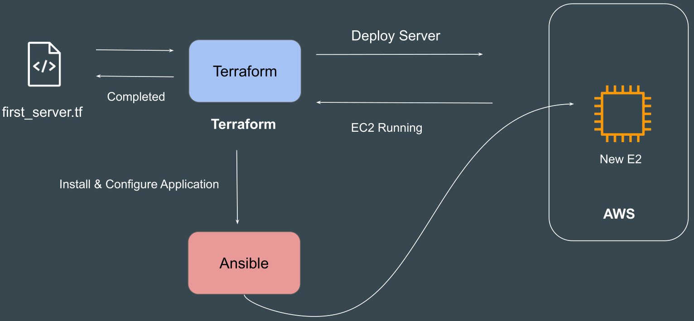

# tools

- [x] Done

## Available Tools

Approach: There are various types of tools that can allow you to deploy infrastructure as code

- Terraform
- CloudFormation
- Heat
- Ansible
- SaltStack
- Chef
- Puppet
- Others

## Categories of Tools

Categories

- Infrastructure orchestration
- Configuration management

### Infrastructure Orchestration

Definitions

- Focus on creating and managing the raw infrastructure components (like servers, networks, etc.)
- Handles the provisioning of infrastructure resources according to specified requirements

Example: Create 3 Servers with 4 GB RAM, 2 vCPUs. Each server should have firewall rule to allow SSH connection from Office IPs

### Configuration Management

Definitions

- Focus on maintaining the desired sttate of systems and ensure consistency across configurations
- Used after infrastructure is provisioned to configure software, manage application settings, or install necessary software (e.g., antivirus, monitoring agents, etc.)

Example: All servers should have Antivirus installed with version 10.0.2

### How Do They Work Together?

Example

- Step 1 (Provisioning): You use Terraform to create 10 new EC2 instances on AWS
- Step 2 (CM): As soon as Terraform finishes creating those 10 instances (which are still empty, with only an OS), Ansible connects to them to install your database, web server (Nginx), and deploy your application code

Notes: Today, this line has become a bit blurry

- Terraform can run provisioners (like remote-exec) to configure a server after creating it (but this is discouraged)
- Ansible also has modules to create cloud resources (like aws_ec2)

## How to Choose IAc Tool?

Prerequisites

- Is your infrastructure going to be vendor specific in longer term ? Example AWS
- Are you planning to have multi-cloud / hybrid cloud based infrastructure ?
- How well does it integrate with configuration management tools ?
- Price and Support

Case 1: Cloudformation

- Organization is going to be based on AWS for next 25 years
- Official support is required in-case if team face any issue related to IAC tool or code itself
- They want some kind of GUI interface that supports automatic code generation

Case 2: Terraform

- Organization is based on Hybrid Solution. They use VMware for on-premise setup; AWS, Azure and GCP for Cloud
- Official support is required in-case if IAC tool has any issues
