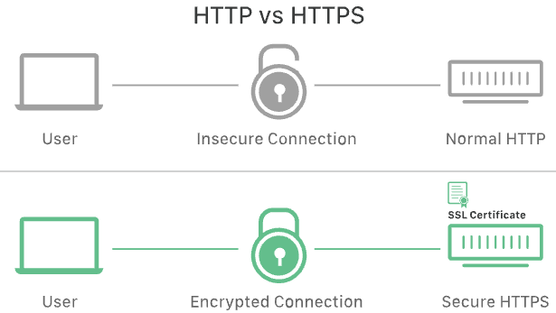

# what is ssl

## What is SSL?

Concepts

- It is a standard technology used to keep an internet connection secure and safeguard any sensitive data
- When a website uses SSL, you see HTTPS (Secure) in the web address instead of just HTTP
- It was invented by Netscape in 1995. While we still call it SSL out of habit, it has actually been updated to a more modern version called TLS (Transport Layer Security)

## How It works?

Functions

- Encryption (Scrambling): It takes your data and mixes it up into a code that no one else can read. If a hacker steals the data, it just looks like a random mess of characters
- The Handshake: Before data is sent, the two devices (like your phone and a server) perform a handshake. This is a quick check to verify that both sides are who they say they are
- Digital signatures: It puts a digital seal on the data. This ensures that no one tampered with the message while it was traveling to its destination

## Why it is important

Reasons

- Protects private info: Before SSL, data was sent as plain text. If you typed in a credit card number, a hacker could read it as it traveled across the internet. SSL hides this information
- Verifies websites: It proves a website is authentic, helping you avoid fake phishing sites that try to trick you
- Tamper poof: It acts like the safety seal on a medicine bottle, if the seal is broken or changed, the computer knows the data isn't safe

## Are SSL and TLS the same thing?

Concepts

- SSL is the older version, TLS is the modern update
- In 1999, a new organization (IETF) took over the project from the original creators (Netscape). They changed the name to TLS to show the change in ownership
- The actual difference between the last version of SSL and the first version of TLS was very small

## Is SSL still up to date?

Concepts

- The actual SSL software hasn't been updated since 1996. It is now considered unsafe and has many security holes. Modern browsers (like Chrome or Safari) will not use it
- Everyone actually uses TLS today because it is secure and up-to-date.
- Because the term SSL is so famous, companies still sell security products called SSL. However, they are almost always selling you TLS technology inside the package

## What is an SSL Certificate?

Concepts

- The digital ID card: It is a digital file that acts like a badge or ID card. It proves that a website is truly who it claims to be
- The key holder: The certificate holds the website's public key
  - The public key is used by visitors to encrypt their data so it is safe. The website then uses a secret private key to decrypt and read it
- The issuer: These certificates are handled out by trusted organizations called Certificate Authorities (CAs) 
