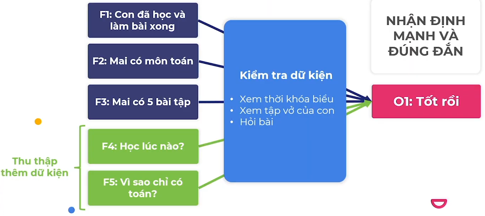
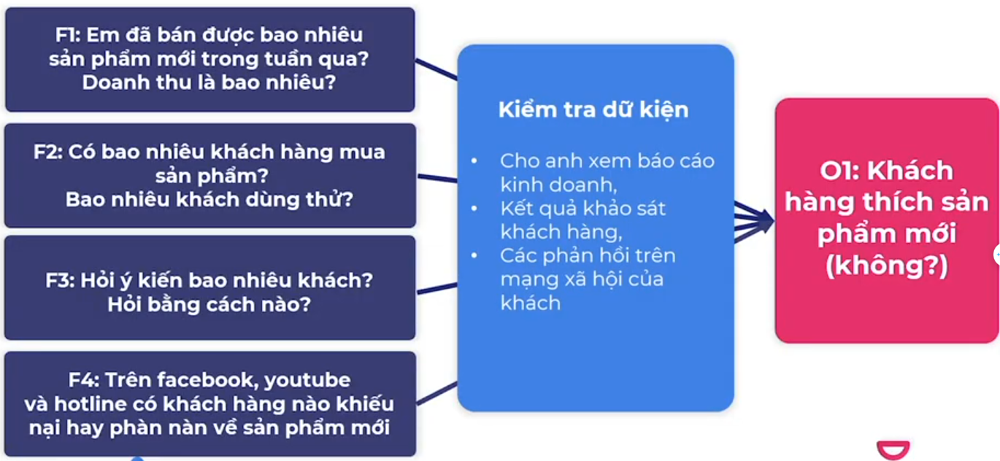

# thu nhập và kiểm tra dữ kiện

## Ví Dụ

Ghi chú

- Nếu bố đã tin tưởng con và sếp tin nhân viên vì đã có quá trình kiểm tra lâu dài thì có thể chấp nhận nhận định của họ
- Còn nếu con còn nhỏ ham chơi, nhân viên chưa qua thử thách thì cần làm theo qui trình trên. Quy trình này dài, tốn thời gian – đây chính là cái giá của niềm tin
- Nhân viên giỏi biết cung cấp đầy đủ các dữ kiện đúng đắn cho sếp
- Sếp giỏi dùng quy trình này để hướng dẫn nhân viên

### Bố Và Con

Nội dung

- Bố: Con đã học bài chưa? Làm bài chưa?
- Con: Con đã học và làm bài xong rồi
- Bố: Mai có mấy môn và có mấy bài tập
- Con: Mai có môn toán thôi ạ, có 5 bài tập
- Bố: Tốt rồi, con đi chơi đi

Phân tích 1

- Câu hỏi: Hãy chỉ ra O và F trong đoạn hội thoại trên
- Câu trả lời
  - F
    - F1: Con đã học và làm bài xong
    - F2: Mai có môn toán
    - F3: Mai có 5 bài tập
  - O
    - O1: Tốt rồi
  - Đánh giá O
    - Đây là nhận định có cơ sở
    - Nhưng đã đúng sự thật chưa?
    - Có chắc con đã làm, đã học hay không? Có chắc chỉ có 5 bài của môn toán hay không?
    - Kêt luận: Nhận định O1 có cơ sở nhưng chưa biết đúng hay sai

Phân tích 2

- Câu hỏi: Làm thế nào để bố biết con thực thực sự đã học và làm bài?
- Câu trả lời - Thêm F
  - Kiểm tra dữ kiện (Fact check): Bố phải kiểm tra các dữ kiện do con cung cấp
  - Kiểm tra qua các câu hỏi logic?
    - Con học lúc nào? Bài tập tóan dạng gì? Bài có gì khó không?
    - Thứ ba thường có Toán, Sinh, và Hóa mà sao tuần này chỉ có Toán?
  - Kiểm tra thực tế
    - Xem thời khóa biểu để biết mai con có mấy môn? Có phải chỉ có toán
    - Xem tập vỡ của con để xem các yêu cầu của thầy cô về bài học và bài tập
    - Xem con đã làm như đã nói chưa
    - Xem con đã học thuộc bài chưa? Yêu cầu con trả bài

### Chất Lượng Sản Phẩm Mới

Nội dung

- Sếp: Sản phẩm mới thế nào em
- Nhân viên: Dạ tốt
- Sếp: Thế hả? Khách hàng thích hả?
- Nhân viên: Vâng, mấy khách hàng gặp em đều khen
- Sếp: Tốt quá, vậy anh yên tâm

Phân tích 1

- Câu hỏi: Hãy chỉ ra O và F trong đoạn hội thoại trên
- Câu trả lời
  - F - F1: Mấy khách hàng em gặp đều khen
  - O - O1: Khách hàng thích sản phẩm mới
  - Đánh giá O - O1: Nhận định yếu, thiếu cơ sở vững chắc và không chắc là đúng

Phân tích 2

- Câu hỏi: Nếu là sếp bạn sẽ đặt câu hỏi gì cho nhân viên để có thể tự tin đi đến nhận định về sản phẩm mới?
- Câu trả lời - Thêm F
  - Em đã bán được bao nhiêu sản phẩm mới trong tuần qua? Doanh thu là bao nhiêu?
  - Có bao nhiêu khách hàng mua sản phẩm? Bao nhiêu khách dùng thử?
  - Hỏi ý kiến bao nhiêu khách? Hỏi bằng cách nào?
  - Trên facebook, youtube và hotline có khách hàng nào khiếu nại hay phàn nàn về sản phẩm mới

## Kiểm Tra Dữ Kiện
