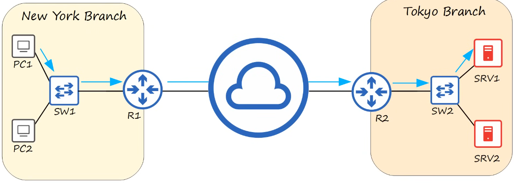

# devices

- [x] Progress: Done

## Network

### Concepts

Concepts

- A computer network is a digital telecommunication network which allows nodes to share resources
- Node: Router, switch, firewall (software, hardware), server, client (smartphone, laptop, etc.), etc.
- Endpoints and end hosts: Server and client

## Servers and clients

### Concepts

Concepts

- A client is a device that accesses a service made available by a server
  - Examples: Laptop, Desktop PC (Microsoft Windows), iMac (macOS), iPhone (iOS)
- A server is a device that provides functions or services for clients
  - Examples: IBM server, DELL server

Note: The same device can be a client in some situations, and a server in other situations

## Switches

### Concepts

Concepts

- Have many network interfaces/ports for end hosts to connect (usually 24+)
- Provide connectivity to hosts within the same LAN (Local Area Network)
- Do not provide connectivity between LANs or over the Internet

## Routers

### Concepts

Concepts

- Have fewer network interfaces than switches
- Are used to provided connectivity between LANs
- Are used to send data over the Internet

## Firewalls

### Concepts

Concepts

- Monitor and control network traffic based on configured rules
- Can be place inside the network, or outside the network
- Are known as "Next-generation firewalls" when they include more modern and advanced filtering capabilities

### Categories

Categories are

- Network firewalls are hardware devices that filter traffic between networks
- Host-based firewalls are software applications that filter traffic entering and exiting a host machine, like a PC

