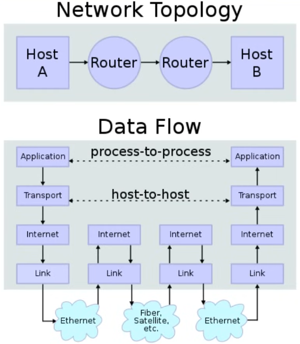

# osi and tcp

- [x] Progress: Done

## Networking Models

### Concepts

- A networking model categorizes and provides a structure for networking protocols and standards
- A protocol is a set of rules defining how network devices and software should work

## OSI Model

### Concepts

- OSI stands for Open Systems Interconnection
- A conceptual model that categorizes and standardizes the different functions in a network
- Created by the International Organization for Standardization (ISO)
- Functions are divided into 7 layers

## Application Layer

### Concepts

- Data unit is Data
- Closest to the end user
- Interacts with software applications, for example your web browser (Brave, Firefox, Chrome, etc)
- HTTP and HTTPS are layer 7 protocols `https://www.google.com`
- Identifies communication partners and synchronizes communication
- Handles encapsulation and de-encapsulation
- Performs same-layer interaction between the application layers of two different systems

## Presentation Layer

### Concepts

- Data unit is Data
- Data in the application layer is in application format
- Translates between application and network formats
- For example encryption of data as it is sent and decryption of data as it is received
- Translates between different application layers formats

## Session Layer

### Concepts

- Data unit is Data
- Controls dialogues (sessions) between communicating hosts
- Establishes, manages, and terminates connections between the local application (for example web browser) and the remote application (for example Youtube)

## Transport Layer

### Concepts

- Data unit is Segment
- Segments and reassembles data for communication between end hosts
- Breaks large pieces of data into smaller segments which can be more easily sent over the network and are less likely to cause transmission problems if errors occur
- Provides host-to-host communication

## Network Layer

### Concepts

- Data unit is Packet
- Provides connectivity between end hosts on different networks (ie outside of the LAN)
- Provides logical addressing (IP addresses)
- Provides path selection between source and destination
- Routers operate at this layer

## Data Link Layer

### Concepts

- Data unit is Frame
- Provides node-to-node connectivity and data transfer (for example PC to switch, switch to router, router to router)
- Defines how data is formatted for transmission over a physical medium (for example copper UTP cables)
- Detects and possibly corrects Physical Layer errors
- Uses layer 2 addressing separate from layer 3 addressing
- Switches operate at this layer

## Physical Layer

### Concepts

- Data unit is Bit
- Defines physical characteristics of the medium used to transfer data between devices
- For example voltage levels, maximum transmission distances, physical connectors, cable specifications
- Digital bits are converted into electrical (for wired connections) or radio (for wireless connections)

## TCP/IP Model

### Concepts

- Conceptual model and set of communications protocols used in the Internet and other networks
- Developed by the US Department of Defense through DARPA (Defense Advanced Research Projects Agency)
- Similar structure to the OSI Model but fewer layers
- This is the model actually in use in modern networks
- The OSI Model still influences how network engineers think and talk about networks

## Review Questions

Q: What does OSI stand for and who created it?

- Open Systems Interconnection created by the International Organization for Standardization (ISO)

Q: How many layers does the OSI model have?

- 7 layers

Q: What are the layer 7 protocols mentioned?

- HTTP and HTTPS

Q: Which layer is responsible for encryption and decryption?

- Presentation Layer

Q: What is the data unit of the Transport Layer?

- Segment

Q: Which layer provides logical addressing like IP addresses?

- Network Layer

Q: At which layer do routers operate?

- Network Layer

Q: At which layer do switches operate?

- Data Link Layer

Q: What is the data unit of the Physical Layer?

- Bit

Q: Who developed the TCP/IP model?

- US Department of Defense through DARPA
