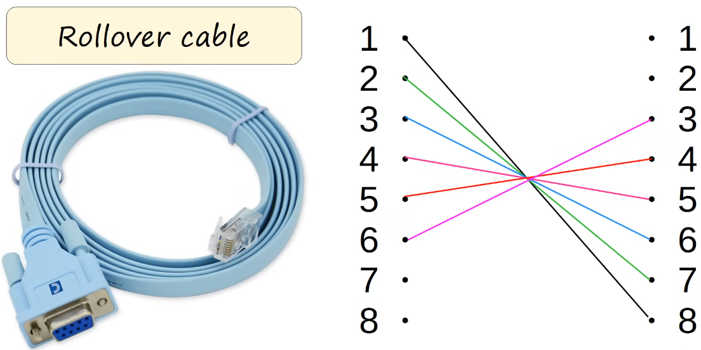
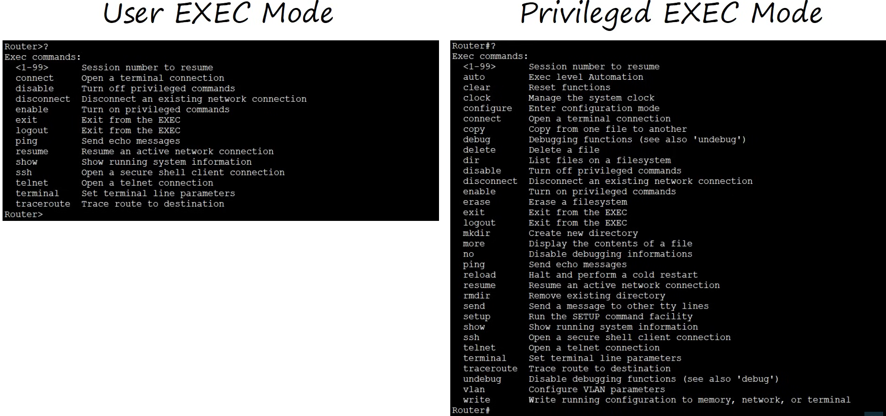

# intro to cli

- [x] Progress: Done

## CLI

### Concepts

- Command-line interface
- Interface used to configure Cisco devices

## GUI

### Concepts

- Graphical User Interface

## Cisco Device Connection

### Overview

- Connect a Cisco device via RJ-45 console port



## Modes

### Overview



## User Exec Mode

### Concepts

- Very limited access
- Users can view settings but cannot make configuration changes
- Also called user mode

### Examples

```txt
# Hostname of the device and user EXEC mode
Router>
```

## Privileged Exec Mode

### Concepts

- Provides complete access to view device configuration and restart device
- Cannot change configuration directly but can change device time and save configuration files

### Examples

```txt
Router>enable
Router#
```

## Global Configuration Mode

### Commands

```txt
Router#configure terminal
Router(config)#
```

## Configuration

### Concepts

- Two separate configuration files kept on device at once
- Running-config is the current active configuration file modified via CLI
- Startup-config is loaded upon device restart

### Commands

```txt
show running-config
show startup-config

# Save the configuration
write
write memory
copy running-config startup-config
```

## Practice

### Commands

```txt
enable password ?
enable password CCNA

# Encrypt the enable password (and other passwords)
service password-encryption

# Configure a more secure, always-encrypted enable password
enable secret password
do show running-config

# Execute a privileged-exec level command from global configuration mode
run <privileged-exec-level-command>

# Remove the command
no service password-encryption
```

### Concepts

- Enabling `service password-encryption` encrypts current and future passwords
- Disabling `service password-encryption` leaves current passwords unencrypted and future passwords unencrypted
- Disabling `service password-encryption` does not decrypt already-encrypted passwords
- `enable secret` is not affected in either case

## Review Questions

Q: What does CLI stand for?

- Command-line interface

Q: What does GUI stand for?

- Graphical User Interface

Q: What port is used to physically connect to a Cisco device?

- RJ-45 console port

Q: What are the limitations of User Exec mode?

- Users can view settings but cannot make any configuration changes

Q: What symbol denotes User Exec mode in the CLI?

- `>`

Q: What command is used to enter Privileged Exec mode?

- `enable`

Q: What command is used to enter Global Configuration mode?

- `configure terminal`

Q: What is the difference between running-config and startup-config?

- Running-config is the active configuration edited in real-time while startup-config is loaded upon device restart

Q: Which commands save the running configuration to the startup configuration?

- `write`, `write memory`, and `copy running-config startup-config`

Q: What happens to current passwords if `service password-encryption` is enabled?

- They are encrypted

Q: What command removes the password encryption service?

- `no service password-encryption`
