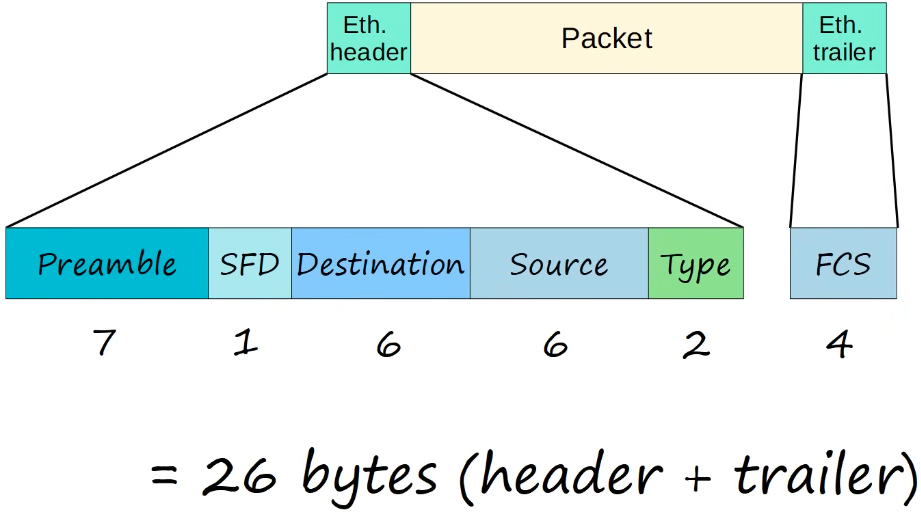
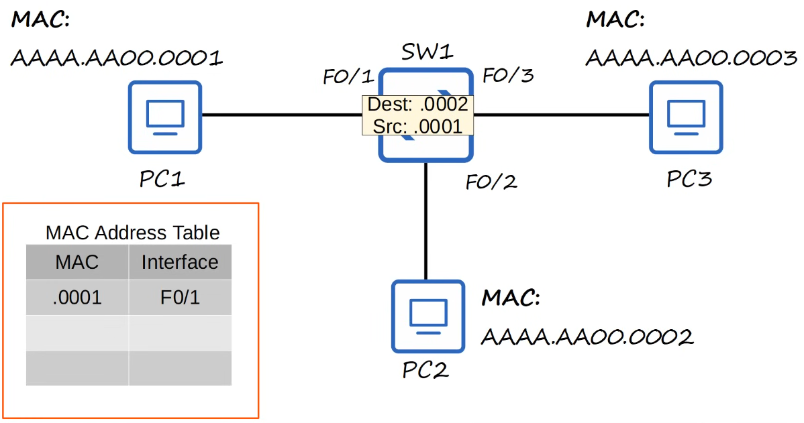
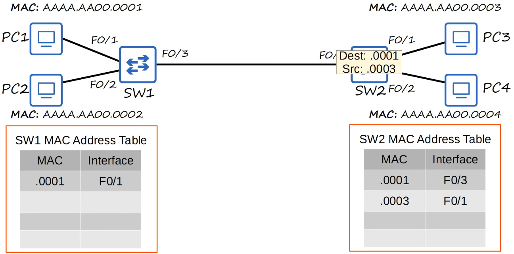

# ethernet lan switching 1

- [x] Progress: Done

## Local Area Networks

## Ethernet Frame

## Preamble

### Concepts

- Length is 7 bytes (56 bits)
- Alternating 1's and 0's (10101010 * 7)
- Allows devices to synchronize their receiver clocks to ensure they are ready to receive the rest of the frame

## Start Frame Delimiter

### Concepts

- SFD stands for Start Frame Delimiter
- Length is 1 byte (8 bits)
- 10101011
- Marks the end of the preamble and the beginning of the rest of the frame

## MAC Addresses

### Concepts

- Indicate the devices sending and receiving the frame
- Consist of the destination and source MAC address
- MAC (Media Access Control) includes a 6-byte (48-bit) address of the physical device
- Also known as Burned-In Address (BIA)
- Globally unique
- Written as 12 hexadecimal characters
- Since 1 byte = 8 bits and 1 hexadecimal character = 4 bits, it takes two hexadecimal characters to represent one byte

### Configuration

- F stands for FastEthernet
- 0 is the slot number
- 1 is the port number

### How it works

- PC1 sends a frame to PC2 and the frame enters the switch (SW1) on port F0/1
- SW1 checks the source MAC address of the frame, adds PC1's MAC address to its MAC address table, and links it to port F0/1 (this is how the switch learns where devices are)
- Next, SW1 looks for the destination MAC address (PC2's address) in its table
- Because the switch doesn't know which port leads to PC2 yet, the frame is considered an unknown unicast frame
- The switch's only option is to flood the frame by sending a copy out of all its ports except the one it came in on (F0/2 and F0/3)
- PC3 receives the frame, sees the destination MAC doesn't match its own, and drops (ignores) it
- PC2 receives the frame, recognizes its MAC address, and processes it
- When PC2 replies to PC1, SW1 receives the frame and already knows PC1 is on port F0/1, so it forwards the frame directly to that single port instead of flooding
- Dynamically learned MAC addresses are removed from the MAC address table after a period of inactivity (typically 5 minutes)

### Examples

## Type or Length Field

### Concepts

- Indicates the Layer 3 protocol used in the encapsulated packet, which is always Internet Protocol (IP) version 4 or version 6
- 2 bytes (16 bits) field
- A value of 1500 or less in this field indicates the length of the encapsulated packet (in bytes)
- A value of 1536 or greater in this field indicates the type of the encapsulated packet (IPv4 or IPv6), and the length is determined via other methods
- IPv4 is 0x0800 in hexadecimal (2048 in decimal)
- IPv6 is 0x86DD in hexadecimal (34525 in decimal)

## Frame Check Sequence

### Concepts

- FCS stands for Frame Check Sequence
- 4 bytes (32 bits) in length
- Detects corrupted data by running a CRC algorithm over the received data
- CRC stands for Cyclic Redundancy Check

## Decimal Number System

### Concepts

- Uses 10 possible digits from 0 to 9

### Examples

- 123.45
- 1 is in the hundreds place (1x10^2)
- 2 is in the tens place (2x10^1)
- 3 is in the units place (3x10^0)
- 4 is in the tenths place (4x10^-1)
- 5 is in the hundredths place (5x10^-2)

## Hexadecimal Number System

### Concepts

- Uses 16 possible digits from 0 to 9 and A to F

### Examples

- Convert 30 (Decimal) to Hexadecimal
- Divide 30 by 16 which is 1 with a remainder of 14 (in hexadecimal, 14 is represented by the digit E)
- The result is 1E
- To verify, the E is in the 1s place (16^0) so 14 x 1 = 14
- The 1 is in the 16s place (16^1) so 1 x 16 = 16
- Sum is 14 + 16 = 30

## Unicast Frames

### Concepts

- A frame destined for a single target

### Categories

- Known Unicast Frame where a switch knows which port the destination MAC address is on and forwards the frame directly to that single port
- Unknown Unicast Frame where a switch doesn't have the destination MAC address in its table and must flood the frame to all ports except the one it came from

## Preamble and SFD Synchronization

### Concepts

- The Preamble gives the receiving device time to synchronize its internal clock with the sender's clock acting as the "get ready" signal
- The SFD acts as a marker signaling to the receiving device that the synchronization is complete and the actual frame content (starting with the destination MAC address) begins immediately after
- The purpose of this synchronization is to ensure data is read correctly (for example if the transmitting device sends 100 million bits in one second, the receiver's clock must be perfectly aligned to be able to read exactly 100 million bits in that same second)

## Review Questions

Q: What is the length of an Ethernet frame Preamble?

- 7 bytes (56 bits)

Q: What does SFD stand for and what is its length?

- Start Frame Delimiter and it is 1 byte (8 bits) long

Q: What is the purpose of the SFD?

- It marks the end of the preamble and the beginning of the rest of the frame

Q: How long is a MAC address?

- 6 bytes (48 bits)

Q: What does a value of 1500 or less in the Type or Length field indicate?

- The length of the encapsulated packet in bytes

Q: What does FCS stand for and what is its purpose?

- Frame Check Sequence and it detects corrupted data by running a CRC algorithm over the received data

Q: How does a switch learn MAC addresses?

- It checks the source MAC address of incoming frames and adds them to its MAC address table linked to the port the frame arrived on

Q: What does a switch do with an unknown unicast frame?

- It floods the frame by sending a copy out of all its ports except the one it came in on

Q: How long does a dynamically learned MAC address typically stay in the MAC address table?

- 5 minutes of inactivity

Q: What happens if a switch receives a frame destined for a MAC address it already has in its table?

- It forwards the frame directly to the specific port linked to that MAC address (known unicast frame)
