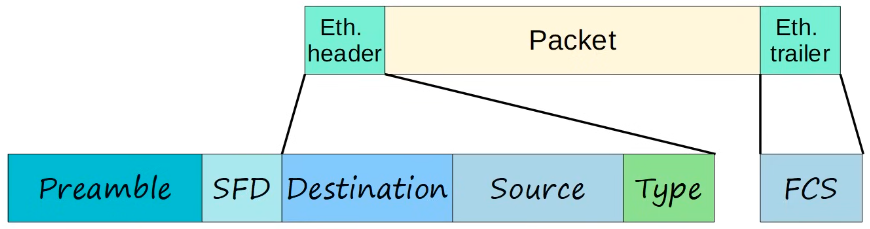
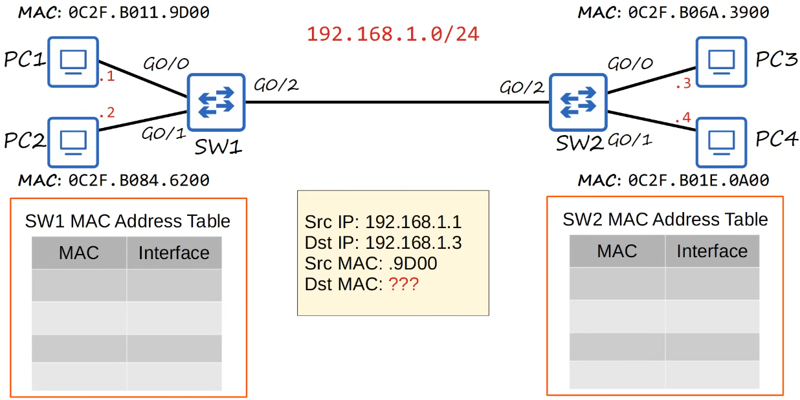
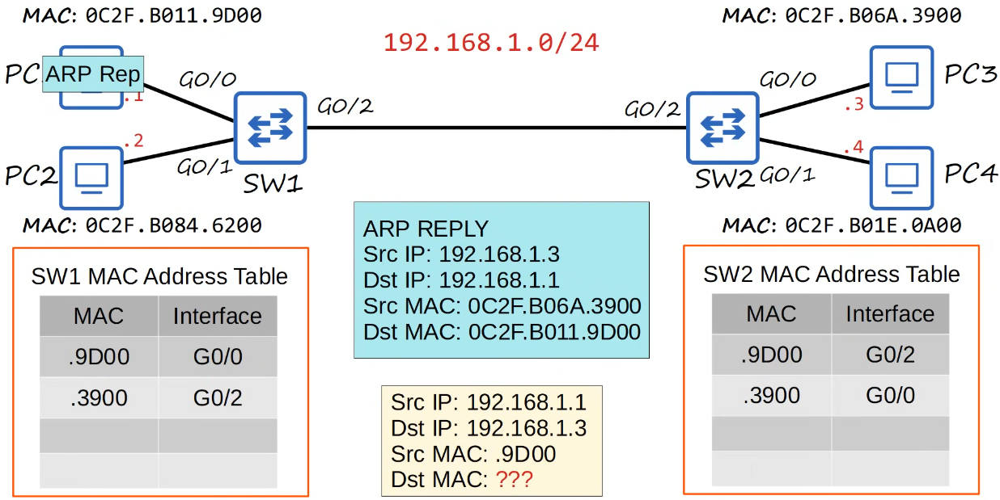
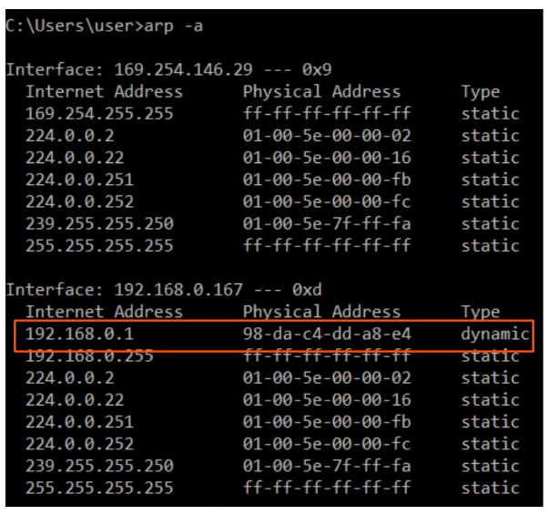
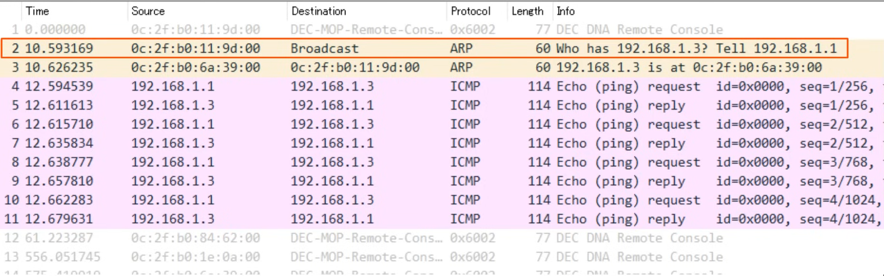
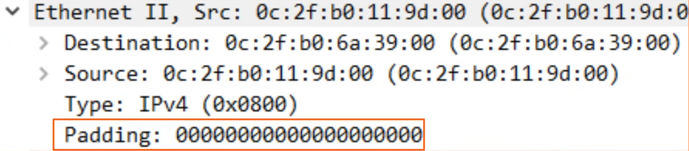

# ethernet lan switching 2

- [x] Progress: Done

## Ethernet Frame

### Concepts

- The Preamble and SFD are usually not considered part of the Ethernet header
- The size of the Ethernet header and trailer is 18 bytes (6 - 6 - 2 - 4)
- The minimum size for an Ethernet frame (Header - Payload [Packet] - Trailer) is 64 bytes
- 64 bytes - 18 bytes (Header and trailer size) = 46 bytes
- Therefore the minimum payload (packet) size is 46 bytes
- If the payload is less than 46 bytes, padding bytes are added
  - For example a 36-byte packet + 12-byte padding = 46 bytes
  - If you send 36 bytes but the minimum Ethernet payload size is 46 bytes, a series of padding bytes must be added to meet the minimum payload size
- The payload of an Ethernet frame may contain an IP packet which includes IP addresses



## Ethernet LAN Switching

### Overview



- If PC1 wants to send an Ethernet frame to PC3, it has to learn PC3's MAC address using ARP

## ARP

### Concepts

- Stands for Address Resolution Protocol
- ARP is used to discover the Layer 2 address (MAC address) of a known Layer 3 address (IP address)
- Consists of two messages
  - ARP Request: Broadcast message sent to all devices on the LAN asking "Who has this IP address?"
  - ARP Reply: Unicast message sent back to the requester with the MAC address associated with the IP address




## ARP Table

### Concepts

- Use `arp -a` to view the ARP table (Windows, macOS, Linux)
- Internet address is the IP address (Layer 3 address)
- Physical address is the MAC address (Layer 2 address)
- Type static means it is a default entry
- Type dynamic means it was learned via ARP



## Ping

### Concepts

- A network utility used to test reachability
- Measures round-trip time
- Uses two messages
  - ICMP Echo Request: Sent to the target host to request a reply
  - ICMP Echo Reply: Sent back to the requester to confirm reachability
- Command to use ping is `ping <ip-address>`



## Cisco Commands

### Commands

```txt
show mac address-table

clear mac address-table dynamic

clear mac address-table dynamic address <mac-address>

clear mac address-table dynamic interface <interface>
```

## Wireshark

### Examples




## Summary

### Flow

- If a device (e.g., PC1) wants to send data to another device (e.g., PC3) on the same LAN but does not know its MAC address, it will perform an ARP discovery first
- Once the MAC address is learned, it will send the actual data

## Review Questions

Q: What is the combined size of the Ethernet header and trailer?

- 18 bytes

Q: What is the minimum size for an Ethernet frame including header, payload, and trailer?

- 64 bytes

Q: What happens if an Ethernet payload is less than the minimum 46 bytes?

- Padding bytes are added to meet the minimum payload size

Q: What does ARP stand for?

- Address Resolution Protocol

Q: What is the purpose of ARP?

- To discover the Layer 2 address (MAC address) of a known Layer 3 address (IP address)

Q: What type of message is an ARP Request?

- A broadcast message sent to all devices on the LAN

Q: What command is used to view the ARP table on Windows, macOS, and Linux?

- `arp -a`

Q: What two ICMP messages are used by the ping utility?

- ICMP Echo Request and ICMP Echo Reply

Q: What Cisco command removes all dynamically learned MAC addresses from the address table?

- `clear mac address-table dynamic`
