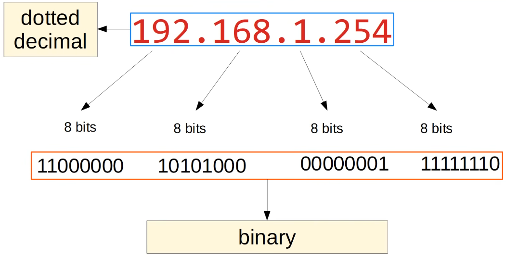
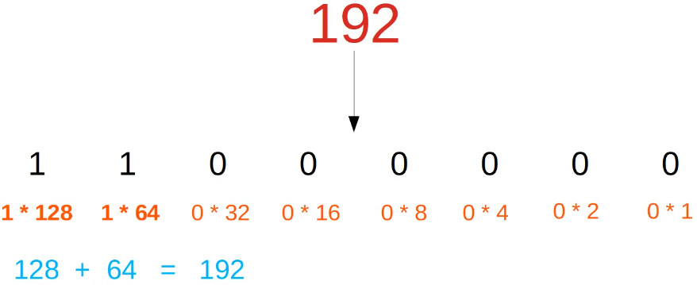
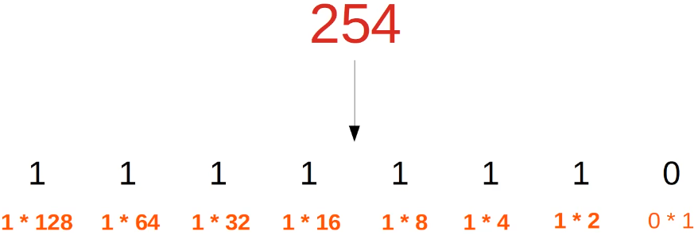
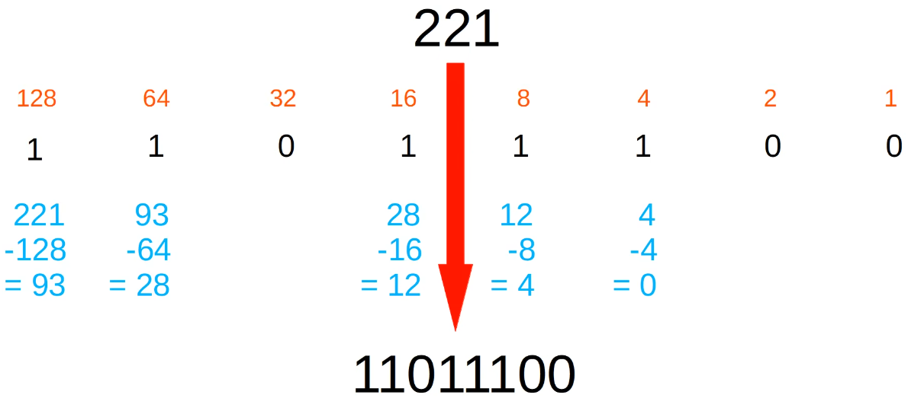

# ipv4 addressing 1

- [x] Progress: Done

## Routing

### Overview

- The broadcast is limited to the local network
- It does not cross the router and go to SW2, etc.

## IPv4 Address

### Overview

## Network and Host Portion

### Examples

- 154.78.111.32/16
- 4 octets
- First two octets are the network portion (154.78)
- Last two octets are the host portion (111.32)

## IP Address Classes

### Categories

| Class | First octet  | First octet numeric range | Prefix Length | Network Number Bit Field | Rest Bit Field | Number of Networks | Addresses per Network          |
|-------|--------------|---------------------------|---------------|--------------------------|----------------|--------------------|--------------------------------|
| A     | 0xxxxxxx     | 0-127                     | /8            | 8 bits                   | 24 bits        | 2^7 = 128 (126 due to loopback)    | 2^24 = 16,777,216 (16,777,214) |
| B     | 10xxxxxx     | 128-191                   | /16           | 16 bits                  | 16 bits        | 2^14 = 16,384      | 2^16 = 65,536 (65,534)         |
| C     | 110xxxxx     | 192-223                   | /24           | 24 bits                  | 8 bits         | 2^21 = 2,097,152   | 2^8 = 256 (254)                |
| D     | 1110xxxx     | 224-239                   | Not applicable| Not applicable           | Not applicable | Multicast          | Multicast                      |
| E     | 1111xxxx     | 240-255                   | Not applicable| Not applicable           | Not applicable | Experimental       | Experimental                   |

### Concepts

- Class A network 0.0.0.0 is a default route
- Class A network 127.0.0.0 is a loopback address

### Examples

- Class A: 12.128.251.34/8
- Class B: 154.78.111.32/16
- Class C: 192.168.1.254/24

## Loopback Addresses

### Concepts

- Address range 127.0.0.0 to 127.255.255.255
- Used to test the network stack on the local device

## Netmasks

### Concepts

- Class A: /8 becomes 255.0.0.0
- Class B: /16 becomes 255.255.0.0
- Class C: /24 becomes 255.255.255.0

## Network Address

### Concepts

- Used to identify the network itself (like a name of a road, not a specific house)
- Host portion of the address is all 0s for a network address
- The network address cannot be assigned to a host

## Broadcast Address

### Concepts

- Used to send messages to all devices connected to the same network at the same time (like a loudspeaker shouting "Send to all houses on street 192.168.1")
- Host portion of the address is all 1s for a broadcast address
- The broadcast address cannot be assigned to a host

## Decimal and Hexadecimal Systems

### Concepts

## Binary System

### Concepts

- 2^8 = 256

## Binary to Decimal Conversion

### How it works

## Decimal to Binary Conversion

### How it works

## Review Questions

Q: Does a broadcast cross a router to reach other networks?

- No, a broadcast is limited to the local network

Q: How many octets make up an IPv4 address?

- 4 octets

Q: What is the prefix length for a Class B network?

- /16

Q: What is the 127.0.0.0 network reserved for?

- Loopback addresses used to test the network stack on the local device

Q: What does an all-zeros host portion represent in an IPv4 address?

- The network address

Q: Can a broadcast address be assigned to a host device?

- No, the broadcast address cannot be assigned to a host

Q: What is the netmask for a Class C network?

- 255.255.255.0

Q: How is the host portion configured for a broadcast address?

- The host portion is all 1s
