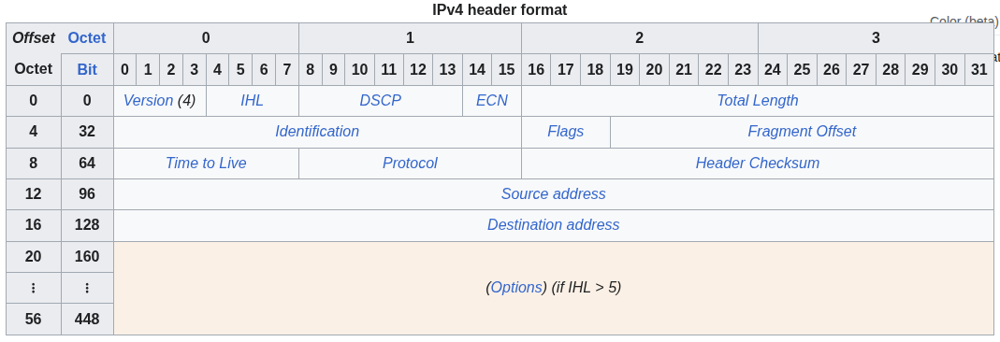
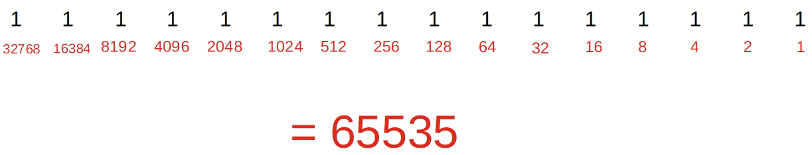
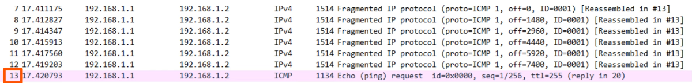

# ipv4 header

- [x] Progress: Done

## IPv4 Header

### Overview



## Version

### Concepts

- Length is 4 bits
- Identifies the version of IP used
- IPv4 is 4 (0100)
- IPv6 is 6 (0110)

## Internet Header Length

### Concepts

- Length is 4 bits
- The final field of the IPv4 header (Options) is variable in length, so this field is necessary to indicate the total length of the header
- Identifies the length of the header in 4-byte increments
- A value of 5 means 5 x 4 = 20 bytes
- Minimum value is 5 (20 bytes)
- Maximum value is 15 (60 bytes) which is all 1s (1111)
- Minimum IPv4 header length is 20 bytes
- Maximum IPv4 header length is 60 bytes

## DSCP

### Concepts

- Length is 6 bits
- Stands for Differentiated Services Code Point
- Used for QoS (Quality of Service)
- Used to prioritize delay-sensitive data (streaming voice, video, etc)

## ECN

### Concepts

- Length is 2 bits
- Stands for Explicit Congestion Notification
- Provides end-to-end (between endpoints) notification of network congestion without dropping packets
- Optional feature that requires both endpoints as well as the underlying network infrastructure to support it

## Total Length

### Concepts

- Length is 16 bits
- Indicates the total length of the packet (L3 header + L4 segment)
- Measured in bytes (not 4-byte increments like IHL)
- Minimum value is 20 (IPv4 header with no encapsulated data)
- Maximum value is 65,535 (2^16 - 1)



## Identification

### Concepts

- Length is 16 bits
- If a packet is fragmented due to being too large, this field is used to identify which packet the fragment belongs to
- All fragments of the same packet will have their own IPv4 header with the same value in this field
- Packets are fragmented if larger than the MTU (Maximum Transmission Unit)
- The MTU is usually 1500 bytes
- Fragments are reassembled by the receiving host

## Flags

### Concepts

- Length is 3 bits
- Used to control and identify fragments
- Bit 0 is Reserved and always set to 0
- Bit 1 is the Don't fragment (DF) bit used to indicate that the packet should not be fragmented
- Bit 2 is the More fragments (MF) bit set to 1 if there are more fragments in the packet, set to 0 for the last fragment
- Unfragmented packets will always have their MF bit set to 0

## Fragment Offset

### Concepts

- Length is 13 bits
- Used to indicate the position of the fragment within the original unfragmented IP packet
- Allows fragmented packets to be reassembled even if the fragments arrive out of order

## Time to Live

### Concepts

- Length is 8 bits
- A router will drop a packet with a TTL of 0
- Used to prevent infinite loops
- Originally designed to indicate the packet's maximum lifetime in seconds
- In practice, indicates a hop count where each time the packet arrives at a router, the router decreases the TTL by 1
- Recommended default TTL is 64

## Protocol

### Concepts

- Length is 8 bits
- Indicates the protocol of the encapsulated L4 PDU
- Value of 6 is TCP
- Value of 17 is UDP
- Value of 1 is ICMP
- Value of 89 is OSPF

## Checksum

### Concepts

- Length is 16 bits
- A calculated checksum used to check for errors in the IPv4 header
- When a router receives a packet, it calculates the checksum of the header and compares it to the one in this field of the header
- If they do not match, the router drops the packet
- Used to check for errors only in the IPv4 header
- IP relies on the encapsulated protocol to detect errors in the encapsulated data
- Both TCP and UDP have their own checksum fields to detect errors in the encapsulated data

## Source and Destination IP Address

### Concepts

- Length is 32 bits each
- Source IP Address is the IPv4 address of the sender of the packet
- Destination IP Address is the IPv4 address of the intended receiver of the packet

## Options

### Concepts

- Length is 0 to 320 bits
- Rarely used
- If the IHL field is greater than 5, it means that Options are present

## Wireshark

### Commands


```txt
// Send 10000 byte pings -> Cause fragmentation
ping 192.168.1.2 size 10000
```



```txt
ping 192.168.1.2 df-bit

// Fail
ping 192.168.1.2 size 10000 df-bit
```

## Review Questions

Q: What is the minimum and maximum length of an IPv4 header?

- Minimum is 20 bytes and maximum is 60 bytes

Q: What does the DSCP field do?

- Used for QoS to prioritize delay-sensitive data

Q: Which field indicates the total length of the packet in bytes?

- Total Length field

Q: What is the purpose of the Identification field?

- It identifies which original packet a fragment belongs to

Q: What does the DF bit do in the Flags field?

- Indicates that the packet should not be fragmented (Don't Fragment)

Q: What happens if a router receives a packet with a TTL of 0?

- The router drops the packet

Q: What protocol does a value of 6 represent in the Protocol field?

- TCP

Q: Does the IPv4 Checksum field check for errors in the encapsulated data?

- No, it only checks for errors in the IPv4 header
