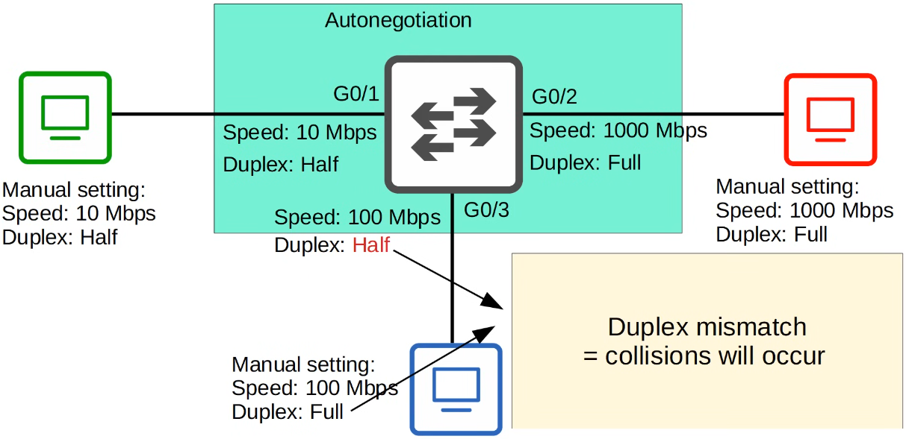

# switch interfaces

- [x] Progress: Done

## Network Topology

### Overview


### Commands

```txt
en

show ip interface brief

show interfaces status

configure terminal
```

### Concepts

- Router interfaces have the shutdown command applied by default, which will be in the administratively down/down state by default
- Switch interfaces do not have the shutdown command applied by default, which will be in the up/up state if connected to another device OR in the down/down state if not connected to another device

## Configure Speed and Duplex

### Commands

```txt
configure terminal

interface f0/1

speed 1000

duplex full

description ## to R1 ##

show interfaces status
```

## Configure Multiple Interfaces

### Commands

```txt
interface range f0/5 - 12

description ## not in use ##

shutdown

interface range f0/5 - 6, f0/9 - 12

no shutdown
```

## Full and Half Duplex

### Concepts

- Half duplex: The device cannot send and receive data at the same time. If it is receiving a frame, it must wait before sending a frame
  - Devices attached to a hub must operate in half-duplex mode
- Full duplex: The device can send and receive data at the same time. It does not have to wait
  - Devices attached to a switch must operate in full-duplex mode

## Half Duplex and Hubs

### Concepts

- A hub is a physical layer device that operates in half-duplex mode at layer 1. In contrast, a switch operates at layer 2 and uses MAC addresses to send frames to specific hosts
- When a device sends a frame, the hub copies and sends the frame out of all other ports. If two devices send frames at the same time, a collision occurs


## CSMA/CD

### How it works

- Carrier Sense Multiple Access with Collision Detection
- Before sending frames, devices listen to the collision domain until they detect that other devices are not sending
- If a collision does occur, the device sends a jamming signal to inform other devices that a collision happened
- Each device will wait a random period of time before resending the frames
- The process repeats


## Speed and Duplex Autonegotiation

### Concepts

- Interfaces that can run at different speeds (10/100 or 10/100/1000) have default settings of speed auto and duplex auto
- Interfaces advertise their capabilities to the neighboring device and they negotiate the best speed and duplex settings they are both capable of


### Troubleshooting

- What if autonegotiation is disabled on the device connected to the switch?
- Speed: The switch will try to sense the speed that the other device is operating at. If it fails to sense the speed, it will use the slowest supported speed (ie. 10 Mbps on 10/100/1000 interface)
- Duplex: If the speed is 10 or 100 Mbps, the switch will use half duplex. If the speed is 1000 Mbps or greater, the switch will use full duplex



## Interface Errors

### Common errors


- Runts: Frames that are smaller than the minimum frame size (64 bytes)
- Giants: Frames that are larger than the maximum frame size (1518 bytes)
- CRC: Frames that failed the CRC check (in the Ethernet FCS trailer)
- Frame: Frames that have an incorrect format due to an error
- Input errors: Total of various counters, such as the above four
- Output errors: Frames the switch tried to send, but failed due to an error

## Review Questions

Q: Are switch interfaces administratively down by default?

- No, they are up/up if connected or down/down if disconnected

Q: What is the difference between half duplex and full duplex?

- Half duplex cannot send and receive data at the same time, while full duplex can

Q: What layer does a hub operate at, and what duplex mode does it use?

- Layer 1 (physical layer) and it operates in half-duplex mode

Q: What does CSMA/CD stand for?

- Carrier Sense Multiple Access with Collision Detection

Q: What does a device do if it detects a collision in CSMA/CD?

- It sends a jamming signal and waits a random period of time before resending

Q: What happens if autonegotiation is disabled and the switch cannot sense the speed?

- It uses the slowest supported speed

Q: What duplex is used if autonegotiation fails and the speed is sensed at 100 Mbps?

- Half duplex

Q: What is a runt frame?

- A frame smaller than the minimum frame size of 64 bytes

Q: What is a giant frame?

- A frame larger than the maximum frame size of 1518 bytes
