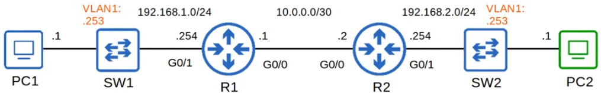
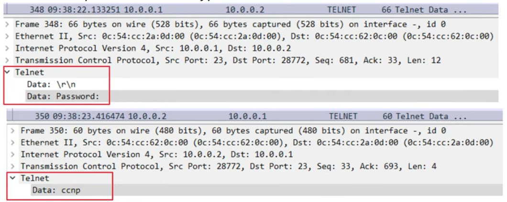
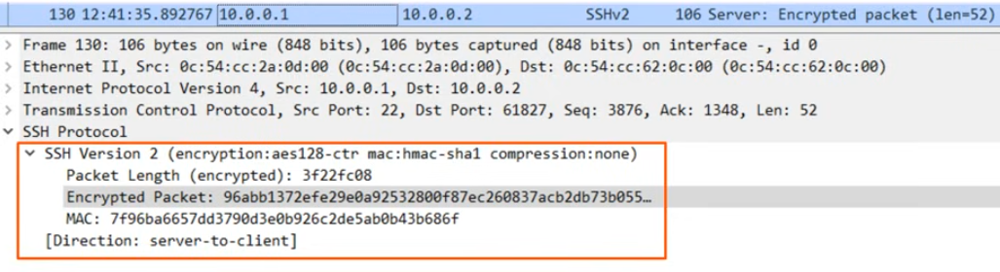

# ssh

- [x] Progress: Done

## Console port security

### Concepts

Key points

- By default, no password is needed to access the CLI of a Cisco IOS device via the console port
- Can configure a password on the console line
  - Have to enter a password to access the CLI via the console port
- Can configure the console line to require users to login using one the configured usernames on the device

### Implementation

Simple login

```txt
line console 0
password ccna
login
end
exit
```

Login local

```txt
username jeremy secret ccnp
line console 0
login local
end
exit
```

## IP management

### Concepts

Key points

- Layer 2 switches do not perform packer routing and do not build a routing table. They are not IP routing aware
- Can assign an IP address to an Switch Virtual Interface (SVI) to allow remote connections to the CLI of the switch (using Telnet or SSH)

### Implementation



SVI configuration

```txt
interface vlan1
ip address 192.168.1.253 255.255.255.0
no shutdown
exit
ip default-gateway 192.168.1.254
```

- Configure the switch's default gateway
  - PC2 is not in the same LAN as SW1
  - If SW1 does not have a default gateway, it cannot communicate with PC2

## Telnet

### Concepts

Key points

- A protocol used to remotely access the CLI of a remote host
- Developed in 1969
- Largely replaced by SSH, which is more secure
- Sends data in plain text. No encryption
- Port 23



### Implementation

Step-by-step guide

```txt
enable secret ccna
username jeremy secret ccna
access-list 1 permit host 192.168.2.1
line vty 0 15
login local
exec-timeout 5 0
transport input telnet
access-class 1 in
telnet 192.168.1.253
```

## SSH

### Concepts

Key points

- SSH (Secure Shell) was developed in 1995 to replace less secure protocols like Telnet
- SSHv2, a major revision of SSHv1, was released in 2006
- If a device supports both v1 and v2, it is said to run version 1.99
- Provides security features such as data encryption and authentication
- Port 22



RSA

- To enable and use SSH, you must generate an RSA public and private key pair
- The keys are used for data encryption/decryption, authentication, etc.
- Greater key lengths are more secure, but take longer to generate and use

### Prerequisites

Check

```txt
show version
show ip ssh
```

- Cisco exports NPE (No Payload Encryption) IOS images to countries that have restrictions on encryption technologies
- NPE IOS images do not support cryptogaphic features such as SSH

Generate RSA

```txt
ip domain name jeremysitlab.com
crypto key generate rsa
do show ip ssh
```

### Implementation

Step-by-step logic

- Configure host name
- Configure DNS domain name
- Generate RSA key pair
- Configure enable password, username/password
- Enable SSHv2
- Configure VTY lines
- Connect: `ssh -l username ip-address` or `ssh username@ip-address`

Step-by-step guide

```txt
enable secret ccna
username jeremy secret ccna
access-list 1 permit host 192.168.2.1
ip ssh version 2
line vty 0 15
login local
exec-timeout 5 0
transport input ssh
access-class 1 in
```
