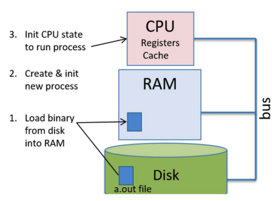
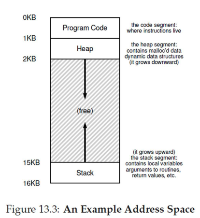

# intro

- [x] Progress: Done

## Computer System

### Concepts

- User software: Applications (browser, email client, games, application servers, databases, AI/ML algorithms, etc.)
- System software: Operating System (OS), etc.
- Hardware: CPU, memory, I/O devices, etc.

## Operating System

### Concepts

- Middleware between user software and hardware (e.g., Linux, Windows, MacOS)
- Contains kernel (core functionality) and other programs (shell, commands, utilities)

### Overview

- Manages hardware: CPU, main memory, I/O devices (hard disk, network card, mouse, keyboard)
- OS provides standardized API (system calls) — applications avoid direct, complex, and dangerous hardware interaction
- Abstracts hardware by hiding complex, low-level physical component details
- Optimizes CPU, memory, and resource usage by allocating process resources and duration
- Ensures process separation — one program cannot crash/impact another or the entire system

## Program

### Concepts

- Executable file stored on disk
  - Contains code (CPU instructions) and data for specific task
  - App package icon (.app) contains Contents folder (executable file) and Resources (data)
- Process is a running instance of a program loaded into memory by OS
  - Single program (e.g., Google Chrome) can run as multiple processes to handle separate tasks (e.g., main UI process, individual tab processes)

### Flow

- **Stage 1: Compilation**
  - Compiler translates high-level code into executable file (machine code and data)
  - Executable file (e.g., "a.out") is created and stored on hard disk
- **Stage 2: Loading - OS**
  - OS creates process and Process Control Block (PCB) to track status
  - OS allocates private virtual address space for process
  - OS loader reads executable file from disk and loads into memory
  - OS allocates stack for process
  - OS initializes CPU context
    - Sets Program Counter (PC) to virtual address of program's entry point (first instruction)
    - Sets Stack Pointer (SP) to top of allocated stack
    - Initializes other registers
  - OS places process in ready queue
- **Stage 3: Execution - CPU**
  - CPU fetches instruction pointed by PC from memory
  - CPU increments PC to point to next instruction
  - CPU decodes instruction to determine operation
  - CPU loads data from memory into registers if needed
  - CPU executes instruction
  - CPU stores results back into register or memory location

## CPU Virtualization

### Overview

- Historically, computers ran one program at a time, causing slow/poor user experience (e.g., cannot listen to music while browsing)
- OS solves this via CPU Virtualization — allows running multiple programs simultaneously
- Relies on two key mechanisms
  - OS scheduler decides which program to run next and for how long
  - OS performs context switch — quickly swaps processes on/off CPU
- Fast switching creates illusion every program has dedicated CPU

### Flow

- OS runs Program A for a short time
- OS pauses Program A and saves current state/execution context
- OS loads saved state of Program B
- OS runs Program B for a short time before switching again

## Memory Virtualization

### Overview

- Without memory virtualization, programs use physical RAM directly, causing major issues
  - Bug in one program could overwrite/corrupt memory of another program or OS, crashing system
  - Program could read/modify another program's private data (security risk)

### Concepts

- Program memory view
  - Code: Program instructions
  - Data: Global and static variables
  - Heap: Dynamically allocated memory (grows as needed)
  - Stack: Function calls and local variables (grows and shrinks)

### Flow

- OS maintains page table for each program acting as a map
- Map translates program's virtual addresses into physical addresses in RAM
- Guarantees each program remains separate and isolated

## Address Space

### Concepts

- Virtual Address Space: Illusion of memory provided by OS. Program sees one large, continuous block starting at address 0
- Physical Address: Real address of data inside RAM. Program data is actually scattered in small chunks across physical RAM

### How it works

- Programmer uses virtual addresses (e.g., pointer in code shows virtual address)
- OS intercepts program attempts to access virtual address
- OS translates virtual address into real physical address to retrieve correct data
- Memory virtualization keeps every program separate and safe

## Isolation and Privilege Levels

### Overview

- Running multiple programs requires isolation to protect processes from one another, prevent data corruption, and share hardware safely
- Mechanisms are built directly into CPU

### Concepts

- CPUs create isolation using privilege levels
  - Unprivileged instructions: Regular, safe commands (e.g., adding numbers, reading own data)
  - Privileged instructions: Sensitive, powerful commands affecting entire computer (e.g., managing memory, accessing hardware)
  - Low Privilege Level (Ring 3 / User Mode): Safe mode where CPU only executes unprivileged instructions
  - High Privilege Level (Ring 0 / Kernel Mode): Powerful mode where CPU executes all instructions

## User Mode and Kernel Mode

### Concepts

- User Mode (Unprivileged): Runs user programs (browser, games). CPU executes only unprivileged instructions
- Kernel Mode (Privileged): Runs OS. CPU executes all instructions, including privileged ones

### Flow

- CPU switches from User Mode to Kernel Mode when OS requires control. Triggers include
  - System calls: User program requests OS service (e.g., opening a file)
  - Interrupts: External hardware event requires OS attention (e.g., mouse click)
  - Program faults: Program error (e.g., dividing by zero) requiring OS handling
- After OS completes task in Kernel Mode, CPU shifts back to User Mode, and original program continues

## System Calls

### Concepts

- System call occurs when user program requests service from OS
- Normal user program cannot run privileged hardware instructions directly (safety feature preventing accidental/malicious harm)

### Examples

- Program requesting to read data from hard disk
- C library `printf` function invokes real system call to write text to screen

### Flow

- User program requests OS service via system call
- CPU jumps from user code to OS handler code for specific call
- OS finishes task — CPU returns to user code at exact interruption point
- Tip: Programmers use standard library functions (e.g., `printf`) to handle system calls instead of making direct calls

## Interrupts

### Overview

- CPU must handle external events (mouse clicks, key presses) alongside running programs
- Prevents CPU from wasting time waiting for I/O devices (e.g., waiting for hard drive data)

### Concepts

- Interrupt is external signal from I/O device requesting CPU attention

### Examples

- Hard drive finishes preparing data and sends interrupt signal to CPU

## Interrupt Handling

### Flow

- CPU runs Program P when interrupt signal arrives
- CPU immediately saves current state/context of Program P
- CPU switches to Kernel Mode to run OS interrupt handler code (e.g., reading keyboard character)
- OS completes handling — CPU restores saved state of Program P
- CPU resumes Program P in User Mode
- Note: Interrupt handling code is part of OS. CPU runs OS handler and returns to user code

## I/O Devices

### Concepts

- CPU and memory connect via fast system/memory bus
- I/O devices (keyboards, monitors, hard drives) connect to CPU/memory using separate buses
- OS manages all I/O devices on behalf of user programs

### Overview

- I/O device primary roles
  - Interface with external world (keyboard, mouse, screen)
  - Store user data persistently (hard drive, SSD)

## Device Controller and Device Driver

### Concepts

- Device Controller: Small microcontroller chip managing specific I/O device. Communicates with CPU/memory over bus
- Device Driver: Special OS software providing device-specific knowledge to handle I/O operations

### How it works

- OS kernel uses device driver to
  - Initialize I/O device upon computer startup
  - Start I/O operations via device commands (e.g., instructing hard disk to read data block)
  - Handle interrupts from device (e.g., hard disk signaling read completion)

## Conclusion

### Summary

- Architecture/OS knowledge is essential for writing high-performance, reliable programs
- OS study addresses
  - Program execution mechanics
  - Performance optimization
  - Security, reliability, and fault tolerance
  - Troubleshooting slow performance and resource consumption
- OS expertise is critical for building complex real-world systems

### Next steps

- Architecture + OS: Foundation for understanding single-machine program execution
- Networking: Cross-machine program communication
- Databases and data storage: Efficient, reliable data storage across machines
- Performance engineering: Program speed optimization
- Distributed systems: Multi-application/multi-machine reliable task execution
- Other topics: Virtualization, cloud computing, security
