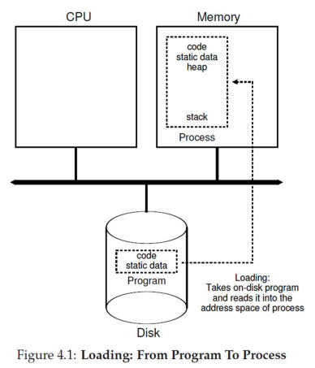
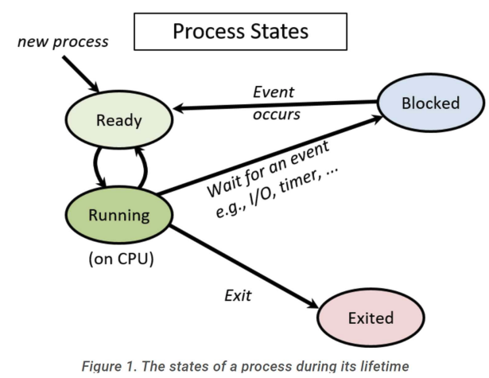

# process abstraction

- [x] Progress: Done

## The Process Abstraction

### Concepts

- Process is a running program
- When program runs, OS creates new process, allocates memory, initializes CPU context, and starts it in user mode
- User programs run on CPU until OS intervenes for system calls, interrupts, or faults

## Process Definition

### Concepts

- Unique Process Identifier (PID)
- Memory image in RAM, including
  - Code and data from executable
  - Stack and heap for runtime use
- Execution context (CPU register values)
  - Program Counter (PC) holds instruction address
  - Other registers hold data
  - Context resides in CPU registers when running and is saved to memory when paused
- I/O state
  - Open files, network connections, and other I/O information

## Process States

### Categories

- Running: Currently executing on CPU — context resides in CPU registers
- Blocked / suspended / sleeping: Cannot run, waits for event (e.g., I/O completion)
- Ready / runnable: Ready to run, waiting for OS scheduler
- Context of blocked and ready processes is saved in OS memory for later resumption

## Process State Transitions

### Examples

- Initially, P0 is running, and P1 is ready
- If P0 requests disk data via system call, OS handles request but moves P0 to blocked state (data not immediately available). OS switches to P1
- P1 runs. Interrupt from disk occurs, signaling P0's requested data is ready. CPU jumps to OS, handles interrupt, and moves P0 to ready state
- OS can continue running P1 — scheduler will switch to P0 later

## Process Control Block (PCB)

### Concepts

- PCB is kernel data structure storing all process information
- Contains
  - Process Identifier (PID)
  - Process state (running, ready, blocked, terminated, etc.)
  - Pointers to related processes (parent, children)
  - Saved CPU context of process when not running
  - Information regarding process memory locations
  - Information regarding ongoing I/O communication
- Known by different names across OSes (e.g., `task_struct` in Linux)

## CPU Scheduler

### Concepts

- OS maintains list of all PCBs
- Scheduler loops through list, picking ready process to run on each CPU core
- Periodically performs context switches between processes

## Booting

### How it works

- System boot triggers Basic Input Output System (BIOS) execution
- BIOS (stored in non-volatile memory) initializes hardware
- BIOS locates boot loader in boot disk (hard disk, USB, etc.)
- Boot loader (simple assembly/C program) locates and loads OS
- Boot loader sets up CPU registers, loads kernel image from disk to memory, and transfers control to kernel
- OS code executes, exposes user terminal, and allows program initiation

## Booting Real Systems

### Overview

- Legacy/simple OS bootloaders fit into 512-byte first sector of boot disk (required for easy BIOS discovery)
- Modern OS bootloaders are complex (reading large kernel images from disk/network) and exceed 512 bytes
- Real-life booting follows two-step process
  - BIOS loads simple bootloader
  - Simple bootloader loads complex bootloader
  - Complex bootloader loads OS
