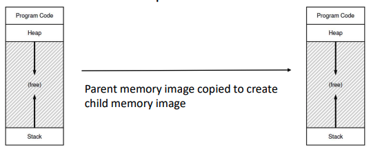

# system calls

- [] Progress: Draft

## API for Process Management

### Concepts

- OS provides API of functions for user programs
- API consists of system calls executing in privileged kernel mode
- Privileged operations (e.g., hardware access) require higher privilege level
- System calls can be blocking (e.g., `read()`, causing context switch) or non-blocking (e.g., `getpid()`, returning immediately)

## Portability Across OS

### Concepts

- POSIX API standardizes system calls for code portability across compliant OSes
- Recompilation may still be needed for different hardware architectures
- Language libraries (e.g., C's `printf`) often wrap system calls (e.g., `write`)
- Application Binary Interface (ABI) defines interface between machine code and hardware

## Process-Related System Calls

### Concepts

- `fork()`: Creates new child process — all processes are forked from parent
- `exec()`: Replaces current process image with new executable
- `exit()`: Terminates current process
- `wait()`: Blocks parent process until child terminates
- Language libraries provide variants of these calls

## Fork() System Call

### Concepts

- Parent's call to `fork()` creates new child process with new PID
- Child receives copy of parent's memory image



### Flow

- After `fork()`
  - Parent and child resume execution from `fork()` call
  - `fork()` returns 0 to child and child's PID to parent
  - Parent and child run independently with separate memory — changes in one do not affect other
- Execution order is non-deterministic without synchronization
- Nested `fork()` calls create multiple processes (e.g., `fork(); fork();` creates 4 total processes)

## Exit() System Call

### Concepts

- Process calls `exit()` to terminate when execution finishes
- OS switches process out and never runs it again
- In C, `exit()` is called automatically at end of `main()`
- Exiting process cannot free its own memory
- Terminated process becomes zombie

## Wait() System Call

### Concepts

- Parent calls `wait()` to reap (clean up) zombie child
- `wait()` cleans up one terminated child's resources
- If child is running, `wait()` blocks parent until child exits
- If child is zombie, `wait()` reaps it and returns immediately
- If no children exist, `wait()` returns immediately
- `waitpid()` reaps specific child by PID
- Parent should eventually call `wait()` for each `fork()`
- "Orphan" process (parent exited first) is adopted and reaped by init process
- Failing to call `wait()` creates zombie processes — can exhaust system resources
- Using `wait()` enforces deterministic execution order (parent waits for child)

## Exec() System Call

### Concepts

- `exec()` replaces current process code and memory with new program
- Takes executable file as argument
- Process memory image is completely replaced by new executable's image
- Successful `exec()` does not return — new program starts executing
- Unsuccessful `exec()` returns error — original program continues

## Shell and Terminal

### Concepts

- Init process is first process on boot and spawns shell (e.g., `bash`)
- All other processes are forked from existing ones
- Shell primary loop: read command, `fork()` child, `exec()` command in child, `wait()` for child
- Commands like `ls` are executables that shell `exec()`s
- Some commands (e.g., `cd`) are built-in and executed directly by shell process — necessary to change shell's own working directory, not a temporary child's

## Foreground and Background Execution

### Concepts

- Default user command runs in foreground — shell cannot accept next command until previous finishes
- For background commands (`&`), shell forks but does not `wait()`, returning to prompt immediately
- Shell reaps background processes later, sometimes using non-blocking `wait()` calls
- Multiple commands can run serially or in parallel

## I/O Redirection

### Concepts

- Every process has default file descriptors: STDIN, STDOUT, and STDERR
- Shell can manipulate child file descriptors before `exec()` to redirect I/O

### Examples

- `ls > foo.txt`: Shell closes child's STDOUT and opens `foo.txt`, taking the same file descriptor number

## Shell Commands With Pipes

### Concepts

- Shell can pipe output of one command to input of another
- Connects one child's STDOUT to another's STDIN using kernel pipe

### Commands

```bash
cat foo.c | grep factorial
