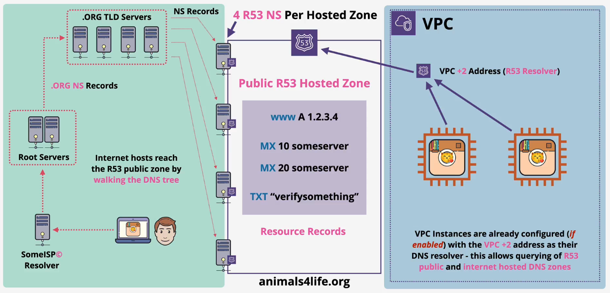

<!-- # r53 public hosted zones

- [x] Progress: Done
- [] Flashcards: Not yet

## R53 Hosted Zones

### Concepts

Concepts

- A R53 hosted zone is a DNS database for a domain, e.g. animals4life.org
- Globally resilient (multiple DNS servers)
- Created with domain registration via R53; can be created separately
- Hosts DNS records (e.g. A, AAAA, MX, NS, TXT, ...)
- Hosted zones are what the DNS system references - authoritative for a domain, e.g. animals4life.org

## R53 Public Hosted Zones

### Concepts

Concepts

- DNS database (zone file) hosted by R53 (public name servers)
- Accessible from the public internet and VPCs
- Hosted on 4 R53 name servers (NS) specific to the zone
- Use NS records to point to these name servers (connect to global DNS)
- Resource records (RR) are created within the hosted zone
- Externally registered domains can point to the R53 public zone

 -->
