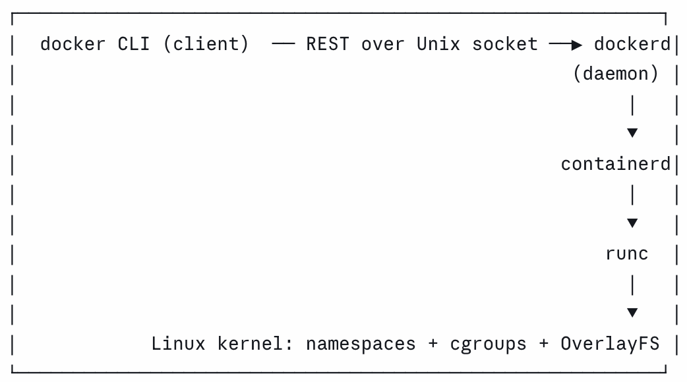
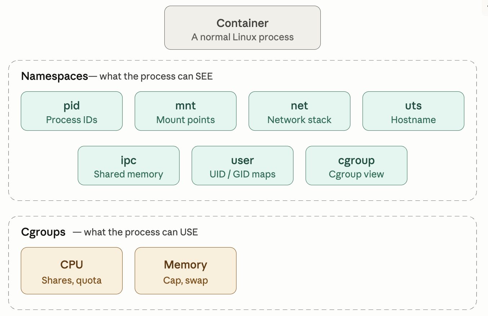

# fundamentals

- [x] Progress: Done

## Concepts

### Architecture



- dockerd: Long-running background process
- containerd: Lower-level runtime
- runc: Executes syscalls

### Overview



## Commands

```bash
# Create and start a container from an image
# clone() with namespace flags, set cgroups, exec the entrypoint
docker run  

# List running containers (-a for stopped too)
# Reads daemon state
docker ps

# Run a new process inside an existing container's namespaces
# setns() into target's namespaces, then exec
docker exec

# Show stdout/stderr captured by the daemon
# Reads the log driver's file
docker logs

# Send SIGTERM, wait --time, then SIGKILL
# Signal to PID 1 of the container
docker stop

# Remove a stopped container
# Frees the OverlayFS upper dir
docker rm
```

## Best practices

- Pin tags: Pin specific versions like `redis:7.2-alpine` instead of `redis:latest`
- Container naming: Name containers using `--name`
- Explicit port: Map ports using `-p HOST:CONTAINER` as `EXPOSE` is only documentation
- Execution modes: `-d` for background services, `-it` for interactive terminal commands
- Restart policy: `--restart unless-stopped` prevents downtime from crashes or reboots
- Lifecycle: `docker rm` deletes the container writable layer

## Examples

```bash
docker run --rm -it alpine:3.20 sh
/ #

docker run --rm python:3.12-slim python -c "import sys; print(sys.version)"
```

## Implementation

```bash
docker run -d \
  --name dev-redis \
  -p 127.0.0.1:6379:6379 \
  --restart unless-stopped \
  redis:7.2-alpine

docker ps -f name=dev-redis
docker port dev-redis
docker exec dev-redis redis-cli PING
docker logs dev-redis
```

## Comparison

Image base variations

- `redis:latest`: Worst choice
- `redis:7.2`: Debian based, heavier
- `redis:7.2-alpine`: Alpine based, lightweight, best for Dev/CI
- `redis@sha256:...`: Digest pin, best for production

Restart policy behaviors

- `none`: Default, stays dead on crash or daemon restarts
- `on-failure`: Restarts only when exiting with error code
- `always`: Forces restart, even after manual stop
- `unless-stopped`: Restarts on crash or machine reboot

## Alpine

### Concepts

- Alpine image: Built on Alpine Linux instead of heavy distributions like Ubuntu or Debian
- Philosophy: Only includes files strictly necessary to run the process
- Base size: Approximately 5 MB

### Components

- BusyBox: Combines common UNIX utilities into a single optimized executable
- musl libc: Replaces glibc as interface to the Linux kernel
- Characteristics: Lightweight, fast, designed for embedded systems and minimal environments