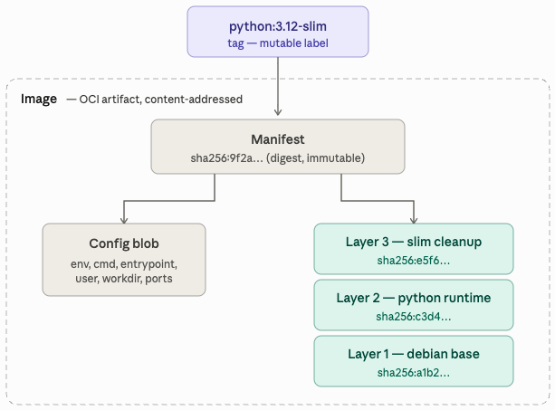
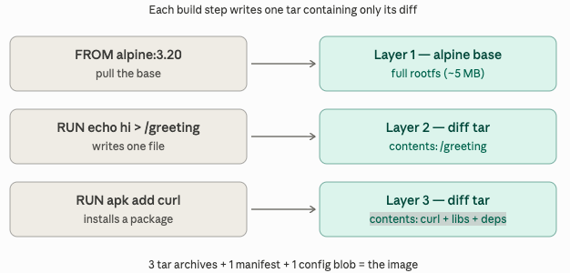
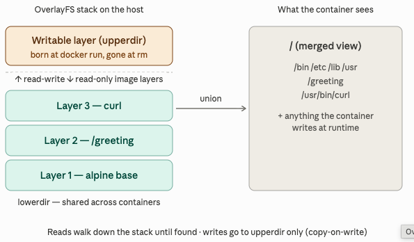
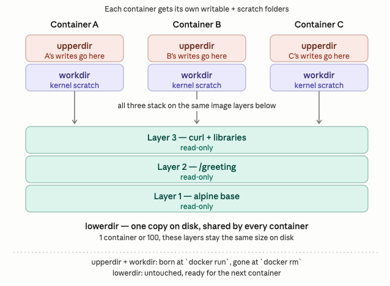
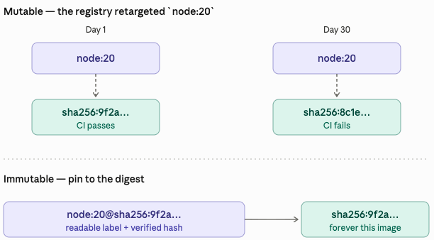
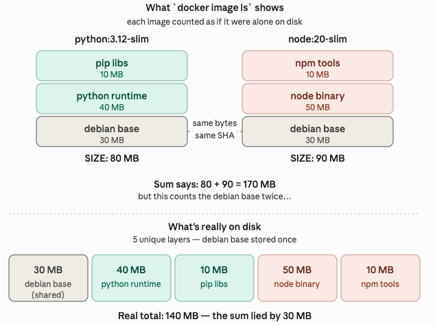

# images

- [ ] Progress: Draft

## Concepts

### Overview

Image definition

- Manifest: JSON document listing configuration and layers
  - Configuration: Environment variables, default `CMD`, exposed ports, default `USER`, etc.
  - Layers: Ordered list of tar archives representing filesystem changes, identified by SHA256 hashes
    - Files: Physical binaries and libraries like `/usr/bin/curl`
    - Deduplication: Unique layers stored once and shared across images



Image build process

- Step 1: Start container from previous layer state
- Step 2: Execute build command inside container
- Step 3: Diff filesystem changes against starting state
- Step 4: Tar changed files and whiteouts
- Step 5: Generate SHA256 hash of the tarball
- Step 6: Discard throwaway container

Build concepts

- Whiteout: Marker file indicating deletion of a path from lower layers
- Image size: `RUN rm -rf` in a separate layer does not shrink the image
- Practice: Run cleanup in the same `RUN` instruction as the installation



### Components

Layer creation

- Instructions creating layers: `RUN`, `COPY`, `ADD`
- Instructions editing config blob: `ENV`, `CMD`, `ENTRYPOINT`, `LABEL`, `WORKDIR`, `USER`, `EXPOSE`

Layer storage

- Registry: Gzipped tarball blobs identified by SHA256 hashes
- Host: `/var/lib/docker/overlay2/<random-id>/diff/`
- Layer sharing: Layers are shared between images sharing the same base

Runtime combination (OverlayFS)

- OverlayFS: Combines multiple directories into a single unified view
- lowerdir: Stacked read-only image layers
- upperdir: Read-write directory created per container for writes
- workdir: Kernel scratch space
- merged: Unified directory mounted as container filesystem
- Copy-on-write: Modifying lower-layer files copies the entire file to `upperdir`
- Volumes: Database or heavy-write workloads belong on volumes, not `upperdir`



Multi-container disk usage

- Sharing: Running 50 containers from one image uses only one copy of `lowerdir`
- Isolation: Docker creates 50 unique pairs of `upperdir` and `workdir`



Storage cost breakdown

- lowerdir: Paid once regardless of running container count
- upperdir: Paid per container, scales with file writes
- workdir: Paid per container, minimal scratch overhead
- Writable layer lifecycle: Files written to `upperdir` are deleted during `docker rm`
- Data persistence: Databases require volumes to persist data when container is removed

### Comparison

- Tag: Mutable reference pointing to a manifest digest
- Digest: Immutable SHA256 hash of the manifest, changes only if content changes



### How it works



- `docker image ls`: Shows virtual size by summing all layers, ignoring sharing
- `docker system df`: Shows actual disk usage, accounting for layer sharing

## Commands

- Rule: `docker rmi` removes the manifest, layers are deleted only when unreferenced

```markdown
python rt     40 MB   → only python used it      → DELETED   (-40 MB)
pip libs      10 MB   → only python used it      → DELETED   (-10 MB)
debian base   30 MB   → node still uses it       → KEPT      ( 0 MB)
                                                  ─────────
                                       Disk freed:    50 MB
```

- Shared layers: Deleting an image only frees disk space for unshared layers

## Best practices

- Pin by digest: Use immutable references like `node:20-slim@sha256:9f2a3b…`
- Disk measurement: Use `docker system df` for actual usage, not `docker image ls`
- Disk cleanup: Use `docker image prune` or `docker system prune` to free space