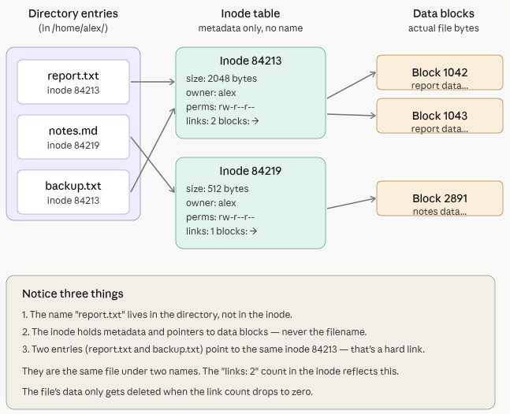

# inodes

- [x] Progress: Done

## Concepts

- File components
  - Name - label of the file
  - Metadata - size, permissions, owner, timestamps, and data block pointers
  - Data - actual bytes on disk
- **Inode** (index node) - structure containing file metadata
- Every file and directory has exactly one inode identified by a unique number
- Inode does not contain the filename
- File creation creates an inode and a directory entry
- **Directory entry** - link mapping a filename to an inode number
- **Directory** - list of directory entries

## How it works

1. Kernel looks up filename in current directory to get inode number (example: 84213)
2. Kernel reads inode to find data block locations
3. Kernel reads blocks and prints contents

