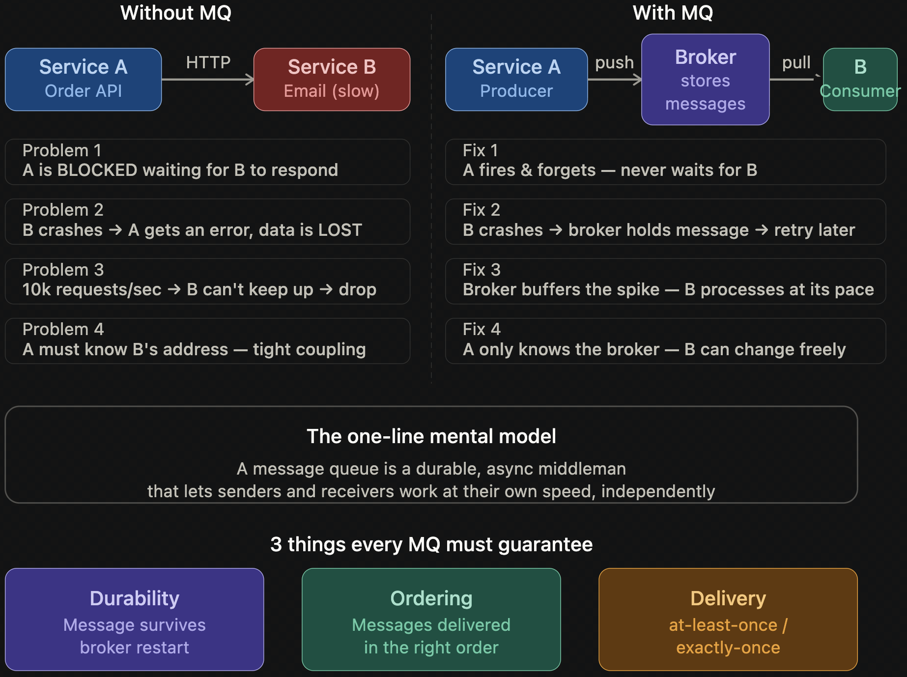

# fundamentals

- [x] Progress: Done

## The Problem MQ Solves

### Overview

- E-commerce scenario: Order placement requires Order service to:
  - Send confirmation email
  - Notify warehouse
  - Update inventory
- Without MQ, Order service calls dependencies directly via HTTP:
  - Email service down for 2 minutes → entire order fails
  - 5,000 simultaneous orders but Warehouse handles 500/min → 4,500 orders dropped
- Core insight: Sender must not care if receiver is alive, fast, or ready. Decoupling is MQ's primary purpose

### Components

- Producer: Service sending message. Hands message to broker and continues (does not wait)
- Broker: Middleman server storing message safely until retrieval (post office equivalent)
- Consumer: Service reading messages from broker and processing at own pace

### Concepts

- Queue functions like dropping letter in mailbox:
  - Producer drops letter and leaves — does not wait at mailbox. Post office (Broker) holds letter. Recipient (Consumer) checks mailbox when ready
  - Recipient unavailable for a week → letter waits without disappearing (Durability). Recipient processes letter upon return (Asynchronous Decoupling)
