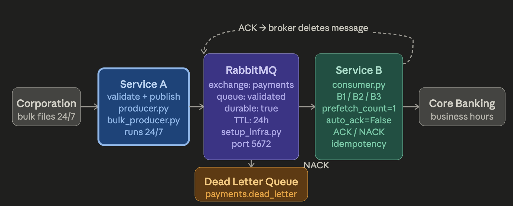
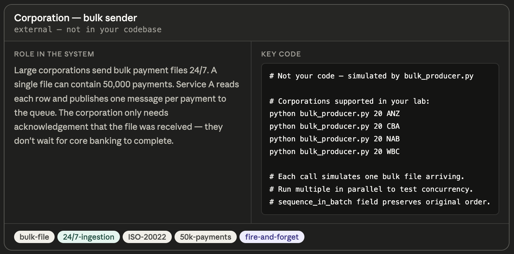
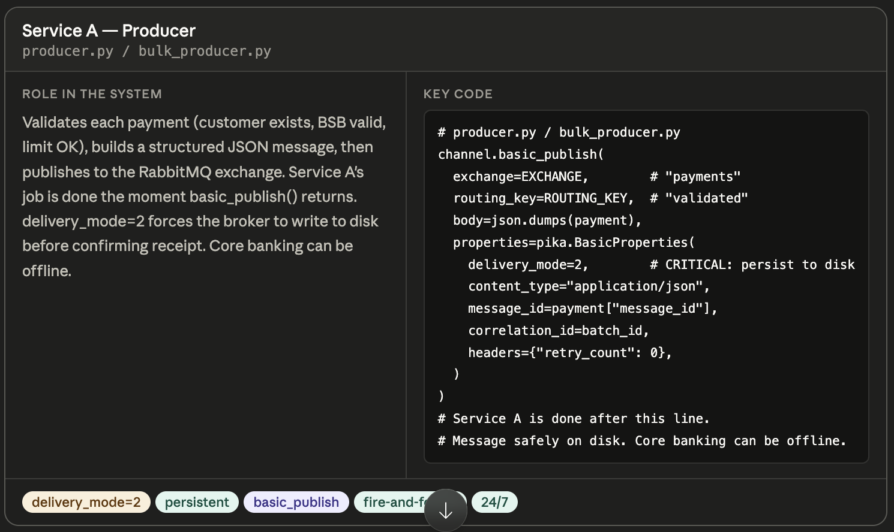
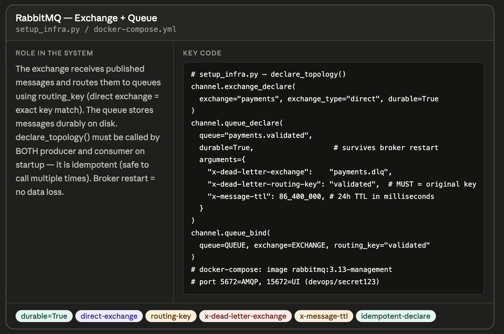
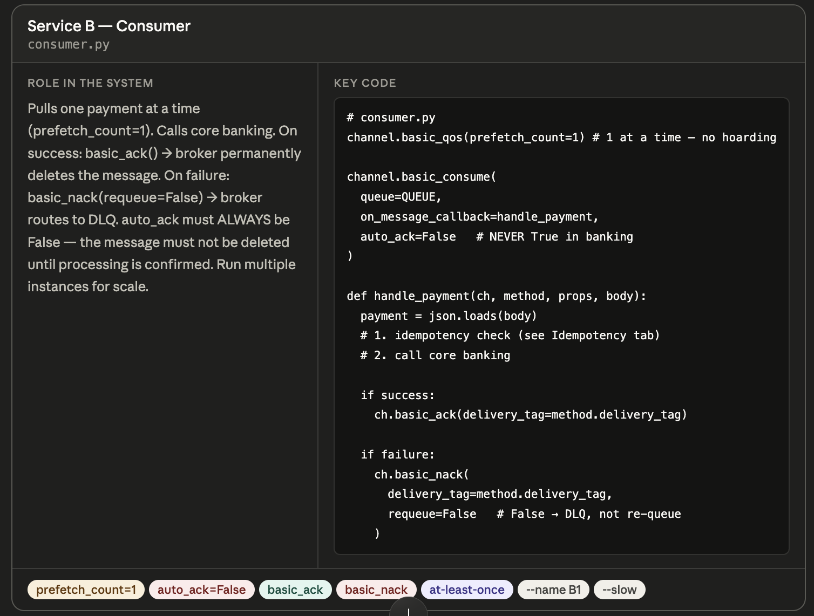
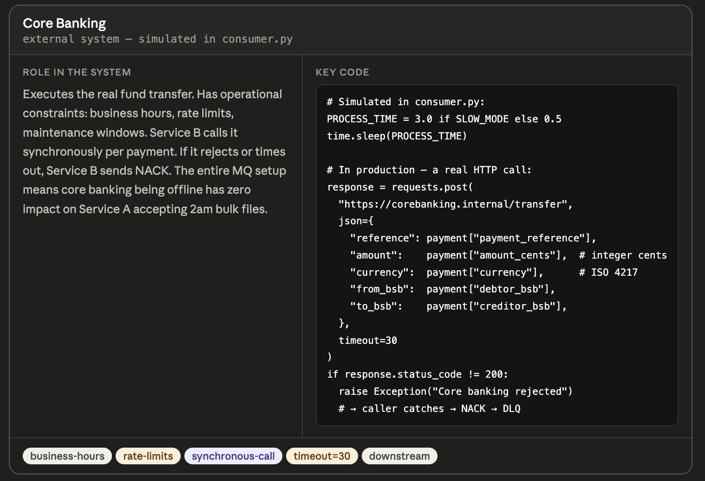
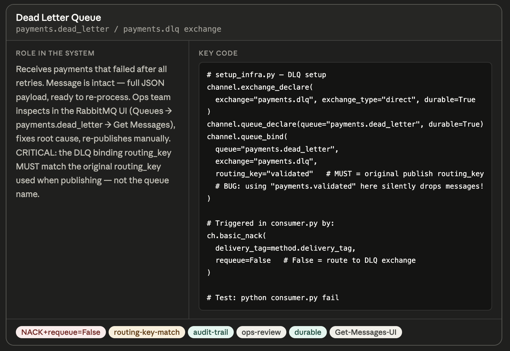
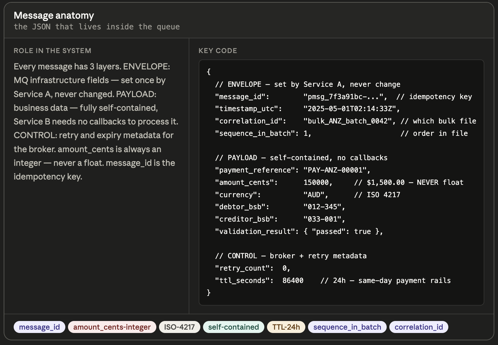
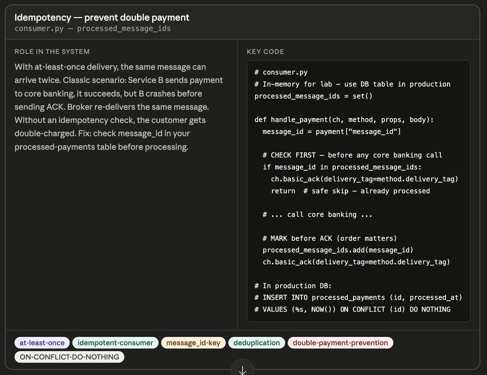
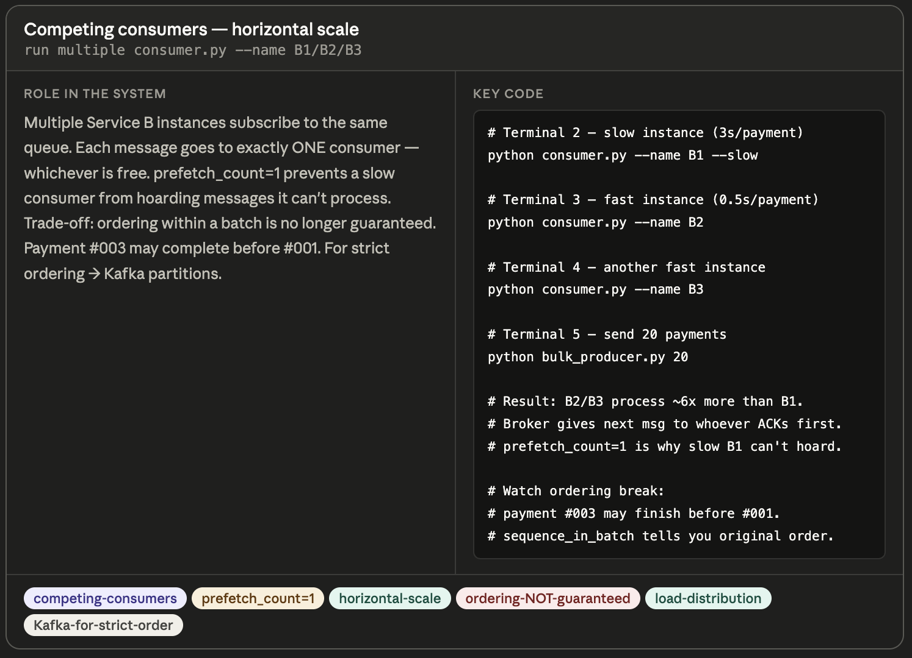

# implementation

- [x] Progress: Done

## Overview

### Flow

### Components

- Corporation
  
- Service A
  
- RabbitMQ
  
- Service B
  
- Core Banking
  
- DLQ
  
- Message
  
- Idempotency
  
- Consumers
  

## Execution

### How it works

- Dashed arc at top represents ACK loop - invisible feedback driving system
- Service B sends ACK, broker deletes message, gives B next message
- ACK loop ensures overall system safety
- NACK arrow routes from broker down to DLQ instead of directly from Service B - because Service B instructs broker to NACK and broker performs routing
- Service B never accesses DLQ directly

### Best practices

- Diagram functions as checklist for implementation practice
- Checklist flow: Corp → Producer (declare topology, basic_publish, delivery_mode=2) → Broker (exchange, queue, DLQ binding, routing key match) → Consumer (prefetch=1, auto_ack=False, idempotency check, ACK/NACK) → Core Banking
- Build components in specified sequence to achieve production-safe payment queue
