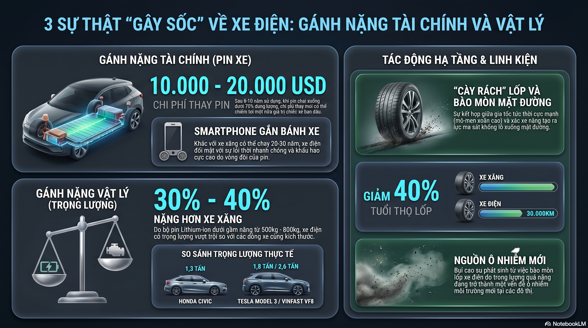
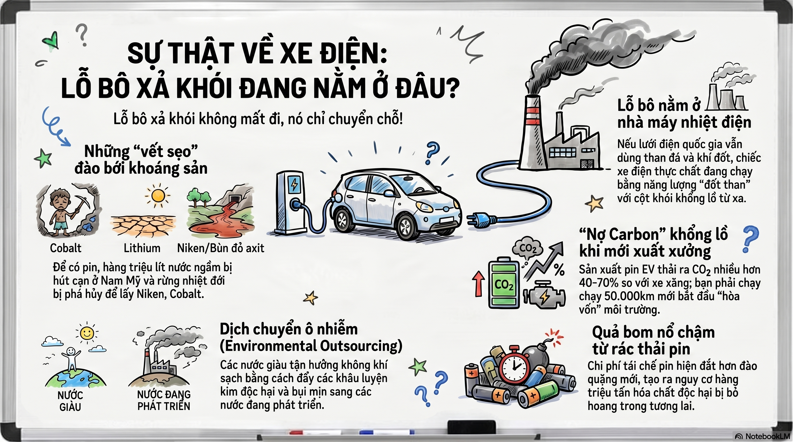
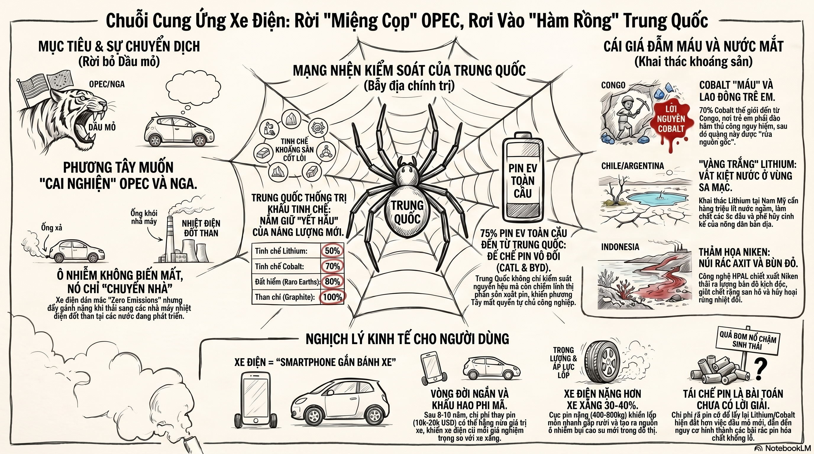
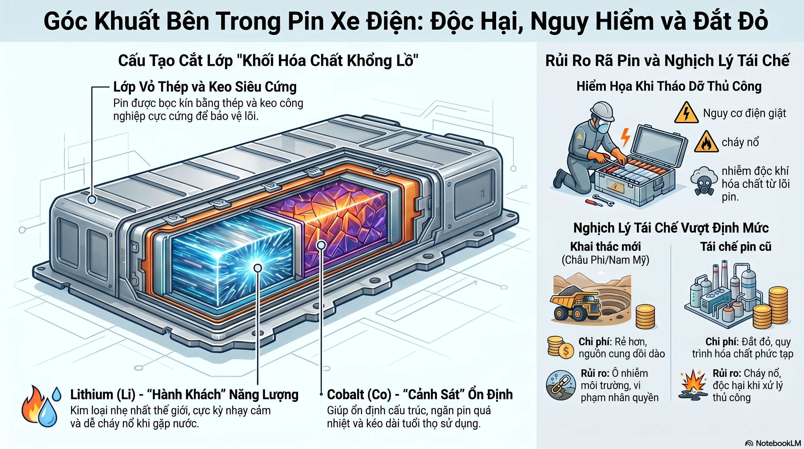
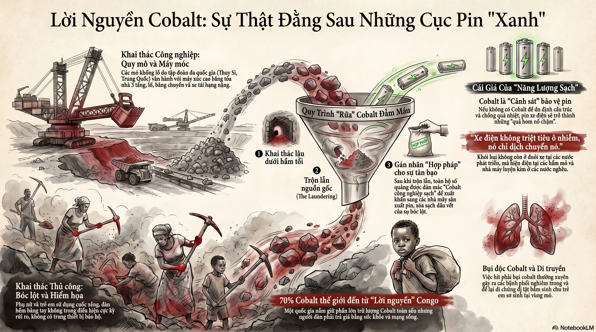
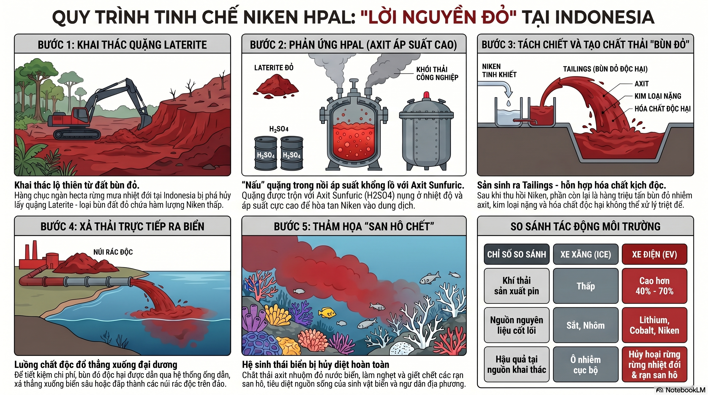
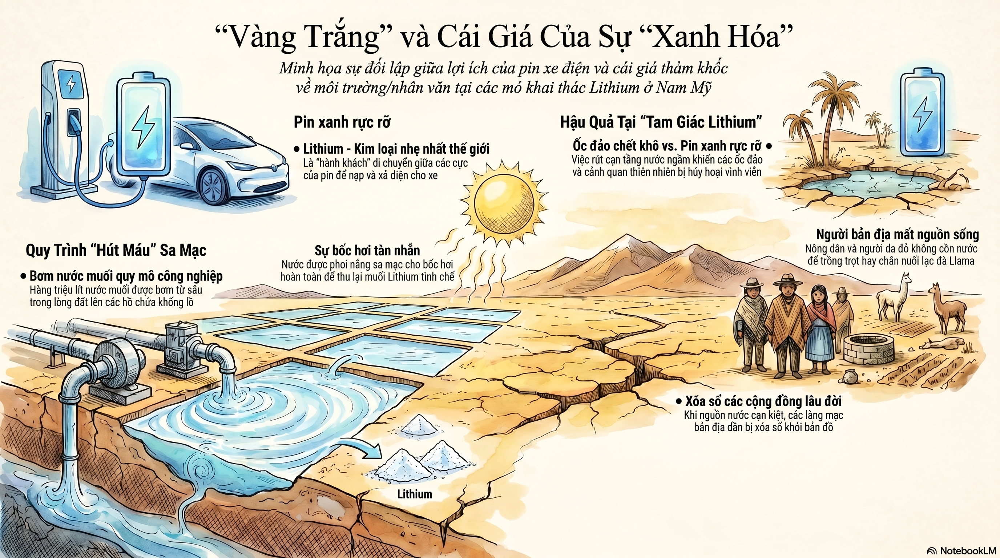

# mat toi xe dien

## Sự Thật Về Xe Điện



- Chi phí thay pin và độ bền
- Xe điện nặng hơn xe xăng 30% - 40%, trong đó pin nặng từ 500kg - 800kg



- Ô nhiễm đến từ
  - Việc khai thác Cobalt, Lithium, Niken
  - Quá trình nung hoặc trích xuất các chất trên
  - Quá trình tạo ra điện
  - Rác thải từ pin

## Chuỗi Cung Ứng



- Phương Tây giảm sự phụ thuộc vào OPEC và Nga
- 50% Lithium, 70% Cobalt, 80% Đất hiếm, 100% Than chì được tinh chế và 75% pin EV từ Trung Quốc

## Pin



### Cobalt



- 70% Cobalt đến từ Congo do phụ nữ và trẻ em
- Bụi độc Cobalt thấm vào phổi gây ảnh hưởng đến thế hệ sau
- Trộn Cobalt công nghiệp và Cobalt thủ công

### Niken



- Tailings thải trực tiếp ra biển

### Lithium



- Vàng trắng

## Note

```text
SỰ THẬT VỀ ZERO EMISSIONS (PHÁT THẢI BẰNG KHÔNG)

1. TỔNG QUAN VỀ PIN VÀ Ô NHIỄM SẢN XUẤT
- Cấu tạo: Xe điện cần PIN (thường là Lithium-ion, nặng khoảng 500kg nằm ở gầm xe).
- Thành phần chính: Lithium (Li - kim loại nhẹ nhất), Cobalt (Co) và Niken (Ni - kim loại cứng, chịu nhiệt tốt).
- Quy trình sản xuất độc hại:
  + Giai đoạn 1: Khai thác (đào bới) gây ô nhiễm môi trường đất và nước.
  + Giai đoạn 2: Tinh chế (nung quặng ở nhiệt độ cực cao bằng than đá hoặc khí tự nhiên).
  + Hệ quả: Quá trình nung giải phóng lượng lớn khí CO2 và SO2, gây áp lực khủng khiếp lên tầng khí quyền.

* Câu nói đáng suy ngẫm: "Lỗ bô xả khói không nằm sau đuôi xe, mà nó nằm ở cái ống khói khổng lồ của nhà máy nhiệt điện."

2. GÓC KHUẤT KHAI THÁC KHOÁNG SẢN

A. Lời nguyền Cobalt (Cộng hòa Dân chủ Congo)
- Vai trò: Cobalt giúp ổn định cấu trúc pin, ngăn quá nhiệt, chống cháy nổ và kéo dài tuổi thọ.
- Thực trạng: 70% Cobalt thế giới đến từ Congo, đa số do phụ nữ và trẻ em khai thác thủ công.
- Vấn đề nhân quyền & sức khỏe: 
  + Phương pháp thô sơ, hầm lò nguy hiểm, bóc lột sức lao động.
  + Bụi Cobalt độc hại gây bệnh phổi và dị tật bẩm sinh cho thế hệ sau.
- Chiêu trò "rửa nguồn gốc": Các tay buôn lậu mua quặng thủ công (khai thác trái phép), trộn chung với quặng từ các mỏ công nghiệp khổng lồ (của Thụy Sĩ, Trung Quốc) để biến nó thành nguồn hàng "hợp pháp" trước khi bán cho các công ty pin.

B. Lithium (Tam giác Lithium: Chile, Argentina, Bolivia)
- Vai trò: Ion di chuyển giữa cực âm và cực dương để nạp/xả điện.
- Phương pháp: Bơm hàng triệu lít nước muối từ lòng đất lên các hồ chứa khổng lồ giữa sa mạc, để nước bốc hơi dưới ánh nắng nhằm thu lấy muối Lithium.
- Hậu quả: Làm cạn kiệt nguồn nước ngầm. Các ốc đảo chết khô, nông dân và người bản địa mất nước sinh hoạt/chăn nuôi, làng mạc bị xóa sổ, hệ sinh thái bị hủy hoại.

C. Niken (Indonesia)
- Vai trò: Quyết định mật độ năng lượng (Niken càng nhiều, xe đi càng xa).
- Công nghệ HPAL (Rửa trôi bằng axit): Dùng Axit Sunfuric (H2SO4) trộn với quặng Laterite, nung ở nhiệt độ và áp suất cực cao.
- Hệ quả: Tạo ra dung dịch Niken và "bùn đỏ" (Tailings) – một chất cực độc. Lượng bùn này thường được xả trực tiếp ra biển hoặc đắp thành núi rác độc trên đảo, tiêu diệt các rạn san hô.

3. VẤN ĐỀ TÁI CHẾ VÀ NGUỒN ĐIỆN

- Khó tái chế: Pin xe điện là khối hóa chất độc hại bọc trong thép và keo siêu cứng. Tháo dỡ thủ công rất nguy hiểm (nguy cơ điện giật, cháy nổ, ngộ độc khí).
- Chi phí: Hiện nay, chi phí hóa chất để rã pin cũ lấy lại Lithium và Cobalt còn đắt hơn cả việc đi đào quặng mới.
- Nguồn gốc điện năng: Để có điện sạc pin, phải làm quay tuabin.
  + Thủy điện: Đắp đập ngăn sông, phá hủy hệ sinh thái sông suối.
  + Nhiệt điện (Than/Khí): Đốt than/gas để đun sôi nước, dùng áp suất hơi nước làm quay tuabin. Nếu lưới điện quốc gia vẫn dựa vào nhiệt điện (như Việt Nam, Ấn Độ, Trung Quốc, Đức), xe điện thực chất vẫn dùng năng lượng hóa thạch.

4. TÁC ĐỘNG KINH TẾ ĐỐI VỚI NGƯỜI TIÊU DÙNG

- Giá trị sử dụng: 
  + Xe xăng: Bảo dưỡng tốt chạy được 20-30 năm, giữ giá.
  + Xe điện: Như một chiếc "smartphone gắn bánh xe", sau 8-10 năm là chai pin. Chi phí thay pin hiện nay khoảng 10.000 - 20.000 USD (bằng nửa giá trị xe).
- Trọng lượng và hao mòn: 
  + Xe điện nặng hơn xe xăng cùng cỡ 30-40% do bộ pin. 
  + Ví dụ: Honda Civic nặng ~1.3 tấn, nhưng Tesla Model 3 nặng ~1.8 tấn, VinFast VF8 nặng ~2.6 tấn.
  + Hệ quả: Trọng lượng lớn cộng với gia tốc mạnh khiến lốp xe bị mài mòn cực nhanh, dễ gây hỏng bề mặt đường và tăng nguy cơ tai nạn nghiêm trọng.

5. ĐỊA CHÍNH TRỊ VÀ CHIẾN LƯỢC PHƯƠNG TÂY

- Mục đích thật sự: Giới phương Tây thúc đẩy xe điện để "cai nghiện" dầu mỏ, thoát khỏi sự phụ thuộc vào OPEC và Nga.
- Sự trớ trêu: Mỹ và Châu Âu có luật môi trường khắt khe và nhân công đắt nên không dám tự tinh chế. Họ đẩy sự ô nhiễm sang Châu Á.
- Thế độc tôn của Trung Quốc: Bắc Kinh đang kiểm soát 60% Lithium, 70% Cobalt, 80% đất hiếm và 100% than chì toàn cầu. Họ sản xuất 75% lượng pin EV thế giới (CATL, BYD).
* Nhận định: "Chuyển đổi sang xe điện, vô hình trung, Mỹ và Châu Âu đã tự nguyện giao nộp quyền tự chủ sản xuất công nghiệp của mình cho Bắc Kinh."
```
