# nao bo

## Cơ Chế Dọn Rác và Sáu Kiểu Quên

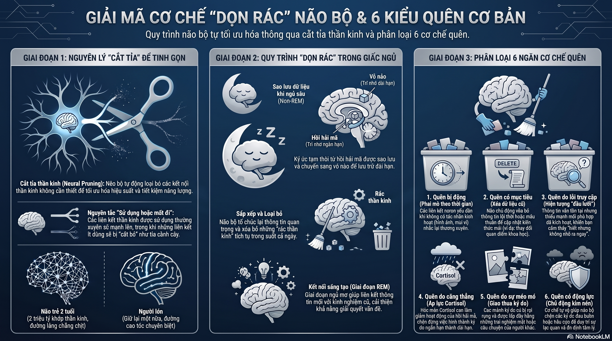

## Năng Lượng

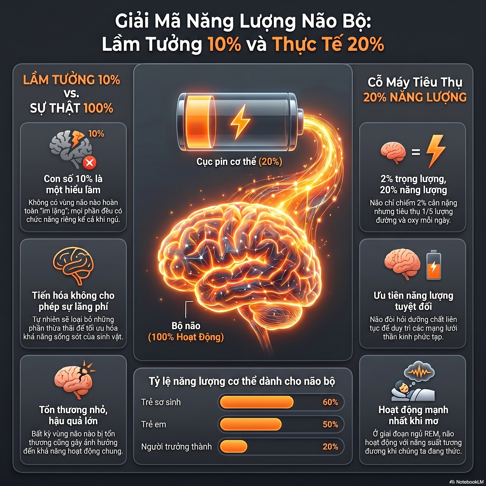

## Đa Ngữ

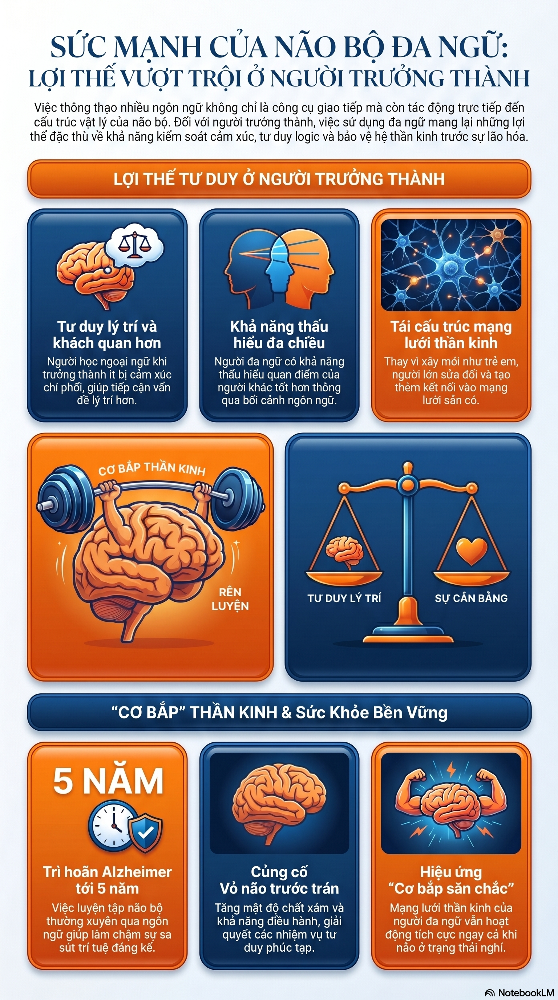

## Quá Trình Ngủ

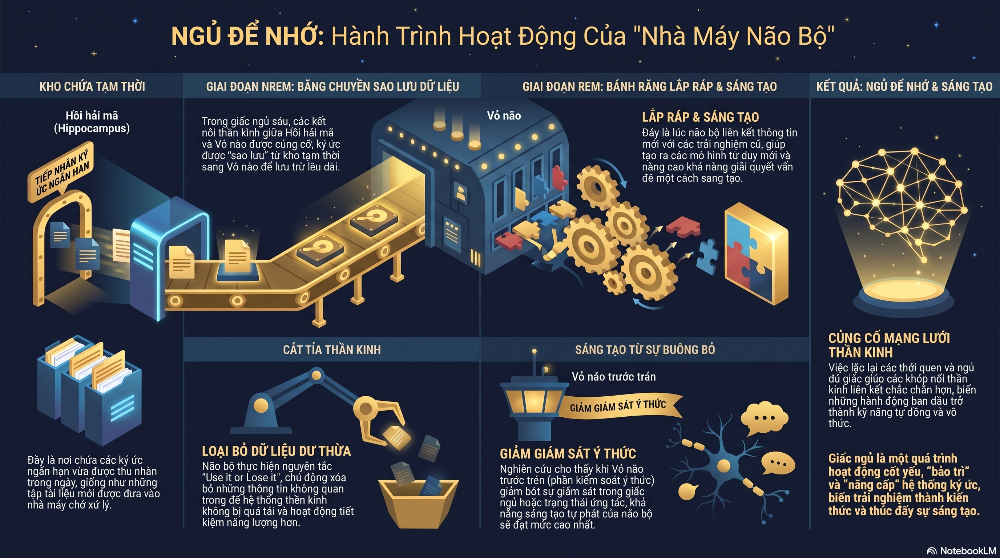

## Tính Dẻo

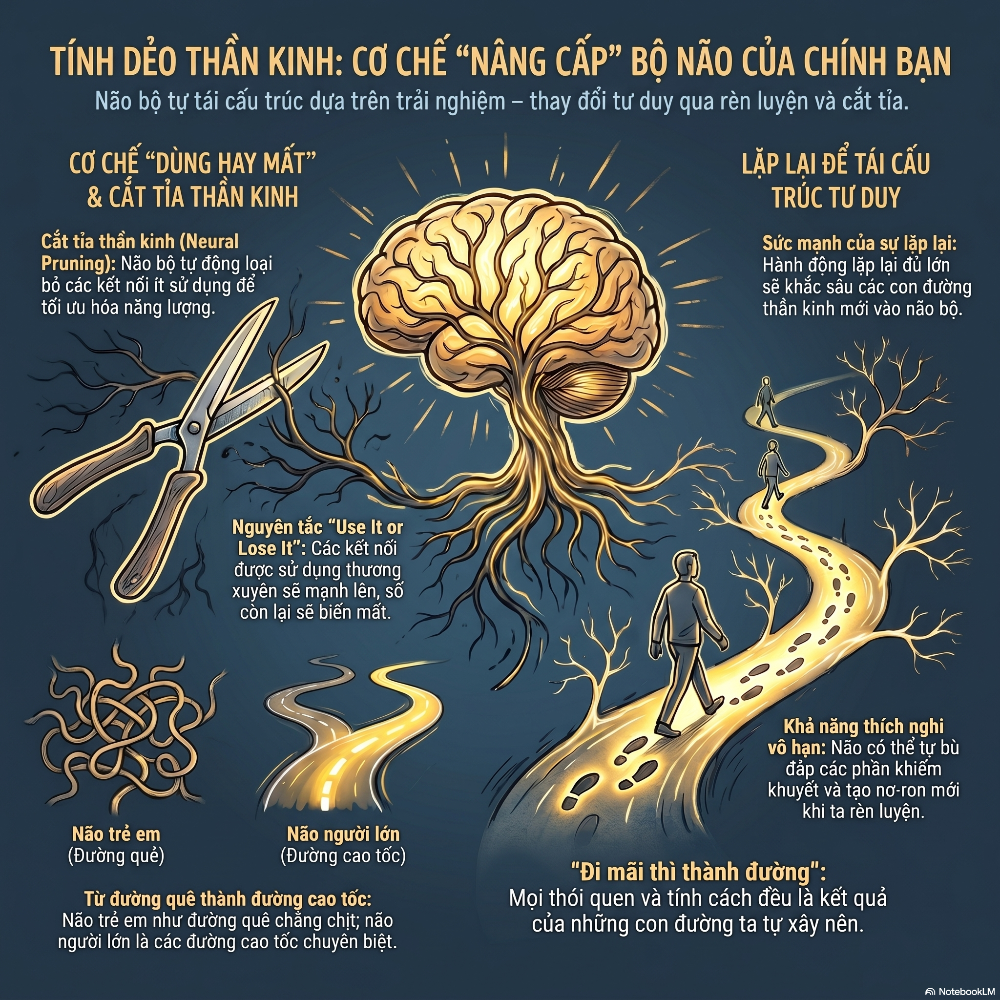

## Đa Nhiệm

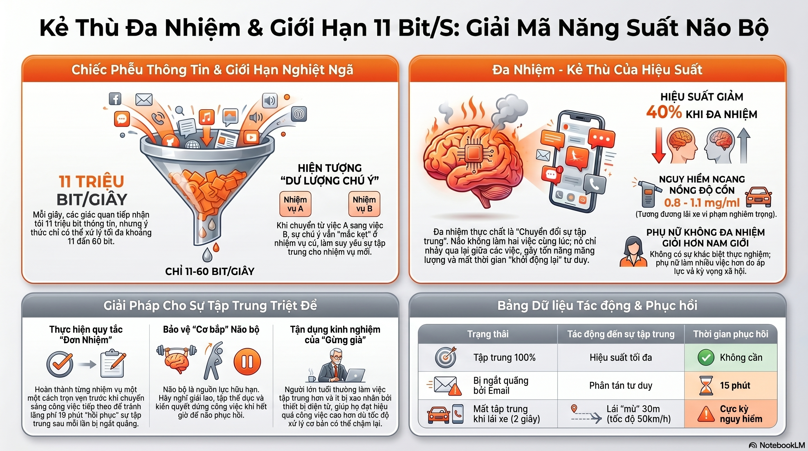

## Cortisol

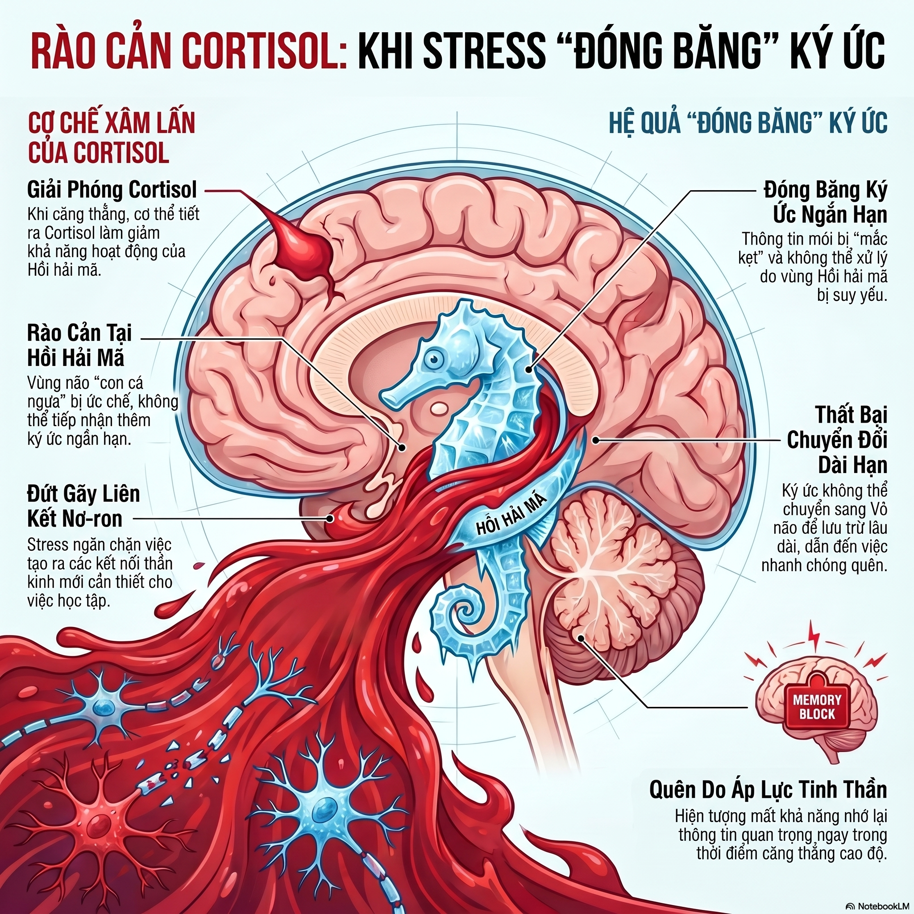

## Dopamine

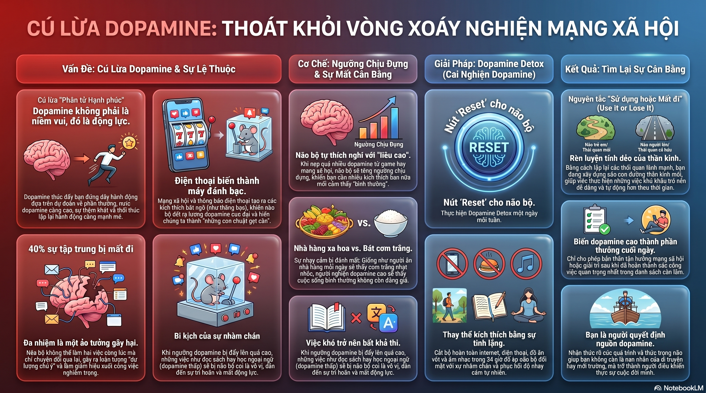

## Ký Ức

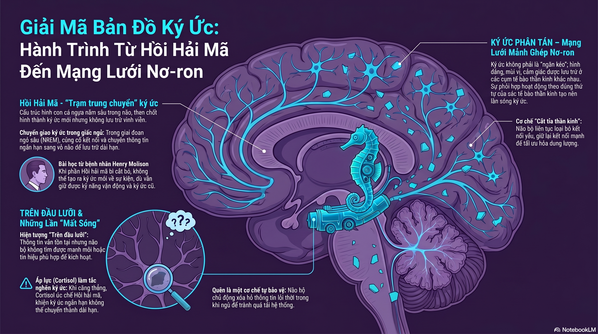

## Glia

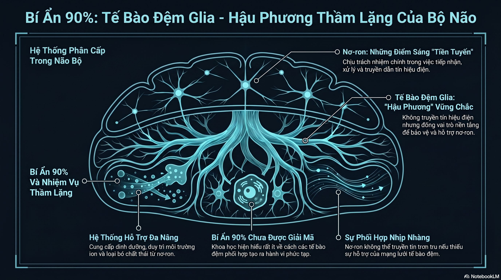

## Vỏ Não Trước Trán

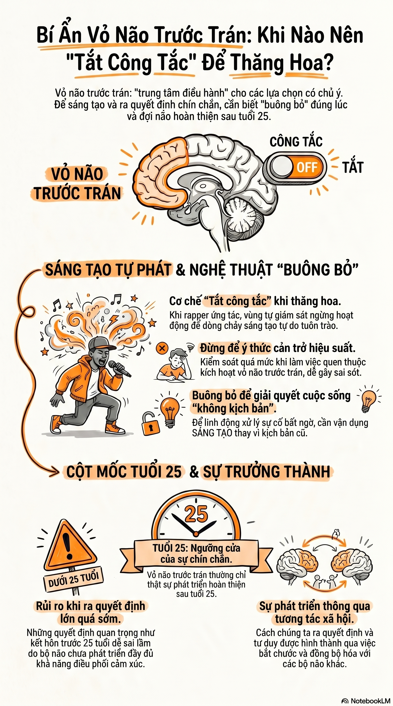
