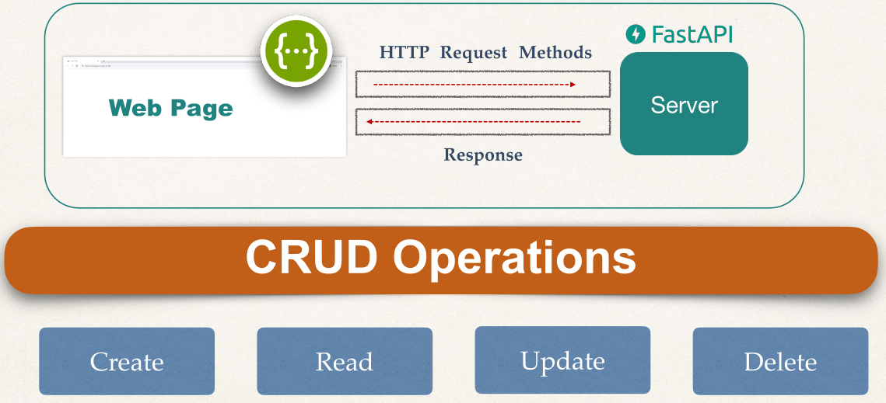

# fastapi

## What is Fastapi?

Concetps

- FastAPI is a Python web-framework for building modern APIs
  - Fast for both performance and development
- FastAPI is a web-framework for building modern RESTful APIs

Why do I need a web framework?

- You may be able to write everything yourself, but why reinvent the wheel?
- Web-frameworks allow a simplified way for rapid development
- Includes many years of development, which allows you to have a secure and fast application

## Request and Response



- Create: POST
- Read: GET
- Update: PUT
- Delete: DELETE

## GET

Example

```python
from fastapi import FASTAPI

app = FastAPI()

@app.get("/api-endpoint")
async def first_api():
  return {"message": "Hello K"}
```
